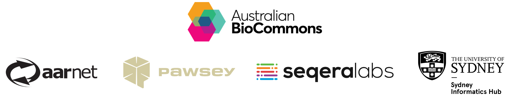

# Reproducible workflows with nf-core

This workshop will provide you with the foundational knowledge required to run and customise nf-core workflows in a reproducible manner. The content is broken up into 2 half-day sessions. In the first session we will cover the basic principles of Nextflow and nf-core pipelines. In the second session we will step through various customisation scenarios using the [nf-core/rnaseq](https://nf-co.re/rnaseq/3.22.2) pipeline. We will explore ways to adjust the workflow parameters based on the needs of your dataset and configuration the workflow to run on your computational environment. See the [lesson plan](./lesson_plan.md) for details.

## Trainers

- Cali Willet, Sydney Informatics Hub, University of Sydney
- Michael Geaghan, Sydney Informatics Hub, University of Sydney

## Target audience

This workshop is suitable for people who are familiar with working at the command line interface and have some experience running [Nextflow](https://www.nextflow.io/) and [nf-core workflows](https://nf-co.re/pipelines).

## Prerequisites

- Experience navigating the Unix command line
- Familiarity with Nextflow and nf-core workflows

## Set up requirements

Please complete the [Setup Instructions](./setup.md) **before the course**.

If you have any trouble, please get in contact with us ASAP via Slack.

## Code of Conduct

In order to foster a positive and professional learning environment we encourage the following kinds of behaviours at all our events and on our platforms:

- Use welcoming and inclusive language
- Be respectful of different viewpoints and experiences
- Gracefully accept constructive criticism
- Focus on what is best for the community
- Show courtesy and respect towards other community members

Our full code of conduct, with incident reporting guidelines, is available [here](https://sydney-informatics-hub.github.io/codeofconduct/).

## Workshop schedule

| Lesson     | Overview |
|------------|----------|
| [Set up your computer](./setup.md)| Follow these instructions to install VS Code and login to your Nimbus instance. |
| [Session 1: Introduction to nf-core](session_1/1.0_intro.md)| Learn fundamental ideas and skills that are essential for using Nextflow and nf-core workflows. |
| [Session 2: Customising nf-core](session_2/2.0_intro.md)| Write, run, adjust, and re-run an nf-core workflow as we step through various customisation scenarios. |

## Course survey

Please fill out our [course survey](https://www.surveymonkey.com/r/custom-nfcore) before you leave. Help us help you! 😁

## Credits and acknowledgements

This workshop event and accompanying materials were developed by the Sydney Informatics Hub, University of Sydney in partnership with Seqera Labs, Pawsey Supercomputing Research Centre, and Australia’s National Research Education Network (AARNet). The workshop was enabled through the Australian BioCommons - Bring Your Own Data Platforms project (Australian Research Data Commons and NCRIS via Bioplatforms Australia).

### Contributors

- Georgie Samaha, Sydney Informatics Hub, University of Sydney
- Cali Willet, Sydney Informatics Hub, University of Sydney
- Chris Hakkaart, Seqera Labs
- Michael Geaghan, Sydney Informatics Hub, University of Sydney

