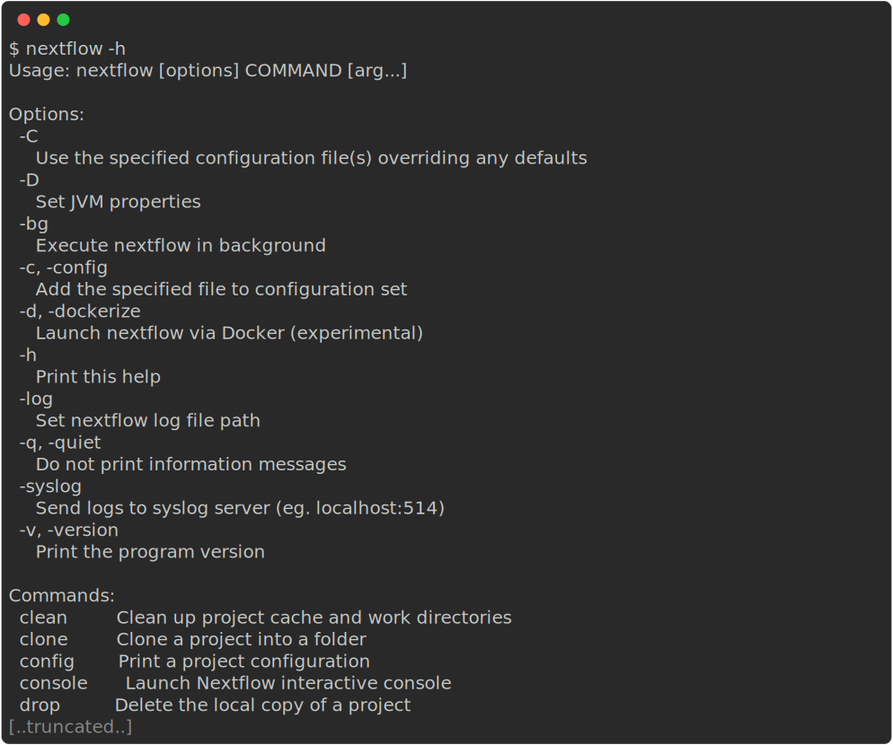
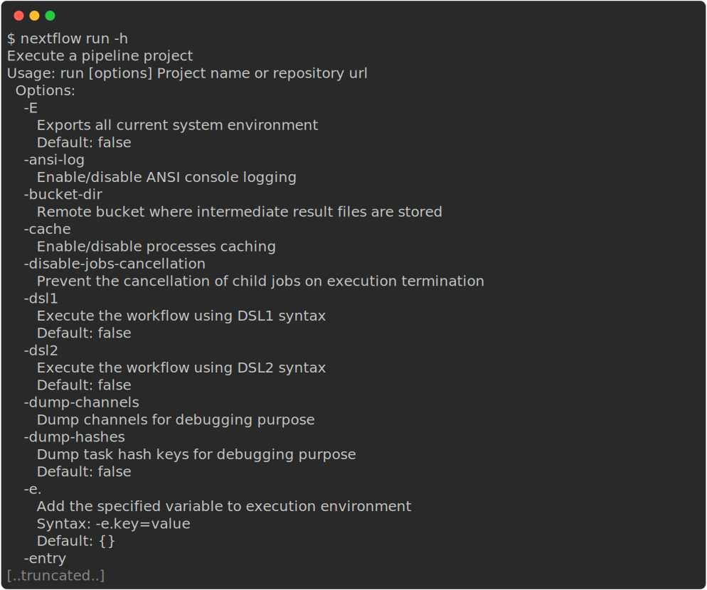
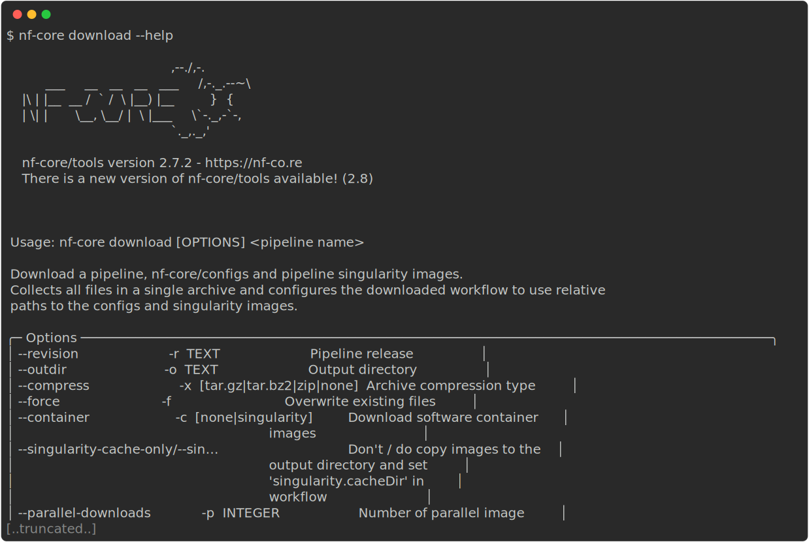
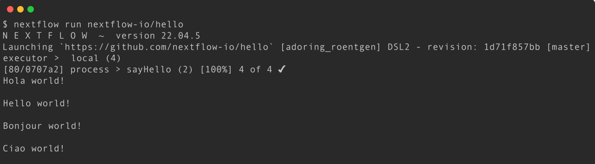
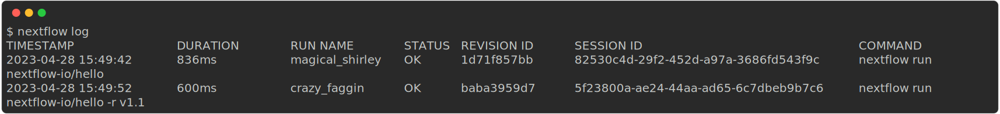
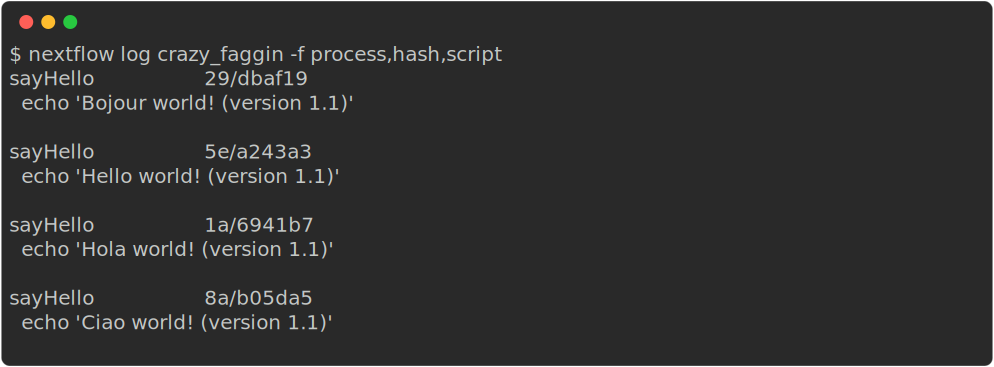

# 1.2 Running nf-core workflows

!!! tip ":construction: Objectives (WIP) :construction:"

    - Learn how to use nf-core tooling.
    - Use Nextflow to pull a workflow from GitHub.
    - Learn fundamental commands and options for executing workflows.

## 1.2.1 Introduction to the Nextflow command line

Nextflow provides a robust command line interface for the management and execution of workflows. The top-level interface consists of options and commands.

!!! note "Nextflow is pre-installed for this workshop"

    For this workshop, we have pre-installed Nextflow so you don't need to worry about installing it and can get stuck right into using it.

    For future reference, we have some instructions for installing Nextflow in our [Tips & Tricks page](../tips_tricks.md#installing-nextflow).

You can list Nextflow options and commands with the `-h` option:

```default
nextflow -h
```



Options for a command can also be viewed by appending the `-help` option to that command.

For example, options for the the `run` command can be viewed:

```default
nextflow run -help
```



!!! example "Exercise"

    Find out which version of Nextflow you are using with the version option.

    ??? success "Solution"

        The version of Nextflow you are using can be printed using the `-v` option:

        ```default
        nextflow -version
        ```

        Or:

        ```default
        nextflow -v
        ```

## 1.2.2 Managing your environment

You can use [environment variables](https://www.nextflow.io/docs/latest/config.html#environment-variables) to control some low-level aspects of how Nextflow runs. For most users, Nextflow will work without setting any environment variables. However, to improve reproducibility and to optimise your resources, you may benefit from establishing environmental variables, which can be exported before running a workflow and will be interpreted by Nextflow. 

For example, for consistency, it is good practice to pin the version of Nextflow you are using with the `NXF_VER` variable:

```default
export NXF_VER=<version number>
```

!!! example "Exercise"

    Pin the version of Nextflow to `23.04.1` using the `NXF_VER` environmental variable and check that it has been applied.

    ??? success "Solution"

        Export the version using the `NXF_VER` environmental variable:

        ```default
        export NXF_VER=23.04.1
        ```

        Check that the new version has been applied using the `-v` option:

        ```default
        nextflow -v
        ```

Similarly, when running Nextflow using containers (as is best practice, especially on shared infrastructure like high performance computing (HPC) clusters), it is a good idea to set the paths to where container images are stored and can be accessed using the `NXF_*_CACHEDIR` variables, e.g. `NXF_SINGULARITY_CACHEDIR` for singularity images:

```default
export NXF_SINGULARITY_CACHEDIR=<custom/path/to/singularity/cache>
```

!!! example "Exercise"

    Create a new folder with the path `/home/training/singularity_cache` to store your singularity images and export its location using the `NXF_SINGULARITY_CACHEDIR` environmental variable:

    ??? success "Solution"

        Make a new folder for your Singularity images:

        ```default
        mkdir /home/training/singularity_cache
        ```

        Export your new folder as your cache directory for singularity images using the `NXF_SINGULARITY_CACHEDIR` environmental variable:

        ```default
        export NXF_SINGULARITY_CACHEDIR=/home/training/singularity_cache
        ```

        Singularity images downloaded by workflow executions will now be stored in this directory.

You may want to include these, or other environmental variables, in your `.bashrc` file (or alternate) that is loaded when you log in so you don’t need to export variables every session.

A complete list of environmental variables can be found [here](https://www.nextflow.io/docs/latest/reference/env-vars.html).

## 1.2.3 nf-core tools

nf-core have created a set of helper tools for use with Nextflow workflows. These tools have been developed to provide a range of additional functionality for **using**, **developing**, and **testing** workflows.

!!! note "nf-core tools is pre-installed for this workshop"

    As with Nextflow, we have pre-installed nf-core tools so you don't need to installing it yourself.

    For your reference, see the [Tips & Tricks page](../tips_tricks.md#installing-nf-core-tools) for information on installing nf-core tools on your onw systems.

The nf-core `--version` option can be used to print your version of nf-core tools:

```default
nf-core --version
```

nf-core tools are for everyone and has commands to help both **users** and **developers**. For users, the tools make it easier to execute workflows. For developers, the tools make it easier to develop and test your workflows using best practices. You can read about the nf-core commands on the [tools page](https://nf-co.re/tools/) of the nf-core website or using the command line.

!!! question "Exercise"

    Find out what nf-core tools commands and options are available using the `--help` option:

    ??? success "Solution"

        Execute the `--help` option to list the options, commands for users, and commands for developers:

        ```default
        nf-core --help
        ```

        

nf-core tools is updated with new features and fixes regularly so it's best to keep your version of nf-core tools up-to-date.

### `nf-core download`

One very useful nf-core tools command is `download`. Sometimes you may need to execute an nf-core workflow on a server or HPC system that has no internet connection. In this case, you will need to fetch the workflow files and manually transfer them to your offline system. The `nf-core download` command makes this process easier and ensures accurate retrieval of correctly versioned code and software containers.

The `nf-core download` command will download both the workflow code and the institutional nf-core/configs files. It can also optionally download singularity image file.

```default
nf-core download
```

If run without any arguments, the download tool will interactively prompt you for the required information. Each prompt option has a flag and if all flags are supplied then it will run without a request for any additional user input:

- **Pipeline name**
    - Name of workflow you would like to download.
- **Pipeline revision**
    - The revision you would like to download.
- **Pull containers**
    - If you would like to download Singularity images.
    - The path to a folder where you would like to store these images if you have not set your `NXF_SINGULARITY_CACHEDIR`.
- **Choose compression type**
    - The compression type for Singularity images.

Alternatively, you could build your own execution command with the command line options.

{width=100%}

## 1.2.4 Executing a workflow

Nextflow seamlessly integrates with code repositories such as [GitHub](https://github.com/). This feature allows you to manage your project code and use public Nextflow workflows &mdash; including nf-core workflows &mdash; quickly, consistently, and transparently.

The Nextflow `pull` command will download a workflow from a hosting platform into your global cache `$HOME/.nextflow/assets` folder.

If you are pulling a project hosted in a remote code repository, you can specify its qualified name or the repository URL. The qualified name is formed by two parts - the owner name and the repository name separated by a `/` character. For example, if a Nextflow project `bar` is hosted in a GitHub repository `foo` at the address `http://github.com/foo/bar`, it could be pulled using:

```default
nextflow pull foo/bar
```

Or by using the complete URL:

```default
nextflow pull http://github.com/foo/bar
```

Alternatively, the Nextflow `clone` command can be used to download a workflow into the current directory:

```default
nextflow clone foo/bar
```

This is equivalent to pulling the GitHub repository directly with `git clone https://github.com/foo/bar`. The `nextflow clone` syntax simply shortens and cleans up the command.

The Nextflow `run` command is used to initiate the execution of a workflow:

```default
nextflow run foo/bar
```

If you `run` a workflow, it will look for a local file with the workflow name you’ve specified. If that file does not exist, it will look for a public repository with the same name on GitHub (unless otherwise specified). If it is found, Nextflow will automatically `pull` the workflow to your global cache and execute it.

!!! warning "Warning"

    Be aware of what is already in your current working directory where you launch your workflow, if there are other workflows (or configuration files) you may encounter unexpected results.

!!! example "Exercise"

    Execute the `hello` workflow directly from `nextflow-io` [GitHub](https://github.com/nextflow-io/hello) repository.

    ??? success "Solution"

        Use the `run` command to execute the [nextflow-io/hello](https://github.com/nextflow-io/hello) workflow:

        ```default
        nextflow run nextflow-io/hello
        ```

        

More information about the Nextflow `run`, `pull`, and `clone` commands can be found in the Nextflow documentation:

- [run](https://www.nextflow.io/docs/latest/reference/cli.html#run)
- [pull](https://www.nextflow.io/docs/latest/reference/cli.html#pull)
- [clone](https://www.nextflow.io/docs/latest/reference/cli.html#clone)

!!! tip "Executing a revision"

    For each of the commands `run`, `pull`, and `clone`, you can optionally supply the option `-r <REVISION>` to pull a specific version of the workflow. This can be any valid branch or tag name, e.g.:

    ```bash
    nextflow run -r dev foo/bar
    ```

    or

    ```bash
    nextflow run -r 1.2.0 foo/bar
    ```

!!! note "Our recommendation"

    As you can see, there are a few different ways you can go about running a nextflow or nf-core pipeline. We recommend using either the `nextflow clone` command or directly cloning the repository with `git clone`. This is because it is the most flexible approach and gives you control over exacly where the workflow is being cloned to (instead of all pipelines going to `$HOME/.nextflow/assets` as with `nextflow pull`/`nextflow run`).

## 1.2.5 Nextflow log

It is important to keep a record of the commands you have run to generate your results. Nextflow helps with this by creating and storing metadata and logs about the run in hidden files and folders in your current directory (unless otherwise specified). This data can be used by Nextflow to generate reports. It can also be queried using the Nextflow `log` command:

```default
nextflow log
```

The `log` command has multiple options to facilitate the queries and is especially useful while debugging a workflow and inspecting execution metadata. You can view all of the possible `log` options with `-h` flag:

```default
nextflow log -h
```

To query a specific execution you can use the `RUN NAME` or a `SESSION ID`:

```default
nextflow log <run name>
```

To get more information, you can use the `-f` option with named fields. For example:

```default
nextflow log <run name> -f process,hash,duration
```

There are many other fields you can query. You can view a full list of fields with the `-l` option:

```default
nextflow log -l
```

!!! example "Exercise"

    Use the `log` command to view with `process`, `hash`, and `script` fields for your tasks from your most recent Nextflow execution.

    ??? success "Solution"

        Use the `log` command to get a list of you recent executions:

        ```default
        nextflow log
        ```

        

        Query the process, hash, and script using the `-f` option for the most recent run:

        ```default
        nextflow log crazy_faggin -f process,hash,script
        ```

        

## 1.2.6 Execution cache and resume

When running large (and possibly expensive) workflows, we want to be sure that if we need to re-run the workflow (e.g. a job failed due to low memory or maybe we changed a parameter or added a new sample) that the workflow won't have to start again from the very beginning. Instead, we want to re-use any previously generated outputs that are still valid and aren't affected by any changes we've made to the run. Task execution **caching** achieves this by keeping track of previous runs and their outputs and re-using them where possible.

In Nextflow, we can utilise this cache by using the `-resume` option. The cache works keeping track of the file paths, file sizes, and modification times of all input files to a process. It also keeps track of the process definition itself. If these are unchanged between runs, the **cached** outputs are re-used. If any of these values have changed, the process will be re-run.

!!! note "Key points"

    - nf-core is a community effort to collect a curated set of analysis workflows built using Nextflow.
    - Nextflow is a workflow management engine and coding language that makes it easy to write data-intensive computational workflows.
    - Environment variables can be used to control your Nextflow runtime.
    - Nextflow has automatic integrations with online code repositories and supports version control.
    - Nextflow will cache your runs and they can be resumed with the `-resume` option.
    - You can manage workflows with various Nextflow commands (e.g., `pull`, `clone`, `run`, and `log`).
