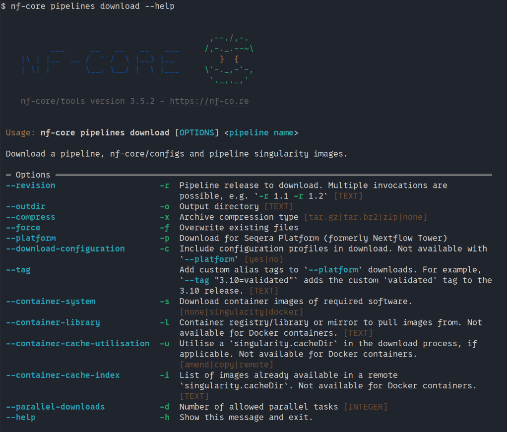
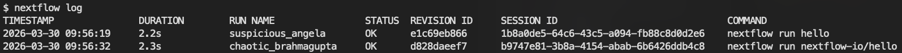
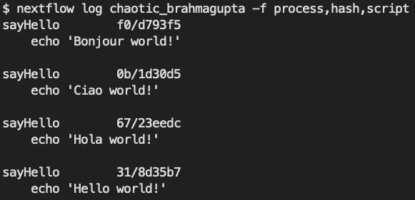

# 1.2 Running nf-core workflows

!!! tip "Objectives"

    - Learn about the Nextflow command line interface.
    - Learn how to use nf-core tooling.
    - Use Nextflow to pull a workflow from GitHub.
    - Learn fundamental commands and options for executing workflows.
    - Inspect the logs of a Nextflow run.

## 1.2.1 Introduction to the Nextflow command line

In order to run an nf-core pipeline, you do not need to know how to code in Nextflow, but you will need to use a few Nextflow commands, in particular the Nextflow `run` command. Nextflow provides a robust command line interface for the management and execution of workflows. The top-level interface consists of options and commands.

!!! note "Nextflow is pre-installed for this workshop"

    For this workshop, we have pre-installed Nextflow so you don't need to worry about installing it and can get stuck right into using it.

    For future reference, we have some instructions for installing Nextflow in our [Tips & Tricks page](../tips_tricks.md#installing-nextflow).

You can list Nextflow options and commands with the `-h` option:

```bash
nextflow -h
```


Options for a command can also be viewed by appending the `-help` option to that command.

For example, options for the the `run` command can be viewed:

```bash
nextflow run -help
```


!!! example "Exercise 1.2.1"

    Find out which version of Nextflow you are using with the version option.

    ??? success "Solution"

        The version of Nextflow you are using can be printed using the `-v` option:

        ```bash
        nextflow -v
        ```

        ```console title="Output"
        nextflow version 25.10.4.11173
        ```

        Alternatively, you can use the `-version` option, which will produce a more verbose output:

        ```bash
        nextflow -version
        ```

        ```console title="Output"

            N E X T F L O W
            version 25.10.4 build 11173
            created 10-02-2026 15:17 UTC (11-02-2026 02:17 AEDT)
            cite doi:10.1038/nbt.3820
            http://nextflow.io

        ```

## 1.2.2 Managing your environment

You can use [environment variables](https://docs.seqera.io/nextflow/config#environment-variables) to control some low-level aspects of how Nextflow runs. For most users, Nextflow will work without setting any environment variables. However, to improve reproducibility and to optimise your resources, you may benefit from establishing environment variables, which can be exported before running a workflow and will be interpreted by Nextflow. 

One particularly useful and important set of Nextflow environment variables are the `NXF_*_CACHEDIR` variables. When running Nextflow using containers (as is best practice, especially on shared infrastructure like high performance computing (HPC) clusters), it is a good idea to set the paths to where Nextflow will store and look for container images - the Nextflow container cache directory. The `NXF_*_CACHEDIR` variables do just this, where `*` is replaced by the upper-case name of the container software you are using. For example, for Singularity images, this is `NXF_SINGULARITY_CACHEDIR`. You can set these variables by `export`ing them:

```bash
export NXF_SINGULARITY_CACHEDIR=<custom/path/to/singularity/cache>
```

!!! tip "Exporting frequently-used variables"

    When you're running lots of workflows, you don't want to be having to export these Nextflow variables every time you log into your machine. If you want to have a particular variable set every time you log in, add it to your `~/.bashrc` file, which is read every time you log in.

    Note that `~/.bashrc` is specific to the "bash" shell, which we are using today on our VMs and which is the default shell on many Linux systems. However, not all systems use bash as their shell; for example, the default shell on newer Macs is called "zsh", and the file you would need to edit there is `~/.zshrc`.

!!! example "Exercise 1.2.2"

    Create a new folder with the path `~/singularity_cache` to store your singularity images and export its location using the `NXF_SINGULARITY_CACHEDIR` environmental variable within your `~/.bashrc` file.

    ??? success "Solution"

        Make a new folder for your Singularity images:

        ```bash
        mkdir ~/singularity_cache
        ```

        Like before, open your `~/.bashrc` file in VS Code:

        ```bash
        code ~/.bashrc
        ```

        Go to the bottom of the file and add the following line, replacing `<USERNAME>` with your provided user name:

        ```bash
        export NXF_SINGULARITY_CACHEDIR=/home/<USERNAME>/singularity_cache
        ```

        Save and close the `.bashrc` file, then run the command `source ~/.bashrc` in any active terminal sessions. Alternatively, you can close and re-open your session to cause the uddated `.bashrc` file to be applied to your session.

        Singularity images downloaded by workflow executions will now be stored in the `~/singularity_cache` directory.

A complete list of environment variables that you can use to configure Nextflow can be found [here](https://docs.seqera.io/nextflow/reference/env-vars).

## 1.2.3 nf-core tools

nf-core have created a set of helper tools for use with Nextflow workflows. These tools have been developed to provide a range of additional functionality for **using**, **developing**, and **testing** workflows.

!!! note "nf-core tools is pre-installed for this workshop"

    As with Nextflow, we have pre-installed nf-core tools so you don't need to install it yourself.

    For your reference, see the [Tips & Tricks page](../tips_tricks.md#installing-nf-core-tools) for information on installing nf-core tools on your onw systems.

The nf-core `--version` option can be used to print your version of nf-core tools:

```bash
nf-core --version
```

nf-core tools are for everyone, with commands intended to help both **users** and **developers**. For users, the tools make it easier to execute workflows. For developers, the tools make it easier to develop and test your workflows using best practices. You can read about the nf-core commands on the [tools page](https://nf-co.re/tools/) of the nf-core website or using the command line.

!!! example "Exercise 1.2.3.1"

    Find out what nf-core tools commands and options are available using the `--help` option:

    ??? success "Solution"

        Execute the `--help` option to list the options, commands for users, and commands for developers:

        ```bash
        nf-core --help
        ```

        

nf-core tools is updated with new features and fixes regularly so it's best to keep your version of nf-core tools up-to-date.

### `nf-core pipelines download`

One very useful nf-core tools command is `nf-core pipelines download`. Sometimes you may need to execute an nf-core workflow on a computer with no internet connection, for example if you have highly protected data. In this case, you will need to fetch the workflow files and manually transfer them to your offline system. The `nf-core pipelines download` command makes this process easier and ensures accurate retrieval of correctly versioned code and software containers.

```bash
nf-core pipelines download
```

If run without any arguments, the download tool will interactively prompt you for the required information. Each prompt option has a flag and if all flags are supplied then it will run without a request for any additional user input:

- **Pipeline name**
    - Name of workflow you would like to download
- **Pipeline revision**
    - The revision you would like to download
- **Pull containers**
    - If you would like to download Singularity images
    - The path to a folder where you would like to store these images if you have not set your `NXF_SINGULARITY_CACHEDIR`
- **Choose compression type**
    - The compression type for the downloaded data
    - If you are downloading the pipeline to the place where you will run it, this should be `none`
    - If you are downloading and then transferring to another computer, you would typically specify `tar.gz` or `zip` here to speed up transfer of the data to the other computer; the data would then need to be extracted again on the remote computer

Alternatively, you could build your own execution command with the command line options.

{width=100%}

The command line method also gives you a few additional options, including the ability to download all of the [nf-core institutional configs](https://nf-co.re/configs). This lets you run a workflow completely offline while still having access to these community-created configurations. **Note** that you must use the command line argument `--download-configuration yes` to do this; the interactive mode doesn't support this option yet.

!!! example "Exercise 1.2.3.2"

    Have a go at using `nf-core pipelines download` to download an nf-core pipeline along with the nf-core institutional configs. Tell the tool to:

    - Download the `nf-core/rnaseq` pipeline
    - Pull the `3.23.0` version of the pipeline
    - Download the institutional configs
    - **Not** download the singularity images for the pipeline (doing so might take a while!)
    - **Not** compress the downloaded data

    Consult `nf-core pipelines download --help` to help you find the right arguments.

    ??? success "Solution"

        The arguments we want are:

        - `--revision 3.23.0`: this pulls the specific version we want
        - `--download-configuration yes`: this pulls the institutional configs
        - `--container-system none`: this tells the tool to not download any images
        - `--compress none`: this tells the tool to not compress the data

        The final command will look like:

        ```bash
        nf-core pipelines download rnaseq --revision 3.23.0 --download-configuration yes --container-system none --compress none
        ```

        You should see a new directory where you ran the command:

        ```bash
        ls
        ```

        ```console title="Output"
        nf-core-rnaseq_3.23.0
        ```

        Let's look at what is inside:

        ```bash
        ls nf-core-rnaseq_3.23.0/
        ```

        ```console title="Output"
        3_23_0  configs
        ```

        Looking one level deeper, we can see what each folder contains:

        ```bash
        ls -lh nf-core-rnaseq_3.23.0/*
        ```

        ```console title="Output"
        nf-core-rnaseq_3.23.0/3_23_0:
        total 340K
        drwxrwxr-x 2 user3 user3 4.0K Apr 24 01:54 assets
        drwxrwxr-x 2 user3 user3 4.0K Apr 24 01:54 bin
        -rwxrwxr-x 1 user3 user3 113K Apr 24 01:54 CHANGELOG.md
        -rwxrwxr-x 1 user3 user3  11K Apr 24 01:54 CITATIONS.md
        -rwxrwxr-x 1 user3 user3  14K Apr 24 01:54 CODE_OF_CONDUCT.md
        drwxrwxr-x 2 user3 user3 4.0K Apr 24 01:54 conf
        drwxrwxr-x 5 user3 user3 4.0K Apr 24 01:54 docs
        -rwxrwxr-x 1 user3 user3 1.1K Apr 24 01:54 LICENSE
        -rwxrwxr-x 1 user3 user3 7.0K Apr 24 01:54 main.nf
        drwxrwxr-x 4 user3 user3 4.0K Apr 24 01:54 modules
        -rwxrwxr-x 1 user3 user3  24K Apr 24 01:54 modules.json
        -rwxrwxr-x 1 user3 user3  17K Apr 24 01:54 nextflow.config
        -rwxrwxr-x 1 user3 user3  57K Apr 24 01:54 nextflow_schema.json
        -rwxrwxr-x 1 user3 user3 1.5K Apr 24 01:54 nf-test.config
        -rwxrwxr-x 1 user3 user3  13K Apr 24 01:54 README.md
        -rwxrwxr-x 1 user3 user3  23K Apr 24 01:54 ro-crate-metadata.json
        drwxrwxr-x 4 user3 user3 4.0K Apr 24 01:54 subworkflows
        drwxrwxr-x 2 user3 user3 4.0K Apr 24 01:54 tests
        -rwxrwxr-x 1 user3 user3 3.0K Apr 24 01:54 tower.yml
        drwxrwxr-x 3 user3 user3 4.0K Apr 24 01:54 workflows

        nf-core-rnaseq_3.23.0/configs:
        total 68K
        drwxrwxr-x 2 user3 user3 4.0K Apr 24 01:54 bin
        -rwxrwxr-x 1 user3 user3 1.6K Apr 24 01:54 CITATION.cff
        drwxrwxr-x 5 user3 user3 4.0K Apr 24 01:54 conf
        -rwxrwxr-x 1 user3 user3  273 Apr 24 01:54 configtest.nf
        drwxrwxr-x 4 user3 user3 4.0K Apr 24 01:54 docs
        -rwxrwxr-x 1 user3 user3 1.1K Apr 24 01:54 LICENSE
        -rwxrwxr-x 1 user3 user3   69 Apr 24 01:54 nextflow.config
        -rwxrwxr-x 1 user3 user3  15K Apr 24 01:54 nfcore_custom.config
        drwxrwxr-x 2 user3 user3 4.0K Apr 24 01:54 pipeline
        -rwxrwxr-x 1 user3 user3  17K Apr 24 01:54 README.md
        ```

        We can see that the `3_23_0` folder contains the pipeline code, including its `main.nf` file, `nextflow.config` file, its `modules` and `subworkflows`, along with its configuration folder `conf`.

        Meanwhile the `configs` folder is where the institutional configs were downloaded. The config files themselves are under the `conf` directory:

        ```bash
        ls nf-core-rnaseq_3.23.0/configs/conf
        ```

        ```console title="Output"
        abims.config
        adcra.config
        alice.config
        alliance_canada.config
        apollo.config
        arcc.config
        awsbatch.config
        aws_tower.config
        azurebatch.config
        azurebatchdev.config
        ...
        ```

        The pipeline code is set up to find these and include them when you request the appropriate profile; for example, if you run the pipeline with `-profile nci_gadi`, it will find the config file stored at `nf-core-rnaseq_3.23.0/configs/conf/nci_gadi.config` and include it in the pipeline's configuration.

## 1.2.4 Downloading and executing workflows with `nextflow`

The `nextflow` command itself can also be used to download pipelines. Nextflow seamlessly integrates with code repositories such as [GitHub](https://github.com/), allowing you tu use public Nextflow workflows &mdash; including nf-core workflows &mdash; quickly, consistently, and transparently.

The Nextflow `pull` command will download a workflow from a hosting platform into your global cache `$HOME/.nextflow/assets` folder.

If you are pulling a project hosted in a remote code repository, you can specify its qualified name or the repository URL. The qualified name is formed by two parts - the GitHub owner/organisation name and the project/repository name separated by a `/` character. For example, if a Nextflow project `bar` is hosted in the GitHub organisation `foo` at the address `http://github.com/foo/bar`, it could be pulled using:

```bash
nextflow pull foo/bar
```

Or by using the complete URL:

```bash
nextflow pull http://github.com/foo/bar
```

Alternatively, the Nextflow `clone` command can be used to download a workflow into the current directory:

```bash
nextflow clone foo/bar
```

This is equivalent to pulling the GitHub repository directly with `git clone https://github.com/foo/bar`. The `nextflow clone` syntax simply shortens and cleans up the command.

Once the workflow is donwloaded, the Nextflow `run` command is used to initiate the execution of a workflow:

```bash
nextflow run foo/bar
```

!!! warning "Warning"

    Be aware of what is already in your current working directory where you launch your workflow. If there are other workflows (or configuration files) within the directory, you may encounter unexpected results.

!!! example "Exercise 1.2.4"

    Use the `nextflow` command line tool to clone the [`nextflow-io/hello` Nextflow repository](https://github.com/nextflow-io/hello) to your local directory, then execute it.

    ??? success "Solution"

        Use `nextflow clone` to pull the repository down to your local directory:

        ```bash
        nextflow clone nextflow-io/hello
        ```

        You should see the following message:

        ```console title="Output"
        nextflow-io/hello cloned to: hello
        ```

        Now, run the workflow:

        ```bash
        nextflow run hello
        ```

        You should get the following output:

        ```console title="Output"

        N E X T F L O W   ~  version 25.10.4

        Launching `hello/main.nf` [crazy_engelbart] DSL2 - revision: e1c69eb866

        executor >  local (4)
        [a9/b6e0fa] sayHello (1) [100%] 4 of 4 ✔
        Ciao world!

        Hola world!

        Hello world!

        Bonjour world!

        ```

        Note that the second line says ``Launching `hello/main.nf` ...``, which indicates that it was launched from the local directory.

### 1.2.4.1 More on `nextflow run`

When you run a pipeline with `nextflow run some_pipeline`, it will look for a local folder with the workflow name you’ve specified and a `main.nf` file within. If that file does not exist, it will next look in your `$HOME/.nextflow/assets` folder to see if you have previously `pull`ed the pipeline. Failing that, it will look for a public repository with the same name on GitHub (unless otherwise specified). If it is found, Nextflow will automatically `pull` the workflow to your global cache and execute it.

This means it is possible to seamlessly `run` public Nextflow pipelines without having to manually download them first.

!!! note "Our recommendation"

    As you can see, there are a few different ways you can go about running a nextflow or nf-core pipeline. Generally, **we recommend always downloading the code to your working directory** and **not** using `nextflow pull` (and by extension `nextflow run` with pipelines you haven't already downloaded). This means using either the `nextflow clone` command or directly cloning the repository with `git clone` to make sure the code is in your working directory first.

    If you need to execute an **nf-core pipeline** in an environment **without an internet connection**, you can use the `nf-core pipelines download` method [mentioned above](#nf-core-pipelines-download) on a computer with internet and transfer it to where it will run. Again, this method ensures that you localise the pipeline code to your working directory first, and makes sure you have all of the required configuration files and singularity images ready for offline use.
    
    We recommend this approach because it is the most flexible approach and gives you control over exacly what version of the workflow is being downloaded and where it is being downloaded to (instead of all pipelines going to `$HOME/.nextflow/assets` as with `nextflow pull`/`nextflow run`). In addition, it provides greater flexibility in modifying configuration files to suit the needs of your data and infrastructure, for example process CPU and memory resources.

More information about the Nextflow `run`, `pull`, and `clone` commands can be found in the Nextflow documentation:

- [run](https://docs.seqera.io/nextflow/reference/cli#run)
- [pull](https://docs.seqera.io/nextflow/reference/cli#pull)
- [clone](https://docs.seqera.io/nextflow/reference/cli#clone)

!!! tip "Executing a revision"

    For each of the commands `run`, `pull`, and `clone`, you can optionally supply the option `-r <REVISION>` to pull a specific version of the workflow. This can be any valid branch or tag name, e.g.:

    ```bash
    nextflow run -r dev foo/bar
    ```

    or

    ```bash
    nextflow run -r 1.2.0 foo/bar
    ```


## 1.2.5 Nextflow log

It is important to keep a record of the commands you have run to generate your results. Nextflow helps with this by creating and storing metadata and logs about the run in hidden files and folders in your current directory (unless otherwise specified). This data can be used by Nextflow to generate reports. It can also be queried using the Nextflow `log` command:

```bash
nextflow log
```

The `log` command has multiple options to facilitate the queries and is especially useful while debugging a workflow and inspecting execution metadata. You can view all of the possible `log` options with `-h` flag:

```bash
nextflow log -h
```

To query a specific execution you can use the `RUN NAME` or a `SESSION ID`:

```bash
nextflow log <run name>
```

To get more information, you can use the `-f` option with named fields. For example:

```bash
nextflow log <run name> -f process,hash,duration
```

There are many other fields you can query. You can view a full list of fields with the `-l` option:

```bash
nextflow log -l
```

!!! example "Exercise 1.2.5"

    Use the `log` command to view the `process`, `hash`, and `script` fields for your tasks from your most recent Nextflow execution.

    ??? success "Solution"

        Use the `log` command to get a list of you recent executions:

        ```bash
        nextflow log
        ```

        

        Query the process, hash, and script using the `-f` option for the most recent run. In this example, the run name is `chaotic_brahmagupta`; remember that yours will be different:

        ```bash
        nextflow log chaotic_brahmagupta -f process,hash,script
        ```

        

## 1.2.6 Execution cache and resume

When running large (and possibly expensive) workflows, we want to be sure that if we need to re-run the workflow (e.g. a job failed due to low memory or maybe we changed a parameter or added a new sample) that the workflow won't have to start again from the very beginning. Instead, we want to re-use any previously generated outputs that are still valid and aren't affected by any changes we've made to the run. Task execution **caching** achieves this by keeping track of previous runs and their outputs and re-using them where possible.

In Nextflow, we can utilise this cache by using the `-resume` option. The cache works keeping track of the file paths, file sizes, and modification times of all input files to a process. It also keeps track of the process definition itself. If these are unchanged between runs, the **cached** outputs are re-used. If any of these values have changed, the process will be re-run.

!!! note "The Nextflow cache can be sensitive!"

    It's important to note that the Nextflow cache looks for any change that might affect the output of each process. This includes:

        - Input file modification times
        - Changes to the script
        - Changes to the container or conda environment used to run the process
        - Changes to the `ext` properties, e.g. `ext.args`

    Sometimes, you can run into issues where the cache is **invalidated** and a re-run of a process is forced even when nothing seems to have changed. Often this will happen on some HPC systems where file modification times aren't syncronised perfectly across parallel file systems. In these cases, it can help to apply the `process.cache = 'lenient'` configuration option to tell Nextflow to only use the file name and size, but not the modification time, to determine whether the cache is valid or not.

    See the [Nextflow cache documentation](https://docs.seqera.io/nextflow/cache-and-resume) for further information on the cache and how to configure it.

!!! note "Key points"

    - Environment variables can be used to control your Nextflow runtime
    - Nextflow has automatic integrations with online code repositories and supports version control
    - You can manage workflows with various Nextflow commands (e.g. `pull`, `clone`, `run`, and `log`)
    - Nextflow will cache your runs and they can be resumed with the `-resume` option
