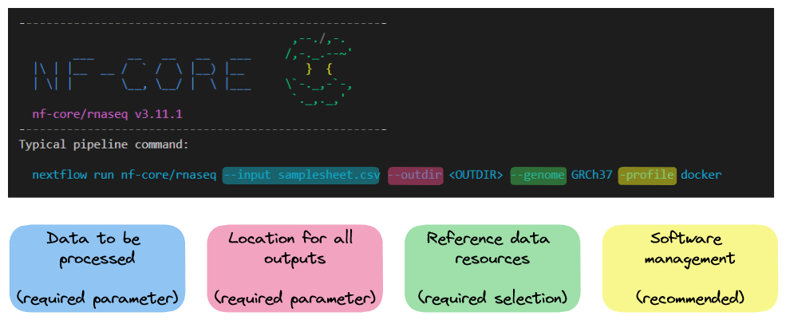
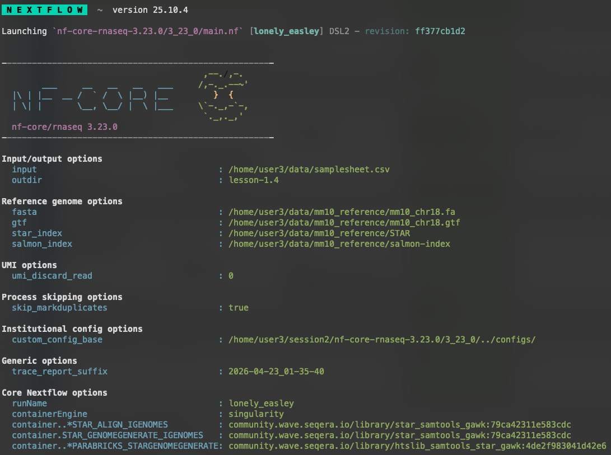
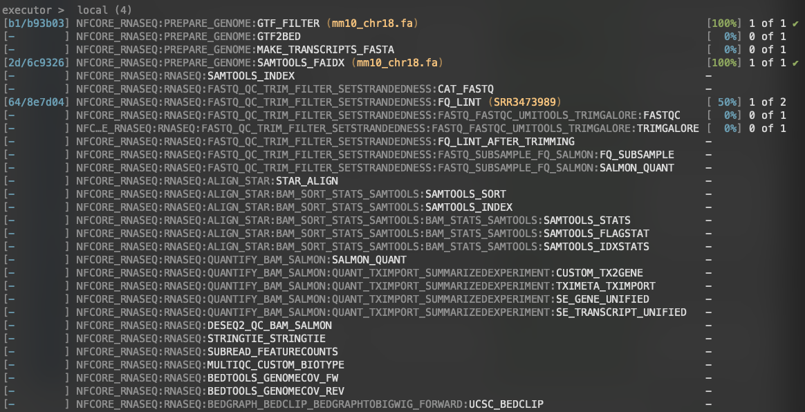
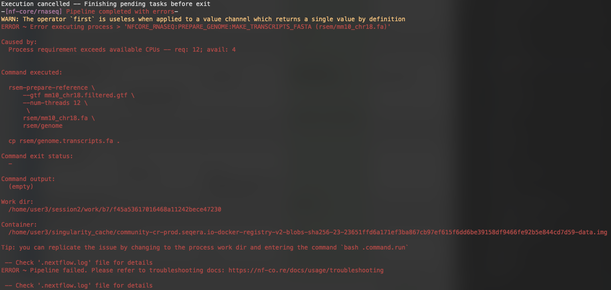
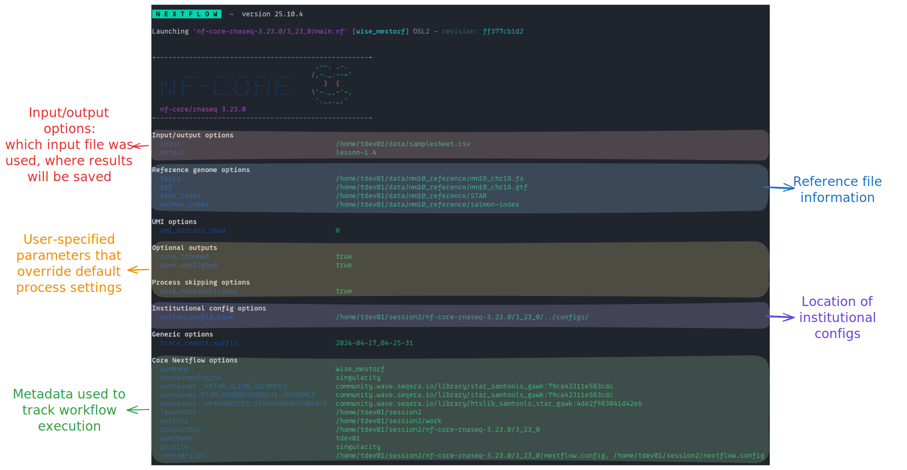

# 1.4 Introduction to nf-core/rnaseq

!!! tip "Objectives"

    - Learn about the `nf-core/rnaseq` pipeline
    - Understand the levels of customisation available for nf-core pipelines
    - Use the nf-core documentation to select appropriate parameters for a run command
    - Write a run command for nf-core/rnaseq
    - Explore pipeline deployment and outputs

## 1.4.1 An introduction to nf-core/rnaseq

For the remainder of this workshop, we will be working with a real-world nf-core pipeline for RNA-seq analysis: `nf-core/rnaseq`. The [nf-core website](https://nf-co.re/rnaseq/3.23.0) describes this pipeline as "a bioinformatics pipeline that can be used to analyse RNA sequencing data obtained from organisms with a reference genome and annotation". It implements a variety of tools and has several branching paths that allow users to select the type of alignment and post-processing they desire, as demonstrated in the nf-core metro-map below:


In this lesson, we will download [nf-core/rnaseq](https://nf-co.re/rnaseq/3.23.0), explore its functionality, and identify processes that may need to be adjusted or customised. By the end of the lesson, we will have constructed a basic run command to execute the pipeline, and then in the next session we will dive further into the customisation options. While nf-core pipelines are designed to run with 'sensible' default settings, these may not always suit the needs of your experiment or compute environment. Designing a custom run command requires you to identify which **[workflow parameters](https://docs.seqera.io/nextflow/config#parameters)** you need to specify to suit your circumstances and experimental design, and which **configurations** you may need to apply to efficiently execute the workflow on your compute platform

### Create a fresh working directory

Before we proceed, let's create a fresh working directory for all our experiments with `nf-core/rnaseq`.

!!! example "Create a new working directory"

    Go ahead and make a new `session2` folder in your home directory and open it in VS Code.

    ```bash
    mkdir ~/session2
    ```

    You can open the new directory either via the VS Code GUI (`File > Open Folder...` or `Ctrl + O` / `Cmd + O`) and navigating to it, or by using the `code` command in the terminal:

    ```bash
    code ~/session2
    ```

### Download the pipeline code

As mentioned above, we will be working with version 3.23.0 of the nf-core/rnaseq pipeline for the rest of the workshop. Go ahead and download that to your working directory now.

!!! example "Exercise 1.4.1"

    Clone the `nf-core/rnaseq` pipeline to your working directory. **Ensure that you download the version `3.23.0`**.

    ??? success "Solution"

        Recall from [earlier today](1.2_run.md#124-executing-a-workflow) that we can clone a workflow with `nextflow clone`. Recall also that we can pull a specific version of the workflow with the `-r` parameter:

        ```bash
        nextflow clone -r 3.23.0 nf-core/rnaseq
        ```

The pipeline files will be downloaded to `~/session2/rnaseq`. Let's have a look at the directory structure.

!!! example "List the downloaded directory contents"

    ```bash
    ls -lh rnaseq
    ```

    You should see the following:

    ```console title="Output"
    total 340K
    drwxrwxr-x 2 tdev01 tdev01 4.0K Apr 16 03:31 assets
    drwxrwxr-x 2 tdev01 tdev01 4.0K Apr 16 03:31 bin
    -rwxrwxr-x 1 tdev01 tdev01 113K Apr 16 03:31 CHANGELOG.md
    -rwxrwxr-x 1 tdev01 tdev01  11K Apr 16 03:31 CITATIONS.md
    -rwxrwxr-x 1 tdev01 tdev01  14K Apr 16 03:31 CODE_OF_CONDUCT.md
    drwxrwxr-x 2 tdev01 tdev01 4.0K Apr 16 03:31 conf
    drwxrwxr-x 5 tdev01 tdev01 4.0K Apr 16 03:31 docs
    -rwxrwxr-x 1 tdev01 tdev01 1.1K Apr 16 03:31 LICENSE
    -rwxrwxr-x 1 tdev01 tdev01 7.0K Apr 16 03:31 main.nf
    drwxrwxr-x 4 tdev01 tdev01 4.0K Apr 16 03:31 modules
    -rwxrwxr-x 1 tdev01 tdev01  24K Apr 16 03:31 modules.json
    -rwxrwxr-x 1 tdev01 tdev01  17K Apr 16 03:31 nextflow.config
    -rwxrwxr-x 1 tdev01 tdev01  57K Apr 16 03:31 nextflow_schema.json
    -rwxrwxr-x 1 tdev01 tdev01 1.5K Apr 16 03:31 nf-test.config
    -rwxrwxr-x 1 tdev01 tdev01  13K Apr 16 03:31 README.md
    -rwxrwxr-x 1 tdev01 tdev01  23K Apr 16 03:31 ro-crate-metadata.json
    drwxrwxr-x 4 tdev01 tdev01 4.0K Apr 16 03:31 subworkflows
    drwxrwxr-x 2 tdev01 tdev01 4.0K Apr 16 03:31 tests
    -rwxrwxr-x 1 tdev01 tdev01 3.0K Apr 16 03:31 tower.yml
    drwxrwxr-x 3 tdev01 tdev01 4.0K Apr 16 03:31 workflows
    ```

The files and directories we will be interacting with in this workshop are:

|Feature                |Importance                                                         |
|-----------------------|-------------------------------------------------------------------|
|`conf/`                |Contains files, default configuration settings and optional profiles that build on global settings set by `nextflow.config`|
|`main.nf`              |The executable Nextflow script that defines the structure and flow of the workflow. It calls `workflows/rnaseq.nf`|
|`modules/`             |Contains Nextflow processes used by the workflow. Each process is split into a module with its own `main.nf` file|
|`workflows/rnaseq.nf`  |The complete rnaseq pipeline, containing modules and subworkflows that are connected by channels |

## 1.4.2 Design your run command

As we learnt in [lesson 1.3.3](./1.3_configure.md#132-viewing-parameters), all nf-core pipelines have a unique set of pipeline-specific parameters that can be used in conjunction with Nextflow parameters to configure the workflow. Generally, nf-core pipelines can be customised at a few different levels:

| Level of effect   |Customisation feature |
|-------------------|----------------------|
| The workflow      | Where diverging methods are available for a pipeline, you may choose a path to follow |
| A process         | Where more than one tool is available for a single step, you may choose which to use |
| A tool            | Apply specific thresholds or optional flags for a tool on top of the default run command |
| Compute resources | Specify resource thresholds or software execution methods for the workflow or a process |

All nf-core pipelines are provided with comprehensive documentation that explain what the default workflow structure entails and options for customising this based on your needs. It is important to remember that nf-core pipelines typically do not include all possible tool parameters. This makes it challenging to piece these different sources of information together to determine which parameters you should be using. 

The following sections of the documentation can be used to understand what the pipeline is doing and inform your choices about aspects of pipeline-specific customisations:

| Docs                                                       | Description       | Customisation level |
|------------------------------------------------------------|-------------------|---------------------|
| [Introduction](https://nf-co.re/rnaseq/3.23.0)             |  Workflow summary | <ul><li>workflow</li><li>process</li></ul> |
| [Usage](https://nf-co.re/rnaseq/3.23.0/docs/usage/)              | Inputs and options| <ul><li>workflow</li><li>process</li></ul> |
| [Parameters](https://nf-co.re/rnaseq/3.23.0/parameters/)    | Available flags   | <ul><li>workflow</li><li>process</li><li>compute resources</li></ul> |
| [Output](https://nf-co.re/rnaseq/3.23.0/docs/output/)            | Files from all processes   | <ul><li>workflow</li><li>process</li><li>tool</li></ul> |

### Pipeline structure

:eyes: Looking at the nf-core/rnaseq pipeline structure provided in the [introduction](https://nf-co.re/rnaseq/3.11.1), we can see that the developers have:

1. Organised the workflow into 5 stages based on the type of work that is being done
2. Provided a choice of multiple methods and specified defaults
3. Provided a choice of tool for some steps


!!! question "Thoughts? :thought_balloon:"

    :question: Observing the diagram above, which statement is true regarding the choice of alignment and quantification methods provided by the nf-core/rnaseq pipeline?

    **a.** The pipeline uses a fixed method for alignment and quantification
    **b.** Users can choose between several different methods for alignment and quantification
    **c.** The pipeline always performs alignment and quantification using STAR or HISAT2
    **d.** The choice of alignment and quantification method is determined automatically based on the input data

    ??? success "Answer"

        The correct answer is **b**. The nf-core/rnaseq pipeline allows users to choose between pseudo-alignment and quantification or several different methods for genome-based read alignment and quantification. 

        * a is incorrect because the pipeline is not limited to a single method.   
        * c is incorrect because HISAT2 is an alignment tool, not a quantification tool, and users can choose between one of three alignment tools (STAR, HISAT2, and Bowtie2) and two quantification tools (RSEM and Salmon), or they can choose the joint pseudo-alignment and quantification method.
        * d is also incorrect, as the pipeline only accepts fastq files as input and the choice of alignment and quantification method must be specified by the user.

        The choices shown in the metro-map above demonstrate the flexibility common to many nf-core workflows, and thus the importance of learning how to customise nf-core runs to best suit your data. Alternative tools and methods are routinely incorporated in workflows, as each dataset is unique and what works well for one may not work well for another. Once you are familiar with customising nf-core workflows, you can easily try out different combinations of tools and parameters to get the best results out of your data 🏆

### Default pipeline usage

The number and type of default and optional parameters an nf-core pipeline accepts is at the discretion of it's developers. However, at a minimum, nf-core pipelines typically:

- Require users to specify a [sample sheet](https://nf-co.re/rnaseq/3.11.1/usage#samplesheet-input) (`--input`) detailing sample data and relevant metadata
- Autogenerate or acquire missing reference files from [iGenomes](https://github.com/nf-core/rnaseq/blob/master/conf/igenomes.config) (using the `--genome` parameter) if not provided by the user.

!!! example "Print the nf-core/rnaseq parameters"

    Recall that we can print out pipeline information, including available paramters, with the `--help` parameter. Print out the available parameters for the `nf-core/rnaseq` pipeline by running:

    ```bash
    nextflow run rnaseq --help 
    ```

The typical or recommended run command for this pipeline is provided at the top of the screen: 



It outlines a requirement for a few basic things: 

- An input samplesheet 
- A location to store outputs 
- A software management method 

!!! warning "Reminder: hyphens matter in Nextflow!"

    Nextflow-specific parameters use one (`-`) hyphen, whereas pipeline-specific parameters use two (`--`). In the typical run command above `-profile` is a **Nextflow** parameter, while `--input` is an **nf-core** parameter.

Most of us will need to adjust the default run command for our experiments. To get us started with running nf-core/rnaseq, we will be adjusting the typical run command by: 

1. Providing our own reference files
2. Using the Singularity software management profile
3. Specifying the computing resource limitations of our VMs (2 CPUs, 8 GB RAM)
4. Overwriting some default parameters to speed up execution and keep intermediate files

### Our dataset

Our input FASTQ files (`fastqs/`), reference data (`mm10_reference/`), and full sample sheet (`samplesheet.csv`) are already available within the home directory. Take a look at the files.

!!! example "Examine our input data"

    Start by listing the `~/data` directory to see what it contains:

    ```bash
    ls -l ~/data
    ```

    ```console title="Output"
    drwxrwxr-x 2 training training 4096 Feb 14 05:36 fastqs
    drwxrwxr-x 3 training training 4096 Feb 14 05:46 mm10_reference
    -rw-rw-r-- 1 training training  641 Feb 16 05:57 samplesheet.csv
    ```

    We can also use the `tree` command to get a deeper look at the folder structure:

    ```bash
    tree ~/data
    ```

    ```console title="Output"
    data
    |-- fastq
    |   |-- SRR3473988_selected.fastq.gz
    |   `-- SRR3473989_selected.fastq.gz
    |-- mm10_reference
    |   |-- STAR
    |   |   |-- Genome
    |   |   |-- Log.out
    |   |   |-- SA
    |   |   |-- SAindex
    |   |   |-- chrLength.txt
    |   |   |-- chrName.txt
    |   |   |-- chrNameLength.txt
    |   |   |-- chrStart.txt
    |   |   |-- exonGeTrInfo.tab
    |   |   |-- exonInfo.tab
    |   |   |-- geneInfo.tab
    |   |   |-- genomeParameters.txt
    |   |   |-- sjdbInfo.txt
    |   |   |-- sjdbList.fromGTF.out.tab
    |   |   |-- sjdbList.out.tab
    |   |   `-- transcriptInfo.tab
    |   |-- mm10_chr18.fa
    |   |-- mm10_chr18.gtf
    |   `-- salmon-index
    |       |-- complete_ref_lens.bin
    |       |-- ctable.bin
    |       |-- ctg_offsets.bin
    |       |-- duplicate_clusters.tsv
    |       |-- info.json
    |       |-- mphf.bin
    |       |-- pos.bin
    |       |-- pre_indexing.log
    |       |-- rank.bin
    |       |-- refAccumLengths.bin
    |       |-- ref_indexing.log
    |       |-- reflengths.bin
    |       |-- refseq.bin
    |       |-- seq.bin
    |       `-- versionInfo.json
    `-- samplesheet.csv
    ```

    Finally, take a look at the `samplesheet.csv` file to see what information the `nf-core/rnaseq` pipeline requires for each sample:

    ```bash
    cat ~/data/samplesheet.csv
    ```

    ```console title="Output"
    sample,fastq_1,fastq_2,strandedness
    SRR3473988,/home/training/data/fastq/SRR3473988_selected.fastq.gz,,forward
    SRR3473989,/home/training/data/fastq/SRR3473989_selected.fastq.gz,,forward
    ```

### Reference data

Many nf-core pipelines have a minimum requirement for reference data inputs. The input reference data requirements for this pipeline are provided in the [usage documentation](https://nf-co.re/rnaseq/3.11.1/usage#reference-genome-files). To see what reference files we can specify using parameters, rerun the pipeline's help command to view all the available parameters.

!!! example "Find the available parameters for specifying reference files"

    ```bash
    nextflow run rnaseq --help
    ```

    The <u>**Reference genome options**</u> section lists all of the reference file options we could possibly provide:

    ```console title="Output"
    Reference genome options
        --genome                      [string]  Name of iGenomes reference. 
        --fasta                       [string]  Path to FASTA genome file. 
        --gtf                         [string]  Path to GTF annotation file. 
        --gff                         [string]  Path to GFF3 annotation file. 
        --gene_bed                    [string]  Path to BED file containing gene intervals. This will be created from the GTF file if not specified. 
        --transcript_fasta            [string]  Path to FASTA transcriptome file. 
        --additional_fasta            [string]  FASTA file to concatenate to genome FASTA file e.g. containing spike-in sequences. 
        --splicesites                 [string]  Splice sites file required for HISAT2. 
        --star_index                  [string]  Path to directory or tar.gz archive for pre-built STAR index. 
        --hisat2_index                [string]  Path to directory or tar.gz archive for pre-built HISAT2 index. 
        --rsem_index                  [string]  Path to directory or tar.gz archive for pre-built RSEM index. 
        --salmon_index                [string]  Path to directory or tar.gz archive for pre-built Salmon index. 
        --kallisto_index              [string]  Path to directory or tar.gz archive for pre-built Kallisto index. 
        --bowtie2_index               [string]  Path to directory or tar.gz archive for pre-built Bowtie2 index. 
        --hisat2_build_memory         [string]  Minimum memory required to use splice sites and exons in the HiSAT2 index build process. [default: 200.GB] 
        --gencode                     [boolean] Specify if your GTF annotation is in GENCODE format. 
        --gffread_transcript_fasta    [boolean] Use gffread to generate transcript FASTA instead of RSEM. 
        --gtf_extra_attributes        [string]  By default, the pipeline uses the `gene_name` field to obtain additional gene identifiers from the input GTF file when running Salmon. 
        [default: gene_name]  
        --gtf_group_features          [string]  Define the attribute type used to group features in the GTF file when running Salmon. [default: gene_id] 
        --featurecounts_group_type    [string]  The attribute type used to group feature types in the GTF file when generating the biotype plot with featureCounts. [default: gene_biotype] 
        
        --featurecounts_feature_type  [string]  By default, the pipeline assigns reads based on the 'exon' attribute within the GTF file. [default: exon]
    ```

For this workshop, we will only require four of these parameters:

- `--fasta`: A path to a FASTA file containing our reference genome sequence.
- `--gtf`: A path to a GTF file containing genome annotations such as locations of genes, transcripts, exons, etc.
- `--star_index`: A path to a set of files used by the STAR aligner software to map sequencing reads to their origin in the genome.
- `--salmon_index`: A path to a set of files used by the Salmon pseudoaligner to count transcript reads from RNA sequencing data.

For each of these parameters, we have the following files that we can use:

| Reference file | File path |
|----------------|-----------|
| FASTA          | `/home/<USERNAME>/data/mm10_reference/mm10_chr18.fa` |
| GTF            | `/home/<USERNAME>/data/mm10_reference/mm10_chr18.gtf` |
| STAR index     | `/home/<USERNAME>/data/mm10_reference/STAR` |
| Salmon index   | `/home/<USERNAME>/data/mm10_reference/salmon-index` |

**Note** that we are just using chr18 as it is a relatively small chromosome, so this should help to keep the run time for our exercises nice and short.

### Writing the run command: required `--input` and `--outdir` parameters

The pipeline requires us to define both an input samplesheet and an output directory to place our results. We supply these with the `--input` and `--outdir` parameters, respectively. We've already looked at our input samplesheet: `~/data/samplesheet.csv`. Our output directory can be named anything we want, and will be automatically created by Nextflow if it doesn't already exists.

!!! example "Exercise 1.4.2.1"

    Start writing a run command for the rnaseq pipeline. Start by providing the samplesheet as input. Also define an output directory called `lesson-1.4`.

    ??? success "Solution"

        Start by writing out the basic `nextflow run` command:

        ```bash
        nextflow run rnaseq \
        ```

        **Note** that we have added a space and a backslash (` \`) to the end of the line so we may continue writing the full command over multiple lines for legibility. You can choose to follow along like this or you can write the command on one single line and omit the backslashes. If you're following the multi-line convention, you can press `Enter` **immediately after** the backslash and you will be provided a new line to continue writing the command. **Be aware**, however, that the space before the backslash is important. It is also important that you **don't** have any spaces **after** the backslash, or the command will run prematurely and fail.

        Next, add the `--input` parameter and pass it the path to the samplesheet. Be sure to replace `<USERNAME>` with your provided user name:

        ```bash hl_lines="2"
        nextflow run rnaseq \
            --input /home/<USERNAME>/data/samplesheet.csv \
        ```

        Finally, add the `--outdir` parameter and give it the name `lesson-1.4`:

        ```bash hl_lines="3"
        nextflow run rnaseq \
            --input /home/<USERNAME>/data/samplesheet.csv \
            --outdir lesson-1.4 \
        ```

### Writing the run command: reference data

With the inputs and outputs defined, we next need to tell the pipeline where to find the necessary reference data. We have already determined the parameters and files we need to pass to the pipeline, so let's add them to the command now.

!!! example "Exercise 1.4.2.2"

    Continue writing your run command by passing the reference files to their respective parameters.

    ??? success "Solution"

        Following on from the last line from Exercise 1.4.2.1, add the `--fasta`, `--gtf`, `--star_index`, and `--salmon_index` parameters, and pass them the files we determined above in [Reference data](#reference-data):

        ```bash hl_lines="4-7"
        nextflow run rnaseq \
            --input /home/<USERNAME>/data/samplesheet.csv \
            --outdir lesson-1.4 \
            --fasta /home/<USERNAME>/data/mm10_reference/mm10_chr18.fa \
            --gtf /home/<USERNAME>/data/mm10_reference/mm10_chr18.gtf \
            --star_index /home/<USERNAME>/data/mm10_reference/STAR \
            --salmon_index /home/<USERNAME>/data/mm10_reference/salmon-index \
        ```

### Optional parameters

Now that we have prepared our input and reference data, we have defined all the required parameters for the pipeline. However, Nextflow still needs to be configured to use Singularity, and we will add an additional workflow parameter to help speed up the pipeline run for the sake of this workshop. The parameters we will use are:

- `-profile singularity`
    - Recall that this is a **Nextflow** parameter and tell it to use nf-core's Singularity profile, rather than the default Docker profile, and run each process using Singularity containers.
- `--skip_markduplicates true`
    - This is a pipeline parameter that tells the `rnaseq` pipeline to [skip duplicate read marking](https://nf-co.re/rnaseq/3.23.0/parameters#skip_markduplicates). Ordinarily we would want to include this, but for the sake of the workshop and in the interest of time we will skip it.

!!! example "Exercise 1.4.2.3"

    Add the optional parameters and the singularity profile to the run command.

    ??? success "Solution"

        Finish writing the run command by adding the `-profile` and `--skip_markduplicates` parameters:

        ```bash hl_lines="8-9"
        nextflow run rnaseq \
            --input /home/<USERNAME>/data/samplesheet.csv \
            --outdir lesson-1.4 \
            --fasta /home/<USERNAME>/data/mm10_reference/mm10_chr18.fa \
            --gtf /home/<USERNAME>/data/mm10_reference/mm10_chr18.gtf \
            --star_index /home/<USERNAME>/data/mm10_reference/STAR \
            --salmon_index /home/<USERNAME>/data/mm10_reference/salmon-index \
            -profile singularity \
            --skip_markduplicates true
        ```

        **Remember** that `-profile` is a *Nextflow parameter* and therefore only uses a **single hyphen**. The remaining parameters are *workflow parameters* and use a **double hyphen**.

        **Note** also that we have left off the trailing space and bashslash from the final line (`--skip_markduplicates true`) since this line concludes our initial run command.

!!! tip "What if the parameter I want to apply isn't available?"

    Recall from the [previous lesson](./1.3_configure.md#configuring-processes) that nf-core modules use `ext.args` to pass additional arguments to a module. This uses a special Nextflow directive [`ext`](https://docs.seqera.io/nextflow/reference/process#ext). If an nf-core pipeline does not have a pre-defined parameter for a process, you may be able to implement `ext.args`; we'll see this in action in the next session.

    The inclusion of `ext.args` is currently best practice for all DSL2 nf-core modules where additional parameters may be required to run a process. However, this may not be implemented for all modules in all nf-core pipelines. Depending on the pipeline, these process modules may not have defined the `ext.args` variable in the script blocks and is thus not available for applying customisation. If that is the case consider submitting a feature request or a making pull request on the pipeline's GitHub repository to implement this!

## 1.4.3 Run the pipeline

You should now have a multi-line command in your terminal waiting to run. Now if you hit `Enter`, Nextflow should launch and the pipeline will start to run. It will take a few seconds to start up, and then you should start seeing processes spawning and running.





However, very quickly, we run into an error!



What happened?

## 1.4.4 Setting resource limits

It turns out that there is one thing left to do in order to run the pipeline: set some **resource limits**. The `nf-core/rnaseq` pipeline is designed to run on large datasets and therefore expects to require lots of CPU and memory resources to run. However, we're using a small test dataset that doesn't need a lot of computing power, and as such we're also using low-resource VMs. Running the workflow with its default settings causes some of the processes to crash due to insufficient CPU and memory requirements.

We can fix this by telling Nextflow that we want to limit the resource requests from each process to an upper bound of 2 CPUs and 6 GB of memory. We do this within a custom configuration file using the `process.resourceLimits` directive. This takes a list of upper resource limits like so:

```groovy
process.resourceLimits = [
    cpus: 2,
    memory: 6.GB,
    time: 1.h
]
```

!!! example "Exercise 1.4.4"

    Create a configuration file called `nectar_vm.config` within your current working directory (`~/session2`) and add the `resourceLimits` directive, giving our workflow a limit of 2 CPUs and 6GB of memory.

    ??? success "Solution"

        First, create the `nectar_vm.config` file:

        ```bash
        touch nectar_vm.config
        code nectar_vm.config
        ```

        Next, add the `resourceLimits` directive. You can do this in one of two ways. You can use the `process.resourceLimits` form as shown above:

        ```groovy title="nectar_vm.config"
        process.resourceLimits = [
            cpus: 2,
            memory: 6.GB
        ]
        ```

        Alternatively, you can use the expanded version by nesting `resourceLimits` within a `process` scope:

        ```groovy title="nectar_vm.config"
        process {
            resourceLimits = [
                cpus: 2,
                memory: 6.GB
            ]
        }
        ```

        The second form is preferable since we will need the `process` scope for configuring processes further in the second session.

We now have a finished initial run command. Now we just need to update our run command to include the new configuration file, as well as tell Nextflow to resume from where it left off - there's no sense re-running jobs that already succeeded!

Our final run command and default config file look like:

```bash hl_lines="11-13"
nextflow run rnaseq \
    --input /home/<USERNAME>/data/samplesheet.csv \
    --outdir lesson-1.4 \
    --fasta /home/<USERNAME>/data/mm10_reference/mm10_chr18.fa \
    --gtf /home/<USERNAME>/data/mm10_reference/mm10_chr18.gtf \
    --star_index /home/<USERNAME>/data/mm10_reference/STAR \
    --salmon_index /home/<USERNAME>/data/mm10_reference/salmon-index \
    -profile singularity \
    --skip_markduplicates true \
    --save_trimmed true \
    --save_unaligned true \
    -c nectar_vm.config \
    -resume
```

```groovy title="nectar_vm.config"
process {
    resourceLimits = [
        cpus: 2,
        memory: 6.GB
    ]
}
```

Go ahead and re-run the workflow. It should now run successfully to completion!

## 1.4.5 Examine the outputs

:eyes: Take a look at the stdout printed to the screen. Your workflow configuration and parameter customisations are all documented here. You can use this to confirm if your parameters have been correctly passed to the run command:



As the workflow starts, you will also see a number of processes spawn out underneath this. Recall from [earlier today](./1.1_nfcore.md#112-what-is-nextflow) that processes are executed independently and can run in parallel. Nextflow manages the data dependencies between processes, ensuring that each process is executed only when its input data is available and all of its dependencies have been satisfied.

To understand how this is coordinated, consider the STAR_ALIGN process that is being run. 


:eyes: You'll notice a few things: 

- We can see which inputs are being processed by looking at the text within parentheses at the end of the process name (e.g. `...:GTF2BED (mm10_chr18.gtf)`)
- When a process starts it progressively spawns tasks for all inputs to be processed 
- A separate TRIMGALORE process is run for each of samples in our `samplesheet.csv` before STAR_ALIGN begins 
- Once a TRIMGALORE task is completed for a sample, the STAR_ALIGN task for that sample begins 
- When the STAR_ALIGN process starts, it spawns 2 tasks

Once your pipeline has completed, you should see this message printed to your terminal:

```console title="Output"
-[nf-core/rnaseq] Pipeline completed successfully -
-[nf-core/rnaseq] Please check MultiQC report: 2/2 samples failed strandedness check.-
Completed at: 20-Apr-2026 01:33:59
Duration    : 7m 6s
CPU hours   : 0.2
Succeeded   : 70
```

The pipeline ran successfully, however, note the warning about all samples having failed the strandedness check. We'll explore that in the next session. 

In the meantime, list the contents of your directory. You will see a few new directories (and a hidden directory and log file) have been created.

!!! example "List the working directory"

    ```bash
    ls -lha
    ```

    ```console title="Output" hl_lines "4 10"
    total 184K
    drwxrwxr-x  6 tdev01 tdev01 4.0K Apr 20 01:27 .
    drwxr-x--- 16 tdev01 tdev01 4.0K Apr 20 01:26 ..
    drwxrwxr-x  8 tdev01 tdev01 4.0K Apr 19 23:51 lesson-1.4
    drwxrwxr-x  4 tdev01 tdev01 4.0K Apr 20 01:34 .nextflow
    -rw-rw-r--  1 tdev01 tdev01   79 Apr 17 03:43 nectar_vm.config
    -rw-rw-r--  1 tdev01 tdev01 150K Apr 20 01:34 .nextflow.log
    drwxrwxr-x  4 tdev01 tdev01 4.0K Apr 17 06:55 rnaseq
    drwxrwxr-x 66 tdev01 tdev01 4.0K Apr 20 01:32 work
    ```

:eyes: Nextflow has created several new directories and files in the current directory. 

### The `work` directory

As each job is run, a unique sub-directory is created in the `work` directory. These directories house temporary files and various command logs created by a process. We can find all information regarding this process that we need to troubleshoot a failed process.

### The `lesson-1.4` directory

All final outputs will be presented in a directory specified by the `--outdir` flag.

### The `.nextflow` directory

This directory contains a `cache` subdirectory to store cached data such as downloaded files and can be used to speed up subsequent pipeline runs. It also contains a `history` file which contains a record of pipeline executions including run time, the unique run name, and command line arguments used.

### The `.nextflow.log` file

This file is created by Nextflow during the execution of a pipeline and contains information about all processes and any warnings or errors that occurred during execution.

!!! example "Exercise 1.4.4"

    Was the runtime for the STAR_ALIGN process comparable for samples SRR3473988 and SRR3473989?

    :bulb: Hint: Remember we can use the [Nextflow log](./1.2_run.md#125-nextflow-log) and [trace fields](https://docs.seqera.io/nextflow/reference/config#trace) to find this information.

    ??? success "Solution"

        Run the following:

        ```bash
        nextflow log <run_name> -f name,realtime | grep "STAR_ALIGN" 
        ```

        Read alignment was comparable for both samples:

        ```console title="Output"
        NFCORE_RNASEQ:RNASEQ:ALIGN_STAR:STAR_ALIGN (SRR3473988) 1m 16s
        NFCORE_RNASEQ:RNASEQ:ALIGN_STAR:STAR_ALIGN (SRR3473989) 53.8s
        ```

!!! note "Key points"

    - nf-core pipelines are provided with sensible default settings and have a combination of required and optional inputs and parameters
    - Each nf-core workflow has a **Usage**, **Output**, and **Parameters** documentation page that should be consulted to help you design a suitable run command for your analysis
    - Parameters can be used to customise the workflow
