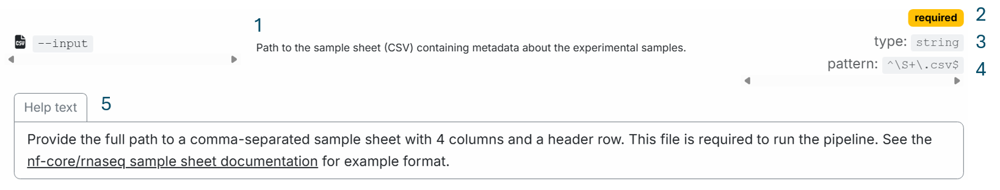
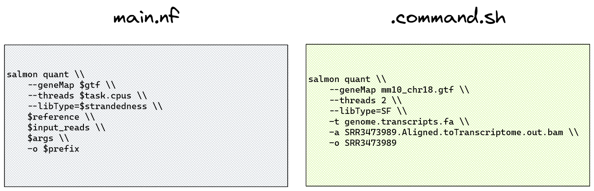

# 2.1 nf-core pipeline parameters

!!! tip "Objectives"

    - Learn how to discover available nf-core pipeline parameters and their default values
    - Use the `nextflow log` command to view task commands executed by a process with their parameters expanded
    - Investigate a run warning message and resolve the issue through parameter application
    - Consider the pros and cons of applying parameters on the command line, within a run script, or via a parameters file
    - Use nf-core pipeline info files to identify the run command and full pipeline parameters of a completed run 


## 2.1.1 Discovering available parameters

In this lesson we will focus on customising nf-core workflows with **parameters**. Understanding what parameters are available to a workflow provides the scope in which you can customise *WHAT* is run. In the next section, we will focus on *HOW* the workflow is run through the use of configuration files. 

When working with a new pipeline, a crucial step to customising it to your experiment data is reviewing available parameters, their meaning, and what defaults may be in place. There are two main methods to discover nf-core pipeline parameters: 

1. nf-core pipeline parameters user guide, found at `nf-co.re/<workflow>/<version>/parameters`
2. nf-core pipeline `help` command, viewed by `nextflow run main.nf|<workflow> --help`

The parameter description provided by each is the same, however the web-based user guide provides more comprehensive information that may be crucial to your correct use of the parameter. 

!!! example "Exercise 2.1.1" :stopwatch: 3 mins

    Compare the information about the nf-core/rnaseq `--input` parameter that is provided by the pipeline parameters user guide and the pipeline `help` menu. 

    Which would you find most useful when setting up a run of this pipeline for your own data?

    ??? success "Solution"

        The [nf-core/rnaseq parameters user guide](https://nf-co.re/rnaseq/3.23.0/parameters) provides five pieces of information about the parameter:

        1. Parameter description
        2. That the parameter is required
        3. Parameter type (string)
        4. Parameter pattern (includes no whitespace, ends in '.csv')
        5. Extended help text with a format description and link to example

        

        In contrast, the command-line help menu provides only two of these five details - the parameter description and type.  

        ```bash
        nextflow run main.nf --input --help | more
        ```

        Reviewing the complete parameter user guide is recommended when setting up and customising your run, particularly if you are new to the pipeline. The help menu can be a handy quick check for available parameters but does not provide as much detail as the user guide. 


## 2.1.2 Find and view a process task command

When we provide a pipeline parameter to a run, the Nextflow workflow script provides that parameter and its provided argument to the appropriate [process](TODO link back to part 1 definition of this term). The process code adds that parameter to the command that is run, pairing it with any other user-supplied, hard-coded, or default parts of the command. 

We could scrutinise this at the code level if desired, however a more user-friendly approach is to view the full command as it was run, with all parameters expanded, or 'interpolated'. 

If you have never run the pipeline before, you won't have the benefit of cached task details in the `work` directory to view the task command, so you would need to manually inspect the code. However, since best practice suggests we always run the nf-core `test` profile before getting started with our own data, this should never be a problem :grin:

Let's consider the example of quantification with the tool Salmon, part of the default pipeline run we executed in [lesson 1.4.3](../session_1/1/4_rnaseq.md#run-the-pipeline). If you were to view the Nextflow code for this process (SALMON_QUANT), you would see the command within Salmon `main.nf` file shown on the left of the diagram below.



This may appear confusing, as we have not directly provided many of the variables shown in that command. To view the command that was *actually* run, we can view the process command within the task **work directory**. The work directory contains numerous folders, each of which are named by a unique hash, so we can't easily find the Salmon quantification directory without the `nextflow log` command. 

To find the specific task work directory, a few `nextflow log` tricks are required, so hints are included! 


!!! example "Exercise 2.1.2" :stopwatch: 6 mins
    Use the `nextflow log <run_name> [options]` command to find the unique task directory for Salmon quantification of sample ID SRR3473988. Then, view the complete command with expanded parameters run by this process.

    ??? tip "Hint 1: use `nextflow log` to find your run name"

        Use `nextflow log` with no options to recover a forgotten run name. Most recent run is printed last (closest to command prompt).

        Run `nextflow log <run-name>` - does this give sufficient detail to find the task directory?  

    ??? tip "Hint 2: Use `nextflow log -help` to print the help menu"

        Pay close attention to `-l`, `-f`, and `-F`.

        What fields and filters could we apply to find the **work directory** for a specific **process**?            

    ??? tip "Hint 3: process vs name"

        Print the process and name fields for your run. What is the difference? 

        The name field contains the process 'tag'. This is an attribute often included in process code to attach a unique identifier to a process, for example the sample ID. 

    ??? tip "Hint 4: Nextflow wildcard regex"

        Nextflow wildcard regex is `.*`, not just `*` like in bash. This is because the `*` means "match any number of the previous character", and the `.` means "any character".

        So to filter on process name, you could either specify an exact match (`==`) to the whole process name, enclosed within double quotes due to the `:` special characters in the full process name, *or* use a pattern match (`=~`) along with the Nextflow wildcard regex.  

    ??? tip "Hint 5: Use `ls -la` to view hidden files"

        The command run by the process is contained within the hidden file `<workdir>/.command.sh`. 

        View this file to see the command with all parameters expanded. 


    ??? success "Solution"

        There are a number of ways in which you could find the answer. Here are three: 

        1. Filter work directories on process using a full match: 
        ```bash
        nextflow log <run-name> -f workdir,name,process -F 'process == "NFCORE_RNASEQ:RNASEQ:QUANTIFY_BAM_SALMON:SALMON_QUANT"'
        ```

        2. Filter work directories on name with Nextflow regex wildcard:
        ```bash
        nextflow log <run-name> -f workdir,name -F 'name =~ /.*SALMON_QUANT.*/'
        ```

        3. Filter with good old grep:
        ```bash
        nextflow log <run-name> -f workdir,name | grep SALMON_QUANT
        ```

        Once the task work directory is found, the full command as executed can be viewed, eg with `cat`:

        ```bash
        cat <workdir>/.command.sh
        ```
        
        ```console title="Output"
        #!/usr/bin/env bash -C -e -u -o pipefail
        salmon quant \
            --geneMap mm10_chr18.filtered.gtf \
            --threads 2 \
            --libType=SF \
            -t genome.transcripts.fa \
            -a SRR3473988.Aligned.toTranscriptome.out.bam \
            \
            -o SRR3473988
        ```


## 2.1.3 Investigate a pipeline warning and resolve with a parameter 

Now that we have learnt how to discover parameters and their meaning, and to find and view process task commands with all parameters expanded, we are equipped to investigate the pipeline warning encountered in [lesson 1.4.3](../session_1/1/4_rnaseq.md#run-the-pipeline):


```console title="Output"
-[nf-core/rnaseq] Pipeline completed successfully with skipped sampl(es)-
-[nf-core/rnaseq] Please check MultiQC report: 2/2 samples failed strandedness check.-
Completed at: 21-Apr-2023 03:58:56
Duration    : 9m 16s
CPU hours   : 0.3
Succeeded   : 66
```

Before we embark on reviewing parameter user guides or cached work directories, we should definitely follow that helpful warning message! 

!!! note "MultiQC report"
    - The MultiQC report is found within the `multiqc` folder of our rnaseq run output directory, which we specified with `--outdir lesson-1.4`


!!! example "Exercise 2.1.3.1" :stopwatch: 2 mins
    Open the `multiqc_report.html` file by right-clicking the file and selecting `Open with Live Server`.

    Search the report for details related to the warning message. 

    ??? success "Source of warning"

    The warning we have received is indicating that our samples failed the `Strandedness Checks` performed by the RSeqQC process. The table shows `Provided strandedness` as 'forward', yet RSeqQC has assessed the data as being 'unstranded'. 

    The source of the 'forward' strand was our samplesheet. Recall Exercise 2.1.1, where we viewed the `--input` parameter user guide. The link to samplesheet format guide described four mandatory columns, one for 'strandedness'. The wrong strand has been supplied in the samplesheet.  
    
    

Now that we have identified the source of the warning, we should correct it to ensure that our data is analysed with the appropriate parameters. 

!!! example "Exercise 2.1.3.2" :stopwatch: 5 mins
    Use the [nf-core/rnaseq parameters guide](https://nf-co.re/rnaseq/3.23.0/parameters/) to find the parameter that can correct our strandedness issue, and identify the argument to provide for our data.

    Then, re-submit the last nf-core/rnaseq run, adding this pipeline parameter and its argument to the run command. Also include the Nextflow `-resume` flag 

    !!! tip "Hint: expand the 'Help text' when you find the right parameter!"

    ??? success "Solution"

    ```console title="Output"
    --salmon_quant_libtype  Override Salmon library type inferred based on strandedness defined in meta object.
    ```

    ```bash
    nextflow run rnaseq/main.nf \
        --input /home/<username>/data/samplesheet.csv \
        --outdir lesson-1.4 \
        --fasta /home/<username>/data/mm10_reference/mm10_chr18.fa \
        --gtf /home/<username>/data/mm10_reference/mm10_chr18.gtf \
        --star_index /home/<username>/data/mm10_reference/STAR \
        --salmon_index /home/<username>/data/mm10_reference/salmon-index \
        -profile singularity \
        --skip_markduplicates true \
        -c nectar_vm.config \
        --salmon_quant_libtype U \
        -resume 
    ```          

This will take 1-2 minutes to run. Observe that some processes now show 'cached' status, while others (SALMON_QUANT and any process that uses the output of SALMON_QUANT) must be re-run due to the new parameter changing the process code and output files. 


**Why is the warning still present?**

Recall the Salmon quant process command we viewed in Exercise 2.1.2: 

```console title="Output"
#!/usr/bin/env bash -C -e -u -o pipefail
salmon quant \
    --geneMap mm10_chr18.filtered.gtf \
    --threads 2 \
    --libType=SF \
    -t genome.transcripts.fa \
    -a SRR3473988.Aligned.toTranscriptome.out.bam \
    \
    -o SRR3473988
```

Using the same process, review the Salmon quant command from your latest run with the new parameter applied:

```bash
nextflow log <run-name> -f workdir,name -F 'name =~ /.*SALMON_QUANT.*/'
cat <workdir>/.command.sh
```

```console title="Output"
#!/usr/bin/env bash -C -e -u -o pipefail
salmon quant \
    --geneMap mm10_chr18.filtered.gtf \
    --threads 2 \
    --libType=U \
    -t genome.transcripts.fa \
    -a SRR3473989.Aligned.toTranscriptome.out.bam \
     \
    -o SRR3473989
```

:bulb: Note the difference~ By applying nf-core/rnaseq parameter `--salmon_quant_libtype U` to our run command, we have changed the Salmon quant command to use 'U' instead of 'SF' at the Salmon parameter `--libType`. 

The residual warning occurs because the "supplied strandedness" within our *samplesheet.csv* is still a mismatch between that inferred by the RSeQC `infer_experiment.py` process! The output of Salmon quantification at least is now correct. Yet how can we be sure that the strand from the samplesheet is not affecting other processes? Without digging very deep into the codebase, we can't, so the best way to resolve this issue confidently would be to **change the strand in the samplesheet**. We will do this in the next lesson. 


## 2.1.4 Reproducibility and portability

**Reproducibility:** being able to run the same bioinformatics data analysis again and get the same results

**Portability:** being able to run that bioinformatics analysis on different computers or systems without needing major changes

These are two foundational concepts in rigorous science, and Nextflow and nf-core help support them by providing standardised, reusable workflows that can be run consistently across different environments. 

From the exercise above, we have seen the complexity of an nf-core pipeline, and how designing and customising a run requires thorough attention to what is being run. We have learnt how to check parameter usage and verify what is being run at the process level, but with so many tool and parameter options within a pipeline, how do we ensure that our runs can be reproduced, either by ourselves, other lab members, or peer reviewers?   

In this lesson we will explore three different ways an nf-core pipeline can be run. You have already practiced one method, which is to **type the full run command at the command prompt** (or retrieve it from history for resumed runs!). While this is handy for a quick test run, it is ***not recommended for reproducible research***. First of all, the commands can get really long! But most important is the difficulty keeping track of what has been run on what data with what parameters. 

The preferred means of running nf-core worflows over real research data are using a **run script** in which all parameters are saved, or using a **parameters file** which performs a similar function, yet with a different format. Parameters files can be supplied to the run command at the command prompt, or included within a run script.  

### 2.1.4.1 Using a run script

The run script is a standard bash script that saves the commands you would enter at the command prompt within a script. 

No special formatting is required, although you can choose to split the long run command over multiple lines for improved readability by using `\` continuation characters, or save frequently changed parameters as variables to make portability to other datasets or compute platforms easier. 

By saving the run command and all custom parameters within a run script, we make it easy to back up our run method along with the raw data and pipeline outputs, ensuring the analysis can be reproduced. 

!!! example "Exercise 2.1.4.1" :stopwatch: 5 mins
    Create a file called `run_rnaseq.sh` and copy your most recent run command into this script, omitting the `--salmon_quant_libtype` parameter.

    Change the value of `--outdir` to 'lesson-2.1'. 

    Additionally, search the [nf-core/rnaseq parameters guide](https://nf-co.re/rnaseq/3.23.0/parameters) for the parameters that control saving trimmed fastq and unaligned reads, and add these parameters to the run script. 

    Finally, change the 'stranded' metadata for our two samples to 'unstranded' within `samplesheet.csv`.

    Save the  script, then submit your updated run with the command `bash run_rnaseq.sh`.

    ??? success "Solution"

    Example script with no variables or line continuation characters:

    ```bash
    #!/bin/bash

    nextflow run rnaseq/main.nf --input /home/tdev02/data/samplesheet.csv --outdir lesson-2.1 --fasta /home/tdev02/data/mm10_reference/mm10_chr18.fa --gtf /home/tdev02/data/mm10_reference/mm10_chr18.gtf --star_index /home/tdev02/data/mm10_reference/STAR --salmon_index /home/tdev02/data/mm10_reference/salmon-index  -profile singularity --skip_markduplicates true -c nectar_vm.config -resume --save_trimmed true --save_unaligned true
    ```

    Example script with variables for portability and line continuation characters for readability:

    ```bash
    #!/bin/bash

    samplesheet=/home/tdev02/data/samplesheet.csv
    output_directory=lesson-2.1
    ref_fasta=/home/tdev02/data/mm10_reference/mm10_chr18.fa
    ref_gtf=/home/tdev02/data/mm10_reference/mm10_chr18.gtf
    star_index=/home/tdev02/data/mm10_reference/STAR
    salmon_index=/home/tdev02/data/mm10_reference/salmon-index
    institutional_config=nectar_vm.config

    nextflow run rnaseq/main.nf \
        --input ${samplesheet} \
        --outdir ${output_directory} \
        --fasta ${ref_fasta} \
        --gtf ${ref_gtf} \
        --star_index ${star_index} \
        --salmon_index ${salmon_index} \
        -profile singularity \
        --skip_markduplicates true \
        -c ${institutional_config} \
        -resume \
        --save_trimmed true \
        --save_unaligned true 
    ```


:clock4: Our run will take approximately 5.5 minutes to complete. 


!!! abstract "Poll 2.1.4"

    Which of the changes that we made do you think will cause 100% of the tasks to be re-run (not cached?)

    a) Changing the value of parameter `--outdir`
    b) Adding parameters to save trimmed and unaligned reads
    c) Changing the strandedness within the samplesheet 
    d) Submitting the run with a run script rather than at the command prompt

    ??? success "Answer"

        c) Changing the strandedness within the samplesheet

        Even though some processes don't use the 'strandedness' field so are not actually impacted by this change, Nextflow perceives that the input has changed and does not scrutinise the code run by each process when deciding when to cache or re-run. 

        a) and d) are incorrect, because changing `--outdir` and submitting the run command wrapped in a script rather than at the command prompt does not change the inputs or code. Nextflow would cache all processes with just these two changes. 

        b) is incorrect because the parameters `--save_trimmed` and `--save_unaligned` change the command run by the STAR_ALIGN module. Nextflow would re-run STAR_ALIGN and all downstream processes that read its output, but cache all processes upstream of STAR_ALIGN. 


 

### 2.1.4.2 Using a parameters file

Similar to the run script, the parameters file keeps all your pipeline parameters neatly together. In addition, it prevents mixing Nextflow `-` parameters and nf-core pipeline `--` parameters together at the run command. If you prefer to use a parameters file, you may also choose to save the command within a run script, for similar ease of use reasons as described earlier. 

The format of a parameters file can be .yaml or .json. 

Example yaml-formatted parameters file:

```yaml
input: samplesheet.csv
outdir: results
max_memory: 128.GB
max_cpus: 16
```

Example json-formatted parameters file:

```json
{
  "input": "samplesheet.csv",
  "outdir": "results",
  "max_memory": "128.GB",
  "max_cpus": 16
}
```

!!! example "Exercise 2.1.4.2" :stopwatch: 5 mins
    Convert your run from Exercise 2.1.4.1 into a yaml-formatted parameters file named `rnaseq_params.yaml` and a run script `run_rnaseq_with_yaml.sh`. 

    If you are feeling adventurous, search the [nf-core/rnaseq parameters guide](https://nf-co.re/rnaseq/3.23.0/parameters) for any other parameters that you may wish to try. 

    Or, test your Nextflow cache, and re-submit the identical run!

    Submit your run, including `-params-file rnaseq_params.yaml` at the run command, either at the command prompt or via a run script. 

    ??? success "Solution" 

    `rnaseq_params.yaml`. Aligning the values is optional but can aid readability. 

    ```yaml
    input                  : /home/tdev02/data/samplesheet.csv
    outdir                 : lesson-2.1
    fasta                  : /home/tdev02/data/mm10_reference/mm10_chr18.fa
    gtf                    : /home/tdev02/data/mm10_reference/mm10_chr18.gtf
    star_index             : /home/tdev02/data/mm10_reference/STAR
    salmon_index           : /home/tdev02/data/mm10_reference/salmon-index
    skip_markduplicates    : true
    save_trimmed           : true
    save_unaligned         : true 
    ```

    `run_rnaseq_with_yaml.sh`: 

    ```bash
    #!/bin/bash

    params=rnaseq_params.yaml
    institutional_config=nectar_vm.config

    nextflow run rnaseq/main.nf \
        -profile singularity \
        -c ${institutional_config} \
        -params-file ${params} \ 
        -resume
    ```

!!! abstract "Poll 2.1.4"

    We have now run the nf-core/rnaseq pipeline with a few different run methods. These methods can be used to run any nf-core pipeline or Nextflow workflow. There are pros and cons to each method.

    Which do you prefer? Why do you prefer that method?

    a) CLI: Run command and all parameters entered at the command prompt 
    b) Run script: Run command and all parameters contained within a run script 
    c) Params file + CLI: All parameters contained within a parameters file and the run command with Nextflow parameters entered at the command prompt  
    d) Params file + run script: All parameters contained within a parameters file and the run command with Nextflow parameters contained within a run script


## 2.1.5 Hidden value within the pipeline_info 

nf-core have provided a safe-guard against incomplete run records by including your run command as well as all workflow parmaters to files within `<outdir>/pipeline_info`.

### Run command and summary report 

!!! example "Exercise 2.1.5.1" :stopwatch: 2 mins

    In the VS Code file explorer to the left, open the `lesson-2.1/pipeline_info` folder. Right click your most recent `execution_report_<date>_<time>.html` file in a browser by right-clicking and selecting 'Open with Live Server'. 
    
    !!! tip If you have run more than one run with the same output directory specified, you will see multiple execution reports. Date and timestamps ensure no pipeline_info files are over-written. 

    Observe the run command printed at the top of the report, then explore the rest of the report. 

    !!! tip The report can be used to identify compute resources used by each process, helping to fine-tune resource configurations when building an institutional config for your compute platform. Another useful file for this is `execution_trace_<date>_<time>.txt` 


### json file of all parameters

As we have seen so far, there are numerous pipeline parameters available for user control, as well as default pipeline parameters that will be invoked unless over-ridden. To ensure that there is no ambiguity about what non-custom parameters were applied to a run, nf-core have included a `params_<date>_time>.json` file within the `pipeline_info` folder. 

!!! example "Exercise 2.1.5.2" :stopwatch: 2 mins
    In the VS Code file explorer to the left, open the `lesson-2.1/pipeline_info` folder. Double click your most recent `params_<date>_time>.json` file. 

    Scroll down to review the parameters - there are over 100! 
    
    You should be able to spot your custom parameters, including those required (eg `"input": "/home/<username>/data/samplesheet.csv"`) and those optional (eg `skip_markduplicates": true`). Many are set to 'null' or 'false'. The others have been applied to your analysis by default. 
    
    This file is a valuable resource to understanding what has been run over your data.

In the next lesson, we will use files within the nf-core `pipeline_info` directory to guide configuration customisations, further demonstrating their utility in understanding the pipeline we are using to analyse our data.  

!!! note "Key points"

    - nf-core pipeline documentation is comprehensive and should always be consulted when customising a run
    - Default values for nf-core pipeline parameters can be over-ridden with parameters provided on the command line, within a run script, or within a parameters file, with the latter two approaches favoured for ease of portability and reproducibility
    - `nextflow log` can be used to help debug warnings or errors, as well as help us understand what command a specific task is running
    - nf-core pipeline_info files are a valuable resource to understanding as well as reproducing a run 


