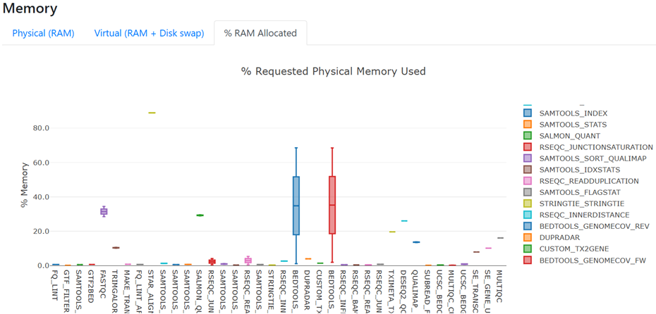
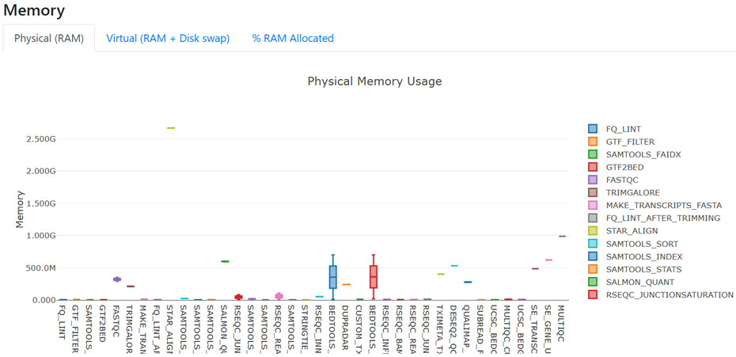

# 2.2 Custom configuration files for your environment

!!! tip "Objectives"

    - Learn how to check the default configurations that are applied to nf-core workflows
    - Understand how to over-ride default configurations with custom configuration files
    - Write a custom configuration file for your local environment and apply this as a `-profile` to your run
    - Observe the hierarchy of custom configurations in action

## 2.2.1 Separation of parameters and configurations

In [Lesson 2.1](./2.1_params.md), we explored how to customise a run with **nf-core pipeline parameters** on the command line, within a parameters file, or using a run script. In this lesson we will expand upon the Nextflow **configuration settings** introduced in [Lesson 1.3](../session_1/1.3_configure.md). 

Pipeline parameters control *what* is run, where configurations control *how* it is run. Customising configurations can be an essential part of getting the workflow to run on your compute system, whether that be your local computer, a remote server or VM, cloud, or High Performance Computer (HPC).

!!! note "Portability and reproducibilty" 

    Nextflow's portability is achieved by separating **workflow implementation** (input data, custom parameters, etc.) from the **configuration settings** (tool access, compute resources, etc.) required to execute it. This portability facilitates reproducibility: by applying the same parameters as a colleague, and adjusting configurations to suit your platform, you can achieve the same results on any machine with no requirement to edit the pipeline source code.


## 2.2.2 Default nf-core configuration

Recall from [Lesson 1.3.1](../session_1/1.3_configure.md/#131-introduction-to-nextflow-configuration) that when a pipeline script is launched, Nextflow looks for [configuration files in multiple locations](https://www.nextflow.io/docs/latest/config.html#configuration-file).

In order of priority, lowest to highest, these are:

1\. `$NXF_HOME/config` (defaults to `$HOME/.nextflow/config`)

**2. `nextflow.config` in the pipeline directory (eg `~/session2/rnaseq/`)**

3\. `nextflow.config` in the launch directory (eg `~/session2/`)

4\. Config files specified with `-c <config-files>`

<br>

At level 2 of the above priority list is the file `<pipeline>/nextflow.config`. This file also applies `<pipeline>/conf/base.config` to the workflow execution with the following statement:

```groovy
includeConfig 'conf/base.config'
```

Together, these two configuration files define the default execution settings and parameters of an nf-core pipeline. 

Let's take a look at these two configuration files for the `nf-core/rnaseq` pipeline to gain an understanding of how defaults are applied.

<br>

### 2.2.2.1 `conf/base.config`

!!! example "Exercise 2.2.2.1 :stopwatch: 1 min"

    Use the `code` command to open `rnaseq/conf/base.config` in the VS Code editor, then scroll through the file.

    What does this config file do?

    ??? success "Solution"

        ```bash
        code rnaseq/conf/base.config
        ```

        - It sets the **default compute resources** for all processes in the nf-core pipeline
        - It uses descriptive **process labels** to set compute resources
        - The config is generic/pipeline agnostic: it does not name any particular pipeline or process, and assumes we are running locally with all required tools available  

    How can we over-ride these default compute resources with our custom resources?

    ??? success "Solution" 

        We can over-ride these default compute resources using a custom configuration file.

<br>

### 2.2.2.2 `nextflow.config`

!!! example "Exercise 2.2.2.2 :stopwatch: 2 mins"

    Use the `code` command to open `rnaseq/nextflow.config` in the VS Code editor, then scroll through the file.

    What does this config do?

    ```bash
    code rnaseq/nextflow.config
    ```

    ??? success "Solution"

        - The `nextflow.config` file is pipeline-specific, and sets the defaults for the pipeline parameters
        - It defines profiles to change the default software access from $PATH to the specified access method, eg singularity
        - It has a number of `includeConfig` statements to bring in other configurations required for this pipeline

    How can we over-ride these default pipeline parameters with our custom parameters? 

    ??? success "Solution"

        We can over-ride the default pipeline parameters on the command line (`--<param> <arg>`) or within a parameters file 

<br>

### 2.2.2.3 Discovering default process settings

 Understanding how to discover default process settings from within the default configuration files of an nf-core pipeline can be very useful when it comes to customising a run for your data and computing platform, for example when trying to identify or modify the CPU and memory requirements for a process.


!!! example "Exercise 2.2.2.3 :stopwatch: 3 mins"

    What are the default settings for CPU and memory for the STAR_ALIGN module?

    ??? hint "Hint 1: Process labels"
        
        To uncover the default compute resources for the STAR_ALIGN process, we need to find out what **process label** has been assigned to this process. 
        
        Process labels are used in `conf/base.config` to assign default compute resources. 

        Find the process label within the STAR_ALIGN `main.nf` file, and check the resources assigned to that label within `conf/base.config`.

    ??? hint "Hint 2: STAR_ALIGN module script"
        
        Recall from [Lesson 1.1.3](../session_1/1.1_nfcore.md/#113-nf-core-workflow-structure) that each process (or 'module') has its own `main.nf` file which includes the Nextflow code to set up the task as well as the actual command to run the analysis. The STAR_ALIGN process label will be included within this script.          

        Finding the `main.nf` script for STAR_ALIGN or any other process can be a little tricky, since nf-core pipelines are a collection of workflows, subworkflows, and modules, that can be local (i.e. used only by) the pipeline, or those that are widely used on other nf-core pipelines. 

        Applying the knowledge that all nf-core module scripts are named `main.nf`, we can't search for the file by name, but we can search for the tool name in the module filepath. nf-core filepaths use lower-case, while the process names themselves use capitals, such as STAR_ALIGN. 

        The bash command below will help you find the STAR_ALIGN `main.nf` file:

        ```bash
        find ./rnaseq/ -type d  -name "*star*" -print
        ```

    ??? success "Solution"

        **Step 1:** Find the STAR_ALIGN module execution file (main.nf)
        
        Searching for `star` in the `nf-core/rnaseq` codebase yields the following output: 

        ```bash
        find ./rnaseq/ -type d  -name "*star*" -print
        ```
    
        ```console title="Output"
        ./rnaseq/modules/nf-core/sentieon/staralign
        ./rnaseq/modules/nf-core/star
        ./rnaseq/subworkflows/local/align_star
        ```

        In [Lesson 1.1.3](../session_1/1.1_nfcore.md/#113-nf-core-workflow-structure) we learnt that a subworkflow is a collection of modules. 

        Looking in the subworkflow script shows that the STAR_ALIGN module is part of this workflow, with module path `modules/nf-core/star/align`:
        
        ```bash
        code ./rnaseq/subworkflows/local/align_star/main.nf
        ```

        ```groovy title="First 8 lines of ./rnaseq/subworkflows/local/align_star/main.nf" hl_lines="6"
        //
        // Alignment with STAR
        //
        include { SENTIEON_STARALIGN as SENTIEON_STAR_ALIGN } from '../../../modules/nf-core/sentieon/staralign/main'
        include { PARABRICKS_RNAFQ2BAM as PARABRICKS_RNA_FQ2BAM } from '../../../modules/nf-core/parabricks/rnafq2bam/main'
        include { STAR_ALIGN                                } from '../../../modules/nf-core/star/align'
        include { STAR_ALIGN as STAR_ALIGN_IGENOMES          } from '../../../modules/nf-core/star/align'
        include { BAM_SORT_STATS_SAMTOOLS                   } from '../../nf-core/bam_sort_stats_samtools'
        ```

        **Step 2:** Find the process label within the STAR_ALIGN main.nf file:

        The process label can then be found in the `modules/nf-core/star/align/main.nf` file, by viewing the file directly (the label will be near the top):
        
        ```bash
        code ./rnaseq/modules/nf-core/star/align/main.nf
        ```

        ```groovy title="First 3 lines of ./rnaseq/modules/nf-core/star/align/main.nf" hl_lines="3"
        process STAR_ALIGN {
        tag "$meta.id"
        label 'process_high'
        ```
        
        Or with the `grep` command:

        ```bash
        grep label ./rnaseq/modules/nf-core/star/align/main.nf 
        ```
        
        ```console title="Output"
        label 'process_high'
        ```

        **Step 3:** Identify the default resources assigned to that process label 

        Open `conf/base.config` and search for the `process high` resources. This shows that the STAR_ALIGN process will receive 12 CPU and 72 GB memory by default. 

        ```bash
        code ./rnaseq/conf/base.config
        ```
        ```groovy title="Output"
        withLabel:process_high {
            cpus   = { 12    * task.attempt }
            memory = { 72.GB * task.attempt }
            time   = { 16.h  * task.attempt }
        }
        ```

## 2.2.3 When to use a custom config file

In [Lesson 1.4.4](../session_1/1.4_rnaseq.md/#144-setting-resource-limits), we applied custom configurations to the rnaseq pipeline to restrict the maximum amount of CPUs and memory each process can use with the custom config we created. As observed when we attempted to run the pipeline before adding that configuration, this customisation was required in order to run the pipeline in our environment. 

Apart from reducing resources to adapt to a low-resource compute environment, there are other circumstances in which our nf-core pipeline run can benefit from custom configurations:

- Increase process resources to take advantage of high CPU or high memory infrastructure
- Increase process resources to adapt to large or complex datasets that require greater compute than defined by the defaults. You will know this is required when your run fails with an out of memory or out of walltime error!
- Adjust resources for bottleneck processes to promote better throughput considering the shape of the compute hardware
- Execute specific modules on specific node types on a cluster, for example trying out the latest GPU queue for a GPU-enabled tool used by the pipeline
- Test out a newer version of a tool used in the pipeline 
- Customise outputs beyond what is possible using the nf-core pipeline parameters


The rest of Lesson 2.2 will explore custom resource configuration files. We won't be covering customising runs for HPC in this workshop, but please check out our [Nextflow for HPC workshop](https://zenodo.org/records/17694728) later if you are interested in this.

## 2.2.4 Configuration profiles

In [Lesson 1.4.4](../session_1/1.4_rnaseq.md#144-setting-resource-limits) we started developing a custom config for our workshop Nectar VMs. We applied this config to our run using the Nextflow `-c <myconfig>` parameter. 

Custom configurations can also be included as a `profile`, just as we did for the MultiQC report configuration in [Lesson 1.3.6](../session_1/1.3_configure.md/#custom-profiles). Profiles are the way in which nf-core's global community-driven shared institutional configs, introduced in [Lesson 1.3.5](../session_1/1.3_configure.md#135-shared-configuration-files), can be applied to your pipeline runs on any of the platforms included in the shared config collection. 

We recommend you use the [NCI Gadi shared config](https://nf-co.re/configs/nci_gadi) or [Pawsey Setonix shared config](https://nf-co.re/configs/pawsey_setonix) if you run nf-core pipelines on these national HPCs. If the computer you are running your nf-core pipelines on does not have a shared config, you may need to create a custom config so that the run can complete with the hardware available on your machine. 


!!! tip "Using a shared configuration profile"

    To use a shared configuration file for your run, include the relevant profile name, for example:

    ```bash
    nextflow run <pipeline> -profile singularity,nci_gadi
    ```

    If you apply a shared config profile and you do not have a copy of the shared config in `<workflow>/conf`, the pipeline will fetch it at run time. 

    If you are running in an environment with no external internet connection, you will need to pre-download the config, as well as singularity images. If this describes your environment, we recommend the following command, to fetch the entire pipeline code, required images, and shared config files:


    ```bash
        nf-core pipelines download <pipeline> \
        --revision <revision> \
        --outdir <outdir> \
        --container-system singularity \
        --compress none \
        --download-configuration yes
    ```

### 2.2.4.1 Using a custom configuration profile

To add a custom profile to a run command, the configuration file which the profile is defined in must be applied to the run, either directly with `-c <myconfig>`, via `includeConfig` within another applied config, or through the default locations that Nextflow searches for configuration files.

In order of priority, lowest to highest, these are:

1\. `$NXF_HOME/config` (defaults to `$HOME/.nextflow/config`)

2\. `nextflow.config` in the pipeline directory (eg `~/session2/rnaseq/`)

3\. `nextflow.config` in the launch directory (eg `~/session2/`)

**4\. Config files specified with `-c <config-files>`**

<br>

We do not recommend **implicitly** relying on Nextflow's default inclusion of custom configs within a user's home (hierarchy level 1) or `nextflow.config` within the launch directory (hierarchy level 3). This can create confusion as to where options are being applied. Being **explicit** with `-c` makes it obvious what options are being applied.

Custom configs should have **descriptive names** that are distinct from other config names found within the nf-core pipeline code, and be accessible to others in your group. Avoiding the use of `nextflow.config` and not saving configs in user home directories is recommended.

<br>

As we continue customising our run for our small test data on the workshop VMs, it makes sense to **define a profile**. 

!!! example "Exercise 2.2.4.1:stopwatch: 5 mins" 

    - Create a new file called `workshop_profile.config`
    - Within the `profiles` scope, define a new profile called `workshop` 
    - Instruct the workshop profile to include our VM config by adding `includeConfig 'nectar_vm.config'`


    ??? hint "Hint: `profiles` syntax"
        Check the [Nextflow profiles scope docs](https://docs.seqera.io/nextflow/config#config-profiles) or revisit [Lesson 1.3.9](../session_1/1.3_configure.md/#139-custom-profiles) for syntax guidance. 

    ??? success "Solution"

        ```groovy title="workshop_profile.config"
        profiles {
            workshop {
                includeConfig 'nectar_vm.config'
            }
        }
        ```


<br>

To apply this profile to our run, we include the custom profile name and the custom profile config file to the Nextflow run command. We no loner need to add `-c nectar_vm.config`, because this has been 'included' within the `workshop` profile:

```bash
nextflow run rnaseq/main.nf -profile singularity,workshop -c workshop_profile.config ...
```
<br>

We can further simplify the run command by enabling Singularity within our institutional config using the [`singularity scope`](https://docs.seqera.io/nextflow/reference/config#singularity). Since Singularity will always be the software management profile used on these workshop VMs, it makes sense to add this to our institutional config. 

!!! note "Singularity options"

    Nextflow has a number of [options for using singularity](https://docs.seqera.io/nextflow/reference/config#singularity) that allow control of how containers are executed.
    
    We will add the `enabled` option to use Singularity to manage containers (default: false), and `cacheDir` to specify the Singularity cache directory.
    
    Even though we have set `cacheDir` within our user profile in [Lesson 1.2.2](../session_1/1.2_run.md/#122-managing-your-environment) so is not strictly required for these exercises, explicitly including it can avoid confusion and make customising it for a given pipeline easier.

<br>

!!! example "Exercise 2.2.4.2 :stopwatch: 4 mins"

    - Open `nectar_vm.config` with `code`
    - Within the `singularity scope`, enable the use of Singularity
    - Also set the Singularity `cacheDir` to the path specified in [Lesson 1.2.2](../session_1/1.2_run.md/#122-managing-your-environment), taking care to replace `<USERNAME>` with your VM login name

    ```groovy title="nectar_vm.config" hl_lines="7-10"
    process {
        resourceLimits = [
            cpus: 2,
            memory: 6.GB
        ]
    }
    singularity {
        enabled     = true
        cacheDir    = '/home/<USERNAME>/singularity_cache'
    }
    ```

    - Change the `--outdir` directory to 'lesson-2.2' in the `run_rnaseq.sh` script file 
    - Before we re-run the pipeline, what other changes should we now make to our run command? 
    - Make these required changes to your command within `run_rnaseq.sh` and re-run the script, ensuring that the `-resume` flag is included.

    ??? success "Solution" 

        The script below has replaced the 'singularity' profile with 'workshop' profile.
        
        Parameters have also been reordered to group pipeline and Nextflow parameters. This is not necessary but can aid clarity.   

        ```bash title="run_rnaseq.sh" hl_lines="12 13 25"
        #!/bin/bash

        # parameters
        samplesheet=~/data/samplesheet.csv
        output_directory=lesson-2.2
        ref_fasta=~/data/mm10_reference/mm10_chr18.fa
        ref_gtf=~/data/mm10_reference/mm10_chr18.gtf
        star_index=~/data/mm10_reference/STAR
        salmon_index=~/data/mm10_reference/salmon-index

        # configurations
        profile=workshop
        config=workshop_profile.config

        nextflow run rnaseq/main.nf \
            --input ${samplesheet} \
            --outdir ${output_directory} \
            --fasta ${ref_fasta} \
            --gtf ${ref_gtf} \
            --star_index ${star_index} \
            --salmon_index ${salmon_index} \
            --skip_markduplicates true \
            --save_trimmed true \
            --save_unaligned true \
            -profile ${profile} \
            -c ${config} \
            -resume
        ```

Since we have not changed anything that affects input or output files, all tasks should have been cached, except MultiQC. 


## 2.2.5 Custom resource configuration

Each process in an nf-core pipeline is assigned a resource **label** (e.g. `process_low`, `process_medium`) which maps to a default CPU and memory value. In [Lesson 2.2.2.1](./#2221-confbaseconfig) we saw that these are set within the nf-core `conf/base.config` file. We can override these defaults for any process in a custom config file, which has the **highest priority** in the [Nextflow configuration hierarchy](./#2241-using-a-custom-configuration-profile).


In the next two exercises, we’ll reduce the resources assigned to processes to better match the machine we’re working on. We will add our custom resource configurations to the `nectar_vm.config` created in [Lesson 1.4.4](../session_1/1.4_rnaseq.md/#144-setting-resource-limits).

!!! note "Workshop VM resources"

    Our Nectar workshop VMs have 4 CPU and 8 GB memory. 
    
    In [Lesson 1.4.4](session_1/1.4_rnaseq.md/#144-setting-resource-limits) we restricted the resources available to the pipeline to 2 CPU and 6 GB RAM. This ensures the run can complete, while reserving some overhead so that we can continue to work on the VMs.


!!! tip "Will I need to do this to run nf-core on my compute platform?"

    It may not be required to customise the resources from their defaults for your input data and machine. To know if this is required, it can be helpful to utilise the `-profile test` run shipped with nf-core pipelines to detect any issues before commencing a run with your real data.

    In some cases (e.g. `nf-core/rnaseq`) the `test` profile runs with *reduced resources* (see in `<pipeline>/nextflow.config`) so this may not flag insufficient resources. If the pipeline has a `test_full` profile, you can try out that way, or use a subset of your real data to test with.

    If your machine does not enough CPU or RAM to meet the default resource settings, the run will fail as demonstrated in [Lesson 1.4.3](session_1/1.4_rnaseq/#143-run-the-pipeline). You can then *reduce* these resources in your custom config file.

    If your real data requires **more** resources than are provided by the defaults, nf-core pipelines are configured to "retry" processes a second time with double the default CPUs and RAM. If this is not sufficient to complete your run, you can *increase* the resources within your custom config file.


### 2.2.5.1 Process selector hierarchy

We can target our custom resource configurations to specific processes using [`process selectors`](https://docs.seqera.io/nextflow/config#process-selectors) introduced in [Lesson 1.3.6](session_1/1.3_configure/#configuring-processes). These are defined within the [`process scope`](https://docs.seqera.io/nextflow/config#process-configuration), the same scope in which we have already applied our 2 CPU and 6 GB RAM `resourceLimits`. 

The `withName` and `withLabel` process selectors allow you to precisely customise a single process or group of processes without having to edit the nf-core source code. As usual, there is a predictable hierarchy applied by Nextflow to determine which setting is priority in the case of a setting being applied in more than one place.

Process configuration settings hierarchy (from lowest to highest priority):

1. Process configuration settings (without a selector)
2. Process directives in the process definition
3. `withLabel` selectors matching any of the process labels
4. `withName` selectors matching the process name
5. `withName` selectors matching the process included alias
6. `withName` selectors matching the process fully qualified name


### 2.2.5.1 Viewing resources used

Before customising resources for the workshop VMs, let's review how the pipeline has been running with the 2 CPU and 6 GB RAM over-ride we have already applied. The summary report introduced in [Lesson 2.1.6.1](2.1_params.md/#2161-summary-report) provides resource usage graphs that be helpful here. 

!!! example "Exercise 2.2.5.1 :stopwatch: 3 mins"

    Open your most recent run report by finding the file in the filesystem explorer in the left hand pane of VS Code, right click and select 'Open with Live Server'.

    The filepath should match the pattern `lesson-2.2/pipeline_info/execution_report_<date>_<time>.html`. 

    - Under the heading 'Resource Usage', view the figure for raw CPU usage
        - Many of the processes are using between 1 and 2 CPU, which means they are making good use of the 2 CPU available to each process. We don't need to do anything further to customise CPU resources for our current compute environment.

    

    <br>

    - Under the heading 'Resource Usage', view the figure for Memory and toggle to '% RAM Allocated'
        - Most processes are using < 40% of the allocated RAM. This indicates that RAM has been *over-allocated* for our needs. Configuring our run to allocate less RAM to each process may enable faster run completion time

    

    <br>

    - Toggle the Memory figure back to 'Physical (RAM)'
        - All processes are using < 1 GB RAM, *except* STAR_ALIGN which uses ~2.5-3 GB

    
<br>

### 2.2.5.2 Customising with process labels

Now we have an understanding of what custom resource configurations are practical for our input data and machine, we will use the `withLabel` process selector to reduce the memory allocated to processes according to their label. 

To make this simpler, we can use wildcards (`*`) and 'or' (`|`) notation with `withLabel` to apply the same configuration to more than one process label. 


!!! example "Exercise 2.2.5.2 :stopwatch: 5 mins"

    - Within `nectar_vm.config`, use the `withLabel` directive to reduce the memory for processes with labels 'process_single' and 'process_low' to 1 GB
    - Reduce the memory to 2 GB for processes with labels 'process_medium' and 'process_high'

    ??? hint "Which config scope?"
        `withLabel` selectors are defined within the `process` scope.

    ??? hint "Syntax help"
        Inspect `conf/base.config` with the `code` command to see how `withLabel` blocks are constructed.
        
        We will use the same syntax, but can save a few lines by using the 'or' notation, for example `'label_1|label_2'`

    ??? success "Solution" 

        ```groovy title="nectar_vm.config" hl_lines="6-11"
        process {
            resourceLimits = [
                cpus: 2,
                memory: 6.GB
            ]
            withLabel: 'process_single|process_low' {
                memory = 1.GB
            }
            withLabel: 'process_medium|process_high' {
                memory = 2.GB
            }           
        }
        singularity {
            enabled     = true
            cacheDir    = '/home/tdev02/singularity_cache'
        }
        ```

<br>


Before we re-run the pipeline with these customisations, recall the memory usage shown in the execution report. All processes used ~ < 1 GB *except* STAR_ALIGN, which used ~2.5-3 GB. Our `withLabel` has reduced the memory for *all* processes with the `process_high` label, not just those that were over-allocated RAM. This could cause STAR_ALIGN to fail due to insifficient memory, or run for longer than it otherwise would.

We clearly need a more precise instrument! The `withName` process selector enables targeting a specific process by name. 


### 2.2.5.2 Customising with process names

The `withName` process selector is a powerful tool: 

- Enables custom over-rides of default configurations at the per-process level
- Multiple module names can be supplied using wildcards (`*`) and 'or' (`|`) notation
- No need to edit the module `main.nf` file to add a process label
- Has a [higher priority](https://docs.seqera.io/nextflow/config#selector-priority) than `withLabel`
- Multiple means of name matching for **precise hierarchical application of custom configurations**

<br>

To utilise `withName`, we first need to ensure we have the correct and specific process name. For utmost specificity, the 'fully qualified name' is safest.  

In nf-core pipelines, the fully qualified process name, also referred to as the **process execution path**, is built from the pipeline name, one or more workflows or subworkflows, and the final process name. For example:

```groovy
PIPELINE_NAME:WORKFLOW_NAME:SUBWORKFLOW_NAME:PROCESS_NAME
```

It can be tricky to identify the process execution path, as nf-core pipelines can contain multiple workflows and subworkflows. From a completed run, you can obtain the process execution path from the execution trace, timeline or report files within `<outdir>/pipeline_info`.

!!! example "Exercise 2.2.6.1 :stopwatch: 2 mins"

    Identify the complete process execution path for the STAR_ALIGN module from the execution trace file, either by viewing the file with `code lesson-2.2/pipeline_info/execution_trace_<date-timestamp>.txt` or using `grep`:

    ```bash
    grep STAR_ALIGN lesson-2.2/pipeline_info/execution_trace_<date-timestamp>.txt
    ```

    ```console title="Output"
    NFCORE_RNASEQ:RNASEQ:ALIGN_STAR:STAR_ALIGN (SRR3473988) 1m 42s  2       43.0%   3 GB    34.3%
    NFCORE_RNASEQ:RNASEQ:ALIGN_STAR:STAR_ALIGN (SRR3473989) 1m 36s  2       32.9%   3 GB    34.3%
    ```

    !!! success "Solution"

        ```groovy
        NFCORE_RNASEQ:RNASEQ:ALIGN_STAR:STAR_ALIGN
        ```

<br>


Using `withName`, we can now adjust the STAR_ALIGN resources specifically, without affecting any of the other processes that share the  `process_high` label. We can keep the configurations for `process_high` the same, since `withName` has a [higher selector priority](https://docs.seqera.io/nextflow/config#selector-priority) than `withLabel`. 

!!! example "Exercise 2.2.6.2 :stopwatch: 5 mins"

    - Within `nectar_vm.config`, use the `withName` directive to allocate 3 GB memory to the STAR_ALIGN process

    ??? hint Hint
        Follow the same general syntax as `withLabel`, providing the STAR_ALIGN execution path in single quotes instead of the process label

    ??? success "Solution" 

        ```groovy title="nectar_vm.config" hl_lines="12-14"
        process {
            resourceLimits = [
                cpus: 2,
                memory: 6.GB
            ]
            withLabel: 'process_single|process_low' {
                memory = 1.GB
            }
            withLabel: 'process_medium|process_high' {
                memory = 2.GB
            }
            withName: 'NFCORE_RNASEQ:RNASEQ:ALIGN_STAR:STAR_ALIGN' {
                memory = 3.GB
            }          
        }
        singularity {
            enabled = true
        }
        ```

<br>

Now that we have customised resources to suit our data and compute platorm, we are ready to run our configured pipeline!

!!! example "Exercise 2.2.6.3 :stopwatch: 2 mins"

    - Since we want to observe the full impact of our changes, remove `-resume` from the `run_rnaseq.sh` script file
    - Save your script, then run the pipeline by entering the command `bash run_rnaseq.sh`

    ```bash
    #!/bin/bash

    # parameters
    samplesheet=~/data/samplesheet.csv
    output_directory=lesson-2.2
    ref_fasta=~/data/mm10_reference/mm10_chr18.fa
    ref_gtf=~/data/mm10_reference/mm10_chr18.gtf
    star_index=~/data/mm10_reference/STAR
    salmon_index=~/data/mm10_reference/salmon-index

    # configurations
    profile=workshop
    config=workshop_profile.config

    nextflow run rnaseq/main.nf \
        --input ${samplesheet} \
        --outdir ${output_directory} \
        --fasta ${ref_fasta} \
        --gtf ${ref_gtf} \
        --star_index ${star_index} \
        --salmon_index ${salmon_index} \
        --skip_markduplicates true \
        --save_trimmed true \
        --save_unaligned true \
        -profile ${profile} \
        -c ${config}
    ```


We now expect to see: 

- Two STAR_ALIGN processes running at once instead of one at a time, each using 3 GB of the total 6 GB we have allowed for the pipeline
- Potentially more upstream and downstream processes running at once since we have reduced the memory for all other processes to 1 or 2 GB

!!! tip "Resource customisation on large infrastructure"

    In a real world scenario, these changes may provide some meaningful reductions in pipeline run time. Consider how this approach can be really powerful when working on HPC or cloud, where the [`executor`](https://docs.seqera.io/nextflow/executor) and [`queue`](https://docs.seqera.io/nextflow/reference/process#queue) directives enable you to take full advantage of the compute resources available on your platform.

    This is covered in more detail in our [Nextflow on HPC](https://zenodo.org/records/17694728) workshop.

<br>

!!! note "Key points"
    - nf-core pipelines work 'out of the box' but there are compute and software configurations we should customise so our runs work well in our environment
    - nf-core executes by default with `<pipeline>/nextflow.config` and `<pipeline>/conf/base.config`
    - nf-core has a repository of community-contributed institutional configs that ship with the workflow 
    - we can write (and contribute) our own institutional config for reproducible runs on our compute platform 
    - custom configs can be applied to a run with `-c <config_name>`, and will over-ride settings in the default configs
    - custom profiles can be used to group a collection of customisations for a specific environment or application
    - customisations can be targeted to specific processes using `withLabel` or `withName`
