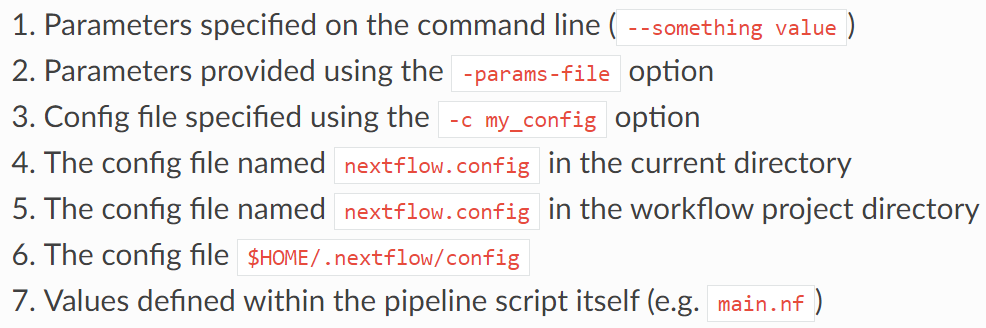
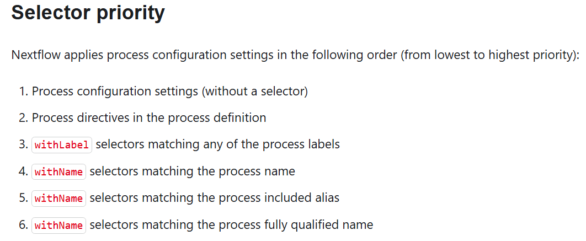
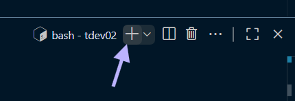

# 2.2 Custom configuration files for your environment

!!! tip "Objectives"

    - Learn how to check the default configurations that are applied to nf-core workflows
    - Understand how to over-ride default configurations with custom configuration files
    - Write a custom configuration file for your local environment and apply this as a `-profile` to your run
    - Observe the hierarchy of parameter configuration in action

## 2.2.1 Separation of parameters and configurations

In [Lesson 2.1](./2.1_params.md), we explored how to customise a run with **nf-core pipeline parameters** on the command line, within a parameters file, or using a run script. In this lesson we will expand upon the Nextflow **configuration settings** introduced in [Lesson 1.3](../session_1/1.3_configure.md). 

Pipeline parameters control *what* is run, where configurations control *how* it is run. Customising configurations can be an essential part of getting the workflow to run on your compute system, whether that be your local computer, a remote server or VM, cloud, or High Performance Computer (HPC).

!!! note "Portability and reproducibilty" 

    Nextflow's portability is achieved by separating **workflow implementation** (input data, custom parameters, etc.) from the **configuration settings** (tool access, compute resources, etc.) required to execute it. This portability facilitates reproducibility: by applying the same parameters as a colleague, and adjusting configurations to suit your platform, you can achieve the same results on any machine with no requirement to edit the pipeline source code.


## 2.2.2 Default nf-core configuration

Recall that when a pipeline script is launched, Nextflow looks for [configuration files in multiple locations](https://www.nextflow.io/docs/latest/config.html#configuration-file): 

{width=75%}

At level 5 of the above priority list is the file `<workflow>/nextflow.config`. This file also applies `<workflow>/conf/base.config` to the workflow execution with the following statement:

```default
includeConfig 'conf/base.config'
```

Together, these two configuration files define the default execution settings and parameters of an nf-core workflow. 

Let's take a look at these two configuration files for the nf-core/rnaseq pipeline to gain an understanding of how defaults are applied.

<br>

**`rnaseq/conf/base.config`**

!!! example "Exercise 2.2.2.1 :stopwatch: 2 mins"

    Using the `more` command, scroll through the nf-core/rnaseq `conf/base.config`.

    *Tip: press spacebar to scroll through `more` output* 

    What does this config file do?

    ```bash
    more rnaseq/conf/base.config
    ```
    ??? success "Solution"

        - It sets the **default compute resources** for all processes in the workflow
        - It uses descriptive **process labels** to set compute resources
        - The config is generic: it does not name any particular pipeline or process, and assumes we are running locally with all required tools available  

    How can we over-ride these default compute resources with our custom resources?

    ??? success "Solution" 

        We can over-ride these default compute resources using a custom configuration file.

<br>

**`rnaseq/nextflow.config`**

!!! example "Exercise 2.2.2.2 :stopwatch: 2 mins"

    Using the `more` command, scroll through the nf-core/rnaseq `nextflow.config`. 

    What does this config do?

    ```bash
    more rnaseq/nextflow.config
    ```

    ??? success "Solution"

        - The `nextflow.config` file is pipeline-specific, and sets the defaults for the workflow parameters
        - It defines profiles to change the default software access from $PATH to the specified access method, eg singularity
        - It has a number of `includeConfig` statements to bring in other configurations required for this pipeline

    How can we over-ride these default pipeline parameters with our custom parameters? 
    
    How can we use singularity for software access, rather than the default of locally installed tools establish in `conf/base.config`? 

    ??? success "Solution"

        We can over-ride the default pipeline parameters on the command line or with a parameters file
        
        We use singularity for software access rather than the default behaviour of searching for tools on $PATH by specifying ` `-profile singularity`.

<br>

The below exercise is designed to familiarise you with searching nf-core configuration and pipeline files for information that may be needed as you customise a run for your data and compute platform. There are are number of steps to uncover the answer! 


!!! example "Exercise 2.2.2.3 :stopwatch: 3 mins"

    What are the default settings for CPU and memory for the STAR_ALIGN module?

    ??? hint "Hint 1: Process labels"
        
        To uncover the default compute resources for the STAR_ALIGN process, we need to find out what **process label** has been assigned to this process. 
        
        Process labels are used in `conf/base.config` to assign default compute resources. 

        Find the process label within the STAR_ALIGN `main.nf` file, and check the resources assigned to that label within `conf/base.config`.

    ??? hint "Hint 2: STAR_ALIGN module script"
        
        Recall from [Lesson 1.1.3](../session1/1.1_nfcore.md/#113-nf-core-workflow-structure) that each process (or 'module') has its own `main.nf` file which includes the Nextflow code to set up the task as well as the actual command to run the analysis. The STAR_ALIGN process label will be included within this script.          

        Finding the `main.nf` script for STAR_ALIGN or any other process can be a little tricky, since nf-core pipelines are a collection of workflows, subworkflows, and modules, that can be local (i.e. used only by) the pipeline, or those that are widely used on other nf-core pipelines. 

        Applying the knowledge that all nf-core module scripts are named `main.nf`, we can't search for the file by name, but we can search for the tool name in the module filepath. nf-core filepaths use lower-case, while the process names themselves use capitals, such as STAR_ALIGN. 

        The bash command below will help you find the STAR_ALIGN `main.nf` file:

        ```bash
        find ./rnaseq/ -type d  -name "*star*" -print
        ```

    ??? success "Solution"

        Searching for `star` in the nf-core/rnaseq codebase yields the following output: 


        ```console title="Output"
        ./rnaseq/modules/nf-core/sentieon/staralign
        ./rnaseq/modules/nf-core/star
        ./rnaseq/subworkflows/local/align_star
        ```

        The ALIGN_STAR subworkflow script can be found at `./rnaseq/subworkflows/local/align_star/main.nf`. This subworkflow calls the STAR_ALIGN module. 
        
        We can find the STAR_ALIGN `main.nf` file either by looking into the `./rnaseq/modules/nf-core/star` directory *or* by viewing the subworkflow script: 
        
        ```bash
        head ./rnaseq/subworkflows/local/align_star/main.nf
        ```

        ```console title="Output"
        //
        // Alignment with STAR
        //
        include { SENTIEON_STARALIGN as SENTIEON_STAR_ALIGN } from '../../../modules/nf-core/sentieon/staralign/main'
        include { PARABRICKS_RNAFQ2BAM as PARABRICKS_RNA_FQ2BAM } from '../../../modules/nf-core/parabricks/rnafq2bam/main'
        include { STAR_ALIGN                                } from '../../../modules/nf-core/star/align'
        include { STAR_ALIGN as STAR_ALIGN_IGENOMES          } from '../../../modules/nf-core/star/align'
        include { BAM_SORT_STATS_SAMTOOLS                   } from '../../nf-core/bam_sort_stats_samtools'
        ```

        The process label can then be extracted from the `modules/nf-core/star/align/main.nf` file, for example with `more` or `grep: 

        ```bash
        grep label rnaseq/modules/nf-core/star/align/main.nf 
        ```
        
        ```console title="Output"
        label 'process_high'
        ```

        The `process_high` label within the `conf/base.config` shows us that the STAR_ALIGN process will receive 12 CPU and 72 GB memory by default:

        ```bash
        more rnaseq/conf/base.config
        ```

        ```console title="Output"
        withLabel:process_high {
            cpus   = { 12    * task.attempt }
            memory = { 72.GB * task.attempt }
            time   = { 16.h  * task.attempt }
        }
        ```

## 2.2.3 When to use a custom config file

In [Lesson 1.4.3](../session_1/1.4_rnaseq.md/#143-run-the-pipeline), we applied custom configurations to the rnaseq pipeline to restrict the maximum amount of CPUs and memory each process can use with the custom config we created. As observed when we attempted to run the pipeline before adding that configuration, this customisation was required in order to run the pipeline in our environment. 

Apart from reducing resources to adapt to a low-resource compute environment, there are other circumstances in which our nf-core pipeline run can benefit from custom configurations:

- Increase process resources to take advantage of high CPU or high memory infrastructure
- Increase process resources to adapt to large or complex datasets that require greater compute than defined by the defaults. You will know this is required when your run fails with an out of memory or out of walltime error!
- Adjust resources for bottleneck processes to promote better throughput considering the shape of the compute hardware
- Execute specific modules on specific node types on a cluster, for example trying out the latest GPU queue for a GPU-enabled tool used by the pipeline
- Test the latest version of a tool used by the pipeline 
- Customise outputs beyond what is possible using the nf-core pipeline parameters


The rest of Lesson 2.2 will explore custom resource configuration files. We won't be covering customising runs for HPC in this workshop, but please check out our [Tips and Tricks page](../tips_tricks.md) later if you are interested in this, as well as the section below on institutional configs for HPC and other platforms. 

## 2.2.4 Configuration profiles and shared configs

In [Lesson 1.4](../session_1/1.4_rnaseq.md#setting-resource-limits) we started developing a custom config for our workshop Nectar VMs. We applied this config to our run using the Nextflow `-c <myconfig>` parameter. 

Custom configurations can also be included as a `profile`, just as we did for the MultiQC report configuration in [Lesson 1.3.6](../session_1/1.3_configure.md/#custom-profiles). Profiles are the way in which nf-core's global community-driven shared institutional configs, introduced in [Lesson 1.3.5](../session1/1.3_configure.md#135-shared-configuration-files), can be applied to your pipeline runs on any of the platforms included in the shared config collection. 

We recommend you use the [NCI Gadi shared config](https://nf-co.re/configs/nci_gadi) or [Pawsey Setonix shared config](https://nf-co.re/configs/pawsey_setonix) if you run nf-core pipelines on these national HPCs. 

### 2.2.4.1 Using a shared configuration profile 

To add the config, include the relevant profile name, for example:

```bash
nextflow run <pipeline> -profile singularity,nci_gadi
```

!!! tip "Accessing shared configs"

    If you apply a shared config profile and you do not have a copy of the shared config in `<workflow>/conf`, the pipeline will fetch it at run time. 

    If you are running in an environment with no external internet connection, you will need to pre-download the config, as well as singularity images. If this describes your environment, we recommend the following command, to fetch the entire pipeline code, required images, and shared config files:


    ```bash
        nf-core pipelines download <workflow> \
        --revision <revision> \
        --outdir <outdir> \
        --container-system singularity \
        --compress none \
        --download-configuration yes
    ```

### 2.2.4.2 Using a custom configuration profile

To add a custom profile to a run command, the configuration file which the profile is defined in must be applied to the run, either directly with `-c <myconfig>`, via `includeConfig` within another applied config, or through the [default locations](./222-default-nf-core-configuration) that Nextflow searches for configuration files. 

We do not recommend using the filename `nextflow.config` within the current or workflow directory (levels 4 and 5 of the hierarchy chart), as this can create confusion. Custom configuration files should have **descriptive names** and be distinct from other config names found within the nf-core pipeline code. 

{width=65%}

At level 6 of the hierarchy chart, we can see a default config path in a user's home directory. This could work, however we also do not recommend this for portability and reproducibility. User home directories are not readable by others in your group, and inclusion of custom configs in this way is not transparent.

Finally, adding your custom config within an 'includeConfig' statement of an nf-core config is similarly not recommended, as this harms reproducibility and portability. For this reason, we will continue to apply our custom config file using the Nextflow `-c` parameter.

<br>

As we continue customising our run for our small test data on the workshop VMs, it makes sense to **define a profile**. 

!!! example "Exercise 2.2.4.1:stopwatch: 5 mins" 

    - Create a new file called `workshop.config`
    - Within the `profiles` scope, define a new profile called `workshop` 
    - Instruct the workshop profile to include our VM config by adding `includeConfig 'nectar_vm.config'`


    ??? hint "Hint: `profiles` syntax"
        Check the [Nextflow profiles scope docs](https://docs.seqera.io/nextflow/config#config-profiles) or revisit [Lesson 1.3](../session_1/1.3_configure.md/#custom-profiles) for syntax guidance. 

    ??? hint "Hint 2 "
        Check the solution of [Exercise 1.4.2.4](../session_1/1.4_rnaseq.md/#setting-resource-limits)

    ??? success "Solution"

        ```groovy
        profiles {
            workshop {
                includeConfig 'nectar_vm.config'
            }
        }
        ```


<br>

To apply this profile to our run, we include the custom profile name and the custom profile config file to the Nextflow run command. We no loner need to add `-c nectar_vm.config`, because this has been 'included' within the `workshop` profile:

```bash
nextflow run rnaseq/main.nf -profile singularity,workshop -c workshop.config ...
```
<br>

We can further simplify the run command by enabling Singularity within our institutional config using the [`singularity scope`](https://docs.seqera.io/nextflow/reference/config#singularity). Since Singularity will always be the software management profile used on these workshop VMs, it makes sense to add this to our institutional config. 

!!! note "Singularity options"

    Nextflow has a number of [options for using singularity](https://www.nextflow.io/docs/latest/config.html?highlight=singularity#scope-singularity) that allow control of how containers are executed.
    
    We will add the `enabled` option to use Singularity to manage containers (default: false)

    Other commonly observed options are:  

    - `autoMounts` to allow Nextflow to automatically mount host paths when a container is executed (default: true since v 23.10.0)
    - `cacheDir` to specify the directory Singularity cache directory. We have set this within our user profile in [Lesson 1.2.2](../session_1/1.2_run.md/#122-managing-your-environment) so it is not required here. 

<br>

!!! example "Exercise 2.2.4.2 :stopwatch: 4 mins"

    - Edit `nectar_vm.config` to enable the use of singularity within the `singularity scope`

    ```groovy
    process {
        resourceLimits = [
            cpus: 2,
            memory: 6.GB
        ]
    }
    singularity {
        enabled = true
    }
    ```

    - Change the `--outdir` directory to 'lesson-2.2' in the `run_rnaseq.sh` script file 
    - Before we resubmit the run, what other changes should we now make to our run command? 
    - Make these required changes to your command within `run_rnaseq.sh` and resubmit the run, ensuring that the `-resume` flag is included.

    ??? success "Solution" 

        The script below has replaced the 'singularity' profile with 'workshop' profile.
        
        Parameters have also been reordered to group pipeline and Nextflow parameters. This is not necessary but can aid clarity.   

        ```bash
        #!/bin/bash

        # parameters
        samplesheet=/home/tdev02/data/samplesheet.csv
        output_directory=lesson-2.2
        ref_fasta=/home/tdev02/data/mm10_reference/mm10_chr18.fa
        ref_gtf=/home/tdev02/data/mm10_reference/mm10_chr18.gtf
        star_index=/home/tdev02/data/mm10_reference/STAR
        salmon_index=/home/tdev02/data/mm10_reference/salmon-index

        # configurations
        profile=workshop
        config=workshop.config

        nextflow run rnaseq/main.nf \
            --input ${samplesheet} \
            --outdir ${output_directory} \
            --fasta ${ref_fasta} \
            --gtf ${ref_gtf} \
            --star_index ${star_index} \
            --salmon_index ${salmon_index} \
            --skip_markduplicates true \
            --save_trimmed true \
            --save_unaligned true \
            -profile ${profile} \
            -c ${config} \
            -resume
        ```

Since we have not changed anything that affects input or output files, all tasks should have been cached, except MultiQC. 


## 2.2.5 Custom resource configuration using process labels

We have already reviewed process labels in the `conf/base.config` file and examined the label and resources for one process. Next we will practice customising resources using process labels, by over-riding pipeline defaults with configurations we add to our `nectar_vm.config`. Recall that our custom config is **third highest** priority in the configuration hierarchy chart, taking precedence over defaults set in `base.config`.

With our workshop VMs having only 4 CPU and 8 GB memory, we are restricted in the resource customisations we can test out. What we can test is whether adjusting resources for bottleneck processes or those that are not utilising their allocated resources can provide better throughput and efficiency considering the shape of the VM hardware. 

:information_source: *A 'bottleneck process' is one that requires more walltime than others, and holds up the entire pipeline as downstream processes rely on its outputs.* 

In the nf-core/rnaseq pipeline, you may have observed that the STAR_ALIGN process is the bottleneck. 


!!! note "Assume you are running nf-core rnaseq on a machine with 16 CPU"

    If we set CPUs to 16 under the `resourceLimits` directive in our custom config, the STAR_ALIGN module would still only utilise 12 CPUs, as this module (as we learnt in Exercise 2.2.2.1) has the label `process_high` which sets CPUs to 12. The `resourceLimits` only changes the resources if they exceed the custom limit that has been set. 

    If there were no processes with fulfilled input channels that could make use of the 4 remaining CPUs, those resources would sit idle until the STAR_ALIGN process had completed. 

    Optimisation for this 16-CPU machine might for example set the CPU limit under `resourceLimits` to 8 so two samples could be aligned concurrently, or over-ride the number of CPU assigned to the STAR_ALIGN module to 16. 

<br>


We can target our configuration customisations to specific processes using [`process selectors`](https://docs.seqera.io/nextflow/config#process-selectors). These are defined within the [`process scope`](https://docs.seqera.io/nextflow/config#process-configuration), the same scope in which we have already applied our `resourceLimits`. 

Following the example scenario above, we could increase CPUs from 12 to 16 for all processes with the 'process_high' label within the `process` scope of a custom configuration file using the `withLabel` process selector:


```console
process {
    withLabel:process_high {
        cpus   = { 16    * task.attempt }
    }
}
```

<br>


Since our workshop is using very small input data - which typically requires less RAM in bioinformatics - we may be able to increase the number of processes running at once by *decreasing* the resources for some processes.

Before customising resources to suit input data and compute, it is always good practice to follow the initial `-profile test` run with a run using representative samples from your real dataset, to gauge their resource requirements. 

Either the trace text file or the html run report are a good place to review usage. 

!!! example "Exercise 2.2.5.1 :stopwatch: 3 mins"

    Open your most recent run report by finding the file in the filesystem explorer in the left hand pane of VS Code, right click and select 'Open with Live Server'.

    The filepath should match the pattern `lesson-2.2/pipeline_info/execution_report_<date>_<time>.html`. 

    Under the heading 'Resource Usage', view the figures for raw CPU usage and physical RAM. Of CPU or memory, which do you think we could reduce without harming the ability of the run to complete? 
        
    ??? success "Solution"

        Many of the processes are using between 1 and 2 CPU, with one even using more than the upper custom limit of 2 CPU, so there is not much capacity to customise CPU in our current compute environment. 

        On the figure for 'Memory', all processes except STAR_ALIGN are using near to or less than 1 GB RAM and less than 20% of their allocated memory. This suggests for our data, most processes could execute with less RAM. 


<br>

Now we have used empirical data to guide our resource configuration, we will use the `withLabel` process selector to reduce the memory allocated to processes according to their label. 

We can use wildcards (`*`) and 'or' (`|`) notation with `withName` to apply the same configuration to more than one process label. 


!!! example "Exercise 2.2.5.2 :stopwatch: 5 mins"

    Within `nectar_vm.config`, use the 'withLabel' directive to reduce the memory for processes with labels 'process_single' and 'process_low' to 1 GB. Reduce the memory to 2 GB for processes with labels 'process_medium' and 'process_high'.

    ??? hint Hint
        'withLabel' selectors are defined within the `process` scope.

    ??? success "Solution" 

        ```groovy
        process {
            resourceLimits = [
                cpus: 2,
                memory: 6.GB
            ]
            withLabel: 'process_single|process_low' {
                memory = 1.GB
            }
            withLabel: 'process_medium|process_high' {
                memory = 2.GB
            }           
        }
        singularity {
            enabled = true
        }
        ```

<br>

!!! warning "Problem!"
    Recall the memory usage shown in the execution report. All processes used ~ < 1 GB *except* STAR_ALIGN, which used ~ 2.5 GB. 
    What do you expect would happen if we submitted this run? 

Given that *only* STAR_ALIGN needs more RAM, and many processes within the pipeline share the same 'process_high' label, we clearly need a sharper instrument to optimally configure resources for our workshop run.

Next, we will learn how to **target specific processes** without relying on labels that may be assigned to numerous processes within the pipeline.


## 2.2.6 Custom resource configuration using process names

In addition to `withLabel`, Nextflow also provides the `withName` process selector. 

`withName` is a powerful tool:

- Enables custom over-rides of default configurations at the per-process level
- Multiple module names can be supplied using wildcards (`*`) and 'or' (`|`) notation
- No need to edit the module `main.nf` file to add a process label
- Has a [higher priority](https://docs.seqera.io/nextflow/config#selector-priority) than `withLabel`
- Multiple means of name matching for precise hierarchical application of custom configurations:


{width=85%}

<br>

To utilise `withName`, we first need to ensure we have the correct and specific process name. For utmost specificity, the 'fully qualified name' is safest.  

In nf-core pipelines, the fully qualified process name, also referred to as the **process execution path**, is built from the pipeline name, one or more workflows or subworkflows, and the final process name. For example:

```groovy
PIPELINE_NAME:WORKFLOW_NAME:SUBWORKFLOW_NAME:PROCESS_NAME
```

!!! tip

    It can be tricky to evaluate the path used to execute a module before running a workflow, though in practice this challenge should never arise, as customising a run should naturally follow at least one initial test run. From the completed run, you can obtain the process execution path from the execution trace, timeline or report files within `<outdir>/pipeline_info`.  

<br>


For the next exercise, remember that `withName` has a [higher selector priority](https://docs.seqera.io/nextflow/config#selector-priority) than `withLabel`. 

!!! example "Exercise 2.2.6.1 :stopwatch: 5 mins"

    Identify the complete process execution path for the STAR_ALIGN module.  
    
    ??? success "Solution"

        ```groovy
        NFCORE_RNASEQ:RNASEQ:ALIGN_STAR:STAR_ALIGN
        ```
    
    Next, within `nectar_vm.config`, use the 'withName' directive to allocate 3 GB memory to STAR_ALIGN process. 

    ??? success "Solution" 

        ```groovy
        process {
            resourceLimits = [
                cpus: 2,
                memory: 6.GB
            ]
            withLabel: 'process_single|process_low' {
                memory = 1.GB
            }
            withLabel: 'process_medium|process_high' {
                memory = 2.GB
            }
            withName: 'NFCORE_RNASEQ:RNASEQ:ALIGN_STAR:STAR_ALIGN' {
                memory = 3.GB
            }          
        }
        singularity {
            enabled = true
        }
        ```


Now that we have customised resources to suit our data and compute platorm, we are ready to re-submit our run!        

We now expect to see: 

- Two STAR_ALIGN processes running at once (one for each of two input samples), thereby halving the time we must wait for that bottleneck process to complete before it provides the inputs required for the downstream processes
- Potentially more upstream and downstream processes running at once, due to the reduced memory enabling up to 3 or 4 non-align processes to fit within our VM capacity of 8 GB RAM  

!!! example "Exercise 2.2.6.3 :stopwatch: 2 mins"
    Since we want to observe the full impact of our changes, remove `-resume` from the `run_rnaseq.sh` script file, then resubmit your run.

    You may want to open a second terminal in VS Code to watch task activity with the `top` or `htop` commands:

    {width=45%}

    You should see two STAR processes running at once, and 🤞 the run completes faster than the initial ~ 5.5 minutes! 


<br>

⏲️ If you review the process execution times within the `pipeline_info` files, you'll see that even our bottleneck process completed in ~ 1 minute, with most others requiring only seconds. For this demonstration, it is therefore unlikely that our run will complete much faster following our customisations for this small dataset on these workshop VMs. 

💻 Consider how this approach can be really powerful when working on HPC or cloud infrastructures, where the [`executor`](https://docs.seqera.io/nextflow/executor) and [`queue`](https://docs.seqera.io/nextflow/reference/process#queue) directives enable you to take full advantage of the compute resources available on your platform.

<br>

!!! note "Key points"
    - nf-core pipelines work 'out of the box' but there are compute and software configurations we should customise so our runs work well in our environment
    - nf-core executes by default with `workflow/nextflow.config` and `workflow/conf/base.config`
    - nf-core has a repository of community-contributed institutional configs that ship with the workflow 
    - we can write (and contribute) our own institutional config for reproducible runs on our compute platform 
    - custom configs can be applied to a run with `-c <config_name>`, and will over-ride settings in the default configs
    - custom profiles can be used to group a collection of customisations for a specific environment or application
    - customisations can be targeted to specific processes using `withLabel` or `withName`
