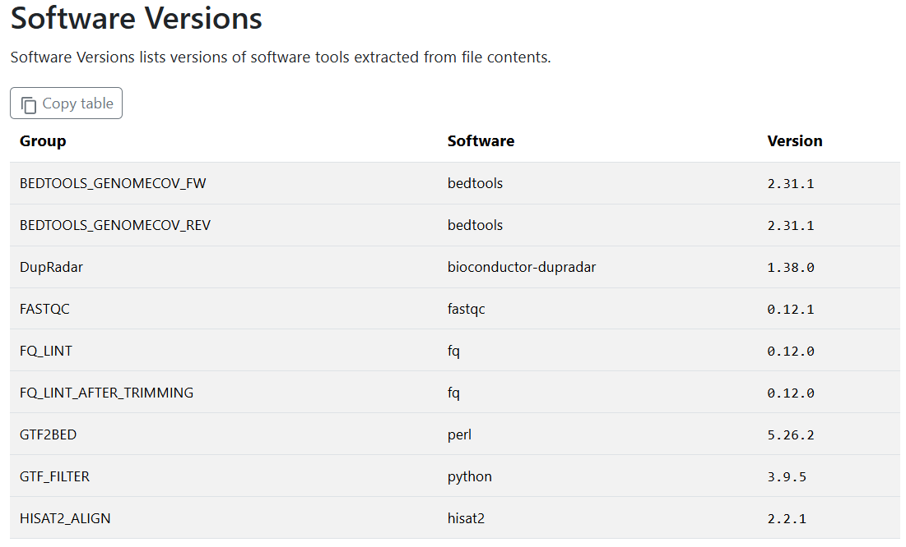
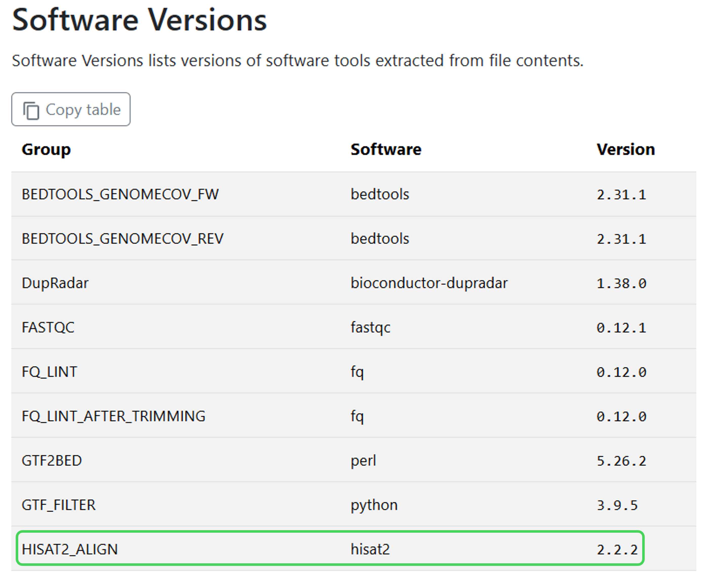
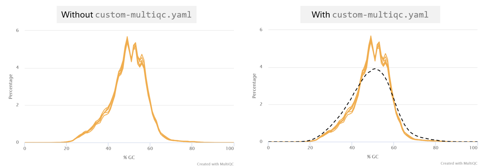

#  2.3 Case study: customisation in action

!!! tip "Objectives"

    - Execute a non-default analysis with an nf-core pipeline
    - Troubleshoot pipeline execution failure
    - Use custom configuration files to resolve the failure
    - Add additional custom configuration files to augment run output 


## 2.3.1 Case study introduction

In this section, no new nf-core or Nextflow concepts will be introduced. Instead, we will apply a number of the customisation strategies we have learnt over the last two days to a theoretical real-world customisation scenario. 

We will cover a typical journey experienced when you choose to perform a non-standard analysis, including debugging the dreaded *error message*, searching for the *issue solution*, and working out how to *make the solution work for you*.

We will apply strategic thinking and methodology to:

- Identify and apply changes to the workflow that best suit our experiment goals using **pipeline parameters**
- Apply the parameters to the run and **investigate an error message**
- Use multiple **custom configurations** to resolve the issue
- **Customise resource tracing and QC files** for tailored analysis reporting 

<br>

🐭 **The scenario**

Our mouse gene expression study needs preliminary results for a looming deadline. We have been tasked with customising the `nf-core/rnaseq` pipeline to identify expressed genes in the dataset in a shorter analysis time.

## 2.3.2 Devising and running a non-default analysis

!!! warning 

    nf-core pipelines are extensively tested, yet with so many tool options and pipeline parameters it would be impractical for every possible combination of workflow choices to be tested. This means that a customised run may at times encounter an error. 

    This exercise will teach some practical steps to finding an issue solution and applying it using the customisation skills we have covered in the workshop. 
    
    While the exact issue described in this lesson is likely to be transient (i.e. fixed in updated `nf-core/rnaseq` versions), the included troubleshooting and customisation steps can be applied to other issues you may encounter when customising nf-core runs. 

<br>

Knowing that the longest-running part of the workflow is the STAR_ALIGN process, we check the [nf-core/rnaseq user guide](https://nf-co.re/rnaseq/3.23.0) and see that the alignment step can be customised to use Hisat2 or Bowtie2 aligner with a **pipeline parameter**.


<br>

Checking out the user guides for these tools, we find Bowtie2 is not suited to our type of input data, and read that Hisat2 is fast with low RAM usage. Given the limited RAM we have available, we decide to test if this customisation can meet our pipeline goals. 


!!! example "Exercise 2.3.2 :stopwatch: 3 mins" 

    - Using the [nf-core/rnaseq parameters guide](https://nf-co.re/rnaseq/3.23.0/parameters), find the parameter needed to use the Hisat2 aligner
    - Add the new parameter to `run_rnaseq.sh`
    - Update the `--outdir` value to lesson-2.3
    - Save the script, then run the updated pipeline by entering the command `bash run_rnaseq.sh`

    ??? success "Solution"

        The parameter needed to use the Hisat2 aligner is:

        ```bash
        --aligner hisat2 
        ```

        ```bash title="run_rnaseq.sh" hl_lines="25"
        #!/bin/bash

        # parameters
        samplesheet=~/data/samplesheet.csv
        output_directory=lesson-2.3
        ref_fasta=~/data/mm10_reference/mm10_chr18.fa
        ref_gtf=~/data/mm10_reference/mm10_chr18.gtf
        star_index=~/data/mm10_reference/STAR
        salmon_index=~/data/mm10_reference/salmon-index

        # configurations
        profile=workshop
        config=workshop_profile.config

        nextflow run rnaseq/main.nf \
            --input ${samplesheet} \
            --outdir ${output_directory} \
            --fasta ${ref_fasta} \
            --gtf ${ref_gtf} \
            --star_index ${star_index} \
            --salmon_index ${salmon_index} \
            --skip_markduplicates true \
            --save_trimmed true \
            --save_unaligned true \
            --aligner hisat2 \
            -profile ${profile} \
            -c ${config} \
            -resume

        ```


!!! abstract "Poll 2.3.2"

    Did your run complete, or fail? 

    If it failed, what was the error printed to the terminal window? 

    ??? success "Solution"

        In this exercise, some runs may succeed, and some may fail! 

        If the run fails, the expected error message is:

        ```console title="Error message"
        Command error: 
         (ERR): mkfifo(/tmp/45.unp) failed. 
         Exiting now ...
         [main_samview] fail to read the header from "-".
        ```


## 2.3.3 Troubleshooting a failed custom pipeline run

**Step 1: What does the error say?**

It appears to have something to do with `/tmp`. The samtools error shows that the piped command received no output, so the aligner didn't process any reads. This means our input data is likely not the cause.

**Step 2: Is it a filesystem permissions or missing directory issue?**

`ls -l /tmp` shows the directory exists and that we have read and write access to the VM `/tmp` directory.
    
**Step 3: Does the process command reveal any potential issues?**

In [Lesson 2.1.3](2.1_params.md/#213-checking-execution-at-the-process-level) we learnt that the command executed by a process was saved within the `.command.sh` file in the process work directory and used the `nextflow log` command to find this command file.

In this case, we don't need to hunt for the command file as the process work directory has been helpfully printed out alongside the error message.

*Note: the work directory below is an example of terminal output, your work directory path will be different*

```console title="Example"
Work dir:
  ~/session2/work/dc/5184fdc7c63198d41a03c73790b7f6
```

!!! example "Exercise 2.3.3.1 :stopwatch: 2 mins"

    View the `.command.sh` file within the failed process work directory, or the example below if your run completed successfully.

    The command shows no obvious issues, with our sample name, `.fq.gz` input file and reference genome files correctly populated within the process command. No clues here!

    ```console title=".command.sh"
    INDEX=`find -L ./ -name "*.1.ht2*" | sed 's/\.1.ht2.*$//'`
    hisat2 \
        -x $INDEX \
        -U SRR3473988_trimmed_trimmed.fq.gz \
        \
        --known-splicesite-infile mm10_chr18.filtered.splice_sites.txt \
        --summary-file SRR3473988.hisat2.summary.log \
        --threads 2 \
        --rg-id SRR3473988 --rg SM:SRR3473988 \
        --un-gz SRR3473988.unmapped.fastq.gz \
        --met-stderr --new-summary --dta \
        | samtools view -bS -F 4 -F 256 - > SRR3473988.bam
    ```


**Step 4: Is this a known/previously reported issue for the tool or the nf-core pipeline?**

!!! example "Exercise 2.3.3.2 :stopwatch: 3 mins"
    - In a web browser, navigate to the [nf-core/rnaseq github repository](https://github.com/nf-core/rnaseq)
    - Select the 'Issues' tab, and search for issues matching the term 'hisat2'
    - Also search for issues relating to tmp/temp directory errors in the [Hisat2 github repository](https://github.com/DaehwanKimLab/hisat2)

    {width=65%}

    Can you find any issues relating to the `(ERR): mkfifo(/tmp/45.unp)` error in either of these repositories? 

    
    ??? success "Solution"

        The `nf-core/rnaseq` issues search was not revealing, however a Hisat2 issue titled [Enabling a --temp-directory parameter #438](https://github.com/DaehwanKimLab/hisat2/issues/438) describes the exact error message some of use have encountered. 

        Reading through the issue activity, you can see that the issue has been linked by an nf-core issue titled 
        [update module: HISAT2/ALIGN #9487](https://github.com/nf-core/modules/issues/9487). 

        Following this link, we can see that nf-core have marked this issue as 'WIP' (work in progress). Seems like we have found a solution to our bug! 

<br>

!!! tip "The importance of open-source and community contribution"

    By reporting issues and bugs we find in open-source code through github issues, we can effect real change. Developers are typically welcoming of bug reports that help improve their code and happy to help you to use their tool for your research. Other users of a tool may also chime in with their solutions, or you may want to add your helpful tips to an open issue!

## 2.3.4 Configuring the solution

The ticket describes a [new release of Hisat2 v 2.2.2](https://github.com/DaehwanKimLab/hisat2/releases/tag/v2.2.2) that features a new parameter to prevent the `/tmp` error. 

To customise this version of the `nf-core/rnaseq` pipeline to use Hisat2, we will:

1. Over-ride the default version of Hisat2 to use the latest version
2. Add the new parameter to the Hisat2 process command


### 2.3.4.1 Running with multiple custom configuration files

Nextflow allows you to add as many configs as needed to customise a run. 

These can be supplied to the Nextflow parameter `-c` in a **comma-delimited list**, for example:

```bash
nextflow run <pipeline> <other args> -c custom-1.config,custom-2.config
```

Alternatively, `-c` can be included several times, for example:

```bash
nextflow run <pipeline> <other args> -c custom-1.config -c custom-2.config
```

!!! tip "Custom config order matters!"

    Recall from [Lesson 1.3.7](../session_1/1.3_configure/#137-custom-configuration-files) that **order matters**, with the right-most custom config files taking precedence.

    In the examples above, a configuration in `custom-2.config` would over-ride `custom-1.config` if both configured the same attribute.

Some configurations make sense being **grouped together within a single config file**, for example customising compute resources and software management within an institutional config. 

Others are best placed within **individual and explicitly named configs** to ensure they are only applied when needed (i.e., they are **modular**). 

As we learnt in [Lesson 2.2.4.2](2.2_config.md/#2242-using-a-custom-configuration-profile), we can also group configuratons that apply to a certain environment or analysis within a **custom `profile`**. Once we have tested and verified our Hisat2 customisation is working, we will incorporate it into our `workshop` custom profile.


### 2.3.4.2 Applying a custom tool version

Recall from [Lesson 2.1.6.2](2.1_params.md/#2162-software-versions) that all tool versions are included within the MultiQC report as well as a yaml file in the `pipeline_info` folder.  

!!! example "Exercise 2.3.4.2.1 :stopwatch: 3 mins"

    Discover the version of Hisat2 used in our most recent run of `nf-core/rnaseq`.

    ??? success "Solution"

        Our run used Hisat2 version 2.2.1.

        - Find using command-line:

        ```bash
        grep hisat2 lesson-2.3-/pipeline_info/nf_core_rnaseq_software_mqc_versions.yml
        ```

        ```console title="Output"
        hisat2: 2.2.1
        ```

        - Find within MultiQC html report under 'Software Versions' sub-heading:

        


<br>

We need Hisat2 version 2.2.2 for the new `--temp-dir` parameter. How should we apply this customisation to our our run?


!!! abstract "Poll 2.3.4.2"

    For maintaining **portability and reproducibility**, what is the optimal method to apply our custom Hisat2 container to our pipeline run? 

    a) Within the `nectar_vm.config` institutional config file. It's already working well on our platform, so we can build on it for further customisations without issue. 

    b) Within a separate custom config file named `custom-hisat2.config`. We would then add it to any runs of `nf-core/rnaseq` that required this non-default workflow.

    c) Within the Hisat2 module `main.nf` file. This way, we don't need to worry about adding another custom config when we execute the `run` command. 

    ??? success "Answer"

        b) Within a separate custom config file named `custom-hisat2.config`. This method is the most **explicit**, **modular**, **portable**, and **reproducible**. 
        
        By placing it within a clearly named custom config file, there is less chance of unwittingly executing a workflow that does not match the expected utilisation of tools. Making it a separate config also means it can be easily dropped from our run when nf-core finalises their testing of the issue marked as 'WIP' and includes the resolution within the next version of rnaseq. 
        
        Institutional configs are intended to be shareable with others using nf-core pipelines on the same infrastructure. Adding the custom tool over-ride to this file would prevent our institutional config from being portable to other analyses, so a) is incorrect. 

        In general, editing the process `main.nf` file is **not** recommended, as this impedes reproducibility. Swapping out tool versions is a bespoke adaptation of the nf-core workflow that would harm reproducibility if it was inadvertently executed, which is likely to happen if it is hidden within the source code, making c) incorrect.  

<br>

To make the purpose of the config clear to anyone else in the lab who runs the pipeline, we will also include a descriptive comment explaining why the config is needed.

!!! note "Comments in Nextflow"

    Commenting code is good practice to make the purpose and logic of the code easier for others and your future self to understand. 
    
    Comments in Nextflow use `//` for single line comments or  `/* .. */` to comment a block or multiple lines.


!!! example "Exercise 2.3.4.1.2 :stopwatch: 5 mins"

    - Create a new file called `custom-hisat2.config`
    - Add a Nextflow comment describing what the config does and why
    - Identify the fully qualified process name/process execution path for the `HISAT2_ALIGN` process
    - Within a `process` scope code block, provide the process name identified above to the appropriate process selector
    - Within the process selector code block, add the path to the Hisat2 v 2.2.2 container described in the [nf-core issue](https://github.com/nf-core/modules/issues/9487)

    ??? hint "Hint: Process execution paths"

        You can obtain the process execution path from the execution trace, timeline or report files within `<outdir>/pipeline_info`. 

        Process names are not always unique in nf-core pipelines that may contain modules from other sources. Best practice for specificity is to use the fully qualified process name, which typically takes the form:

        `PIPELINE_NAME:WORKFLOW_NAME:SUBWORKFLOW_NAME:PROCESS_NAME`  

    ??? hint "Hint: Process selectors"

        We learnt about process selectors in [Lesson 2.2.5](2.2_config.md/#225-custom-resource-configuration-using-process-labels) and [Lesson 2.2.6](2.2_config.md/#226-custom-resource-configuration-using-process-names)

    ??? hint "Hint: Syntax help"

        Our `nectar_vm.config` files contain `process` scope and process selector code blocks. Our hisat2 config will be more simple, not requiring the `profile` or `singularity` scopes we have within our Nectar institutional config.
    
    ??? hint "Hint: Hisat2 v 2.2.2 container path"

        ```groovy
        container = 'https://community-cr-prod.seqera.io/docker/registry/v2/blobs/sha256/c3/c36472269e8898f63b7b65dd40433462d541f9e75f9401f0bf8488021275d006/data'
        ```

    ??? success "Solution"

        ```groovy title="custom-hisat2.config"
        // Custom config to apply latest Hisat2 v 2.2.2 to nf-core/rnaseq v 3.23.0
        // Required to add new Hisat2 --temp-directory parameter to resolve known issue
        // Hisat2 issue: https://github.com/DaehwanKimLab/hisat2/issues/438
        // nf-core issue: https://github.com/nf-core/modules/issues/9487
        //
        // This config should be dropped when running future nf-core/rnaseq versions that resolve the issue

        process {
            withName: "NFCORE_RNASEQ:RNASEQ:FASTQ_ALIGN_HISAT2:HISAT2_ALIGN" {
                container = 'https://community-cr-prod.seqera.io/docker/registry/v2/blobs/sha256/c3/c36472269e8898f63b7b65dd40433462d541f9e75f9401f0bf8488021275d006/data'
            }
        }
        ```

<br>

!!! warning "Use caution when customising tool versions"

    Note that for deploying nf-core pipelines, it is generally *not recommended* to change the tool versions, as this will decrease portability and reproducibilty as well as being an untested pipeline.
    
    This exercise is to demonstrate how you can specify containers, as this may aid you in developing and testing your own Nextflow workflows or testing new tool versions. When a non-standard version of a tool is used for publishing nf-core pipeline results, this should be clearly stated within the methods section of the publication.  

### 2.3.4.3 Adding a custom tool parameter

As introduced in [Lesson 1.3.8](../session_1/1.3_configure/#138-configuring-processes), nf-core modules define an `ext.args` process directive that can be used to add any tool parameter to a process command. 

The utility of this directive is wide-reaching when you consider the number of optional parameters a typical bioinformatics tool may have. It is not feasible for nf-core to paramaterise all of these arguments...

{width=50%}

Extra convenience has been added for some commonly-used tools by wrapping the `ext.args` directive within an nf-core pipeline parameter, typically named `--extra_<tool>_args`. 

!!! example "Exercise 2.3.4.2.1 :stopwatch: 2 mins"

    - Open the [nf-core/rnaseq parameters online guide](https://nf-co.re/rnaseq/3.23.0/parameters) and check for any `--extra_<tool>_args` parameters
    - Can you find a pipeline parameter to add extra arguments to the Hisat2 tool?

    ??? success "Solution"

        There is no such parameter for Hisat2. 
        
        Included in version 3.23.0 of `nf-core/rnaseq` are:

        - `--extra_trimgalore_args`
        - `--extra_fastp_args`
        - `--extra_star_align_args`
        - `--extra_bowtie2_align_args`
        - `--extra_salmon_quant_args`
        - `--extra_kallisto_quant_args`
        - `--extra_fqlint_args`

<br>


The `ext.args` directive typically forms part of all nf-core module code, even if the tool itself does not have an `extra_<tool>_args` parameter. This provision enables you to add *any* tool parameter to *any* nf-core pipeline tool with a **custom configuration file** that passes your parameter to the target module via `ext.args`.

Let's see this in action!

!!! example "Exercise 2.3.4.2.2 :stopwatch: 3 mins"

    - Using the procedure described in [Exercise 2.2.2.3](2.2_config.md/#222-default-nf-core-configuration), find the `main.nf` file for the HISAT2_ALIGN process:

    ```bash
    find ./rnaseq -type d  -name "*hisat2*" -print
    ```

    ```console title="Output"
    ./rnaseq/modules/nf-core/hisat2
    ./rnaseq/subworkflows/nf-core/fastq_align_hisat2
    ```

    The nf-core subworkflow named FASTQ_ALIGN_HISAT2 shows the module path for HISAT2_ALIGN as `modules/nf-core/hisat2/align/main.nf`. 
    
    - Open the file with `code modules/nf-core/hisat2/align/main.nf` file
    - View the file to observe the Nextflow code that defines a variable called `args` and assigns it the contents of `ext.args`
    
    If `ext.args` is empty (i.e. the run does not add any extra arguments to this tool), the `args` variable remains empty in the process script. If it has been provided to the run, `$args` will be expanded to the supplied custom argument in the process script:

    ```groovy title="Lines 26-27 of rnaseq/modules/nf-core/hisat2/align/main.nf"
    26      script:
    27      def args = task.ext.args ?: ''
    ```

    Further down, within the hisat2 command that is executed by the process, we can see the `$args` variable added to the hisat2 command:

    ```bash title="Lines 42-52 of rnaseq/modules/nf-core/hisat2/align/main.nf" hl_lines="10"
    42          hisat2 \\
    43              -x \$INDEX \\
    44              -U $reads \\
    45              $strandedness \\
    46              $ss \\
    47              --summary-file ${prefix}.hisat2.summary.log \\
    48              --threads $task.cpus \\
    49              $rg \\
    50              $unaligned \\
    51              $args \\
    52              | samtools view -bS -F 4 -F 256 - > ${prefix}.bam
    ``` 

<br>

Now that we have verified that the pipeline soure code can accept our argument via `ext.args`, we will add it to our `custom-hisat2.config` file created in the previous lesson, and run our updated pipeline with **multiple custom configuration files**.


!!! example "Exercise 2.3.4.2.3 :stopwatch: 3 mins"

    - Provide `--temp-directory .` to the `ext.args` directive within the process selector code block of `custom-hisat2-version.config`
    - Update `run_rnaseq.sh` by adding `custom-hisat2.config` to the Nextflow `-c` parameter, and ensure the Nextflow `-resume` flag is applied
    - Change `--outdir` to `lesson-2.3.4`
    - Save both scripts, then run the updated pipeline by entering the command `bash run_rnaseq.sh`
    
    !!! info "Paths inside containers"
    
         When running tools with containers, the process is running *inside* the container, so the `.` path will evaluate to a location inside the container. 
         
         In our case, this will ensure that the `tmp` directory used by each process will be *unique*, and avoid error-inducing clashes when multiple HISAT2_ALIGN processes attempt to write to the user's `/tmp` on the local machine. 

    ??? success "Solution"

        ```groovy title="custom-hisat2.config" hl_lines="11"
        // Custom config to apply latest Hisat2 v 2.2.2 to nf-core/rnaseq v 3.23.0
        // Required to add new Hisat2 --temp-directory parameter to resolve known issue
        // Hisat2 issue: https://github.com/DaehwanKimLab/hisat2/issues/438
        // nf-core issue: https://github.com/nf-core/modules/issues/9487
        //
        // This config should be dropped when running future nf-core/rnaseq versions that resolve the issue

        process {
            withName: "NFCORE_RNASEQ:RNASEQ:FASTQ_ALIGN_HISAT2:HISAT2_ALIGN" {
                container = 'https://community-cr-prod.seqera.io/docker/registry/v2/blobs/sha256/c3/c36472269e8898f63b7b65dd40433462d541f9e75f9401f0bf8488021275d006/data'
                ext.args = '--temp-directory .'
            }
        }
        ```

        ```bash title="run_rnaseq.sh" hl_lines="5 14 28 29"
        #!/bin/bash

        # parameters
        samplesheet=~/data/samplesheet.csv
        output_directory=lesson-2.3.4
        ref_fasta=~/data/mm10_reference/mm10_chr18.fa
        ref_gtf=~/data/mm10_reference/mm10_chr18.gtf
        star_index=~/data/mm10_reference/STAR
        salmon_index=~/data/mm10_reference/salmon-index

        # configurations
        profile=workshop
        config=workshop_profile.config
        hisat2=custom-hisat2.config

        nextflow run rnaseq/main.nf \
            --input ${samplesheet} \
            --outdir ${output_directory} \
            --fasta ${ref_fasta} \
            --gtf ${ref_gtf} \
            --star_index ${star_index} \
            --salmon_index ${salmon_index} \
            --skip_markduplicates true \
            --save_trimmed true \
            --save_unaligned true \
            --aligner hisat2 \
            -profile ${profile} \
            -c ${config},${hisat2} \
            -resume
        ```

🤞 Hopefully your run now completes without error!

### 2.3.4.5 Verifying customisations

In some cases, the successful application of customisations to a run are self-evident in the pipeline outputs. In other cases, they may not be, and you may want to perform verification. 

In this scenario, the error only occurs if more than one Hisat2 process runs at the same time, which is why your initial Hisat2 run may or may not have encountered an error. 

!!! example "Exercise 2.3.4.5.1 :stopwatch: 5 mins"

    Check that the custom version 2.2.2 of hisat2 was run.

    ??? hint

        Recall from [Lesson 2.1.6.2](2.1_params.md/#2162-software-versions) that all tool versions are included within the MultiQC report as well as a yaml file in the `pipeline_info` folder. 

    ??? success "Solution"

        By viewing the `Software Versions` heading in the MultiQC report:

        {width=85%}

        Or using the yaml file in the `pipeline_info` folder:

        ```bash
        grep -i hisat lesson-2.3.4/pipeline_info/nf_core_rnaseq_software_mqc_versions.yml
        ```

        ```console title="Output" hl_lines="1-2"
        HISAT2_ALIGN:
        hisat2: 2.2.2
        HISAT2_BUILD:
        hisat2: 2.2.1
        HISAT2_EXTRACTSPLICESITES:
        hisat2: 2.2.1
        ```


!!! example "Exercise 2.3.4.5.2 :stopwatch: 5 mins"

    - Check that the custom parameter `--temp-directory .` was applied to the HISAT2_ALIGN process command

    ??? hint

        Finding the `.command.sh` for a process within the process work directory using `nextflow log` was practised in [Exercise 2.1.3](2.1_params.md/#213-checking-execution-at-the-process-level).

    ??? success "Solution"

        - Check that the custom parameter `--temp-directory .` was applied to the HISAT2_ALIGN process command:

        ```bash
        nextflow log  <run_name> -f workdir,name | grep HISAT2_ALIGN
        cat <workdir>/.command.sh
        ```

        ```console title="Output" hl_lines="10"
        hisat2 \
            -x $INDEX \
            -U SRR3473989_trimmed_trimmed.fq.gz \
            \
            --known-splicesite-infile mm10_chr18.filtered.splice_sites.txt \
            --summary-file SRR3473989.hisat2.summary.log \
            --threads 2 \
            --rg-id SRR3473989 --rg SM:SRR3473989 \
            --un-gz SRR3473989.unmapped.fastq.gz \
            --temp-directory . \
            | samtools view -bS -F 4 -F 256 - > SRR3473989.bam
        ```

        👍 HISAT2_ALIGN is using the custom version and custom parameter to resolve our issue. 

### 2.3.4.6 Customisation specificity

HISAT2_ALIGN has used our custom container version, but not the other Hisat2 modules within the rnaseq pipeline. **Version consistency** within data analysis is crucial for preventing potential version conflicts in execution or outputs, as well as reproducibility.

To apply the custom container version to all Hisat2 tools in the pipeline while restricting the `ext.args` application to where it is valid, we could utilise wildcards (*) with `withName`.

!!! example "Exercise 2.3.4.6 :stopwatch: 5 mins"

    - Adjust `custom-hisat2.config` to the following:

    ```groovy
    process {
        withName: /.*HISAT2.*/ {
            container = 'https://community-cr-prod.seqera.io/docker/registry/v2/blobs/sha256/c3/c36472269e8898f63b7b65dd40433462d541f9e75f9401f0bf8488021275d006/data'
        }
        withName: "NFCORE_RNASEQ:RNASEQ:FASTQ_ALIGN_HISAT2:HISAT2_ALIGN" {
            ext.args = '--temp-directory .'
        }    
    }
    ```

    - Save the config, then run the updated pipeline with `bash run_rnaseq.sh`
    - Check the tool version for other Hisat2 processes (HISAT2_BUILD, HISAT2_EXTRACTSPLICESITES) using either of the methods shown in Exercise 2.3.4.5.1

    !!! success "Solution"

    TODO


## 2.3.5 Customising resource tracing

As observed in [Lesson 2.2.5.1](2.2_config/#2251-viewing-resources-used), the `pipeline_info` html report file shows resources used in graphical form. A text file that is easily parsed for example using R or Python can be more flexible in meeting custom reporting needs, for example making plots of resource usage.

The nf-core `pipeline_info` [trace file](https://docs.seqera.io/nextflow/reports#trace-file), printed to the pipeline output directory by default, is a plain tab-delimited file that contains key details about processes. There are a number of other [available fields](https://docs.seqera.io/nextflow/reference/config#tracefields), and the trace file can be customised to include any combination of fields using a custom configuration file.

The `rnaseq/nextflow.config` file enables the `trace` option and sets a unqiue filename using date and timestamp:

```groovy title="Lines 140 and 362-365 of rnaseq/nextflow.config"
   140      trace_report_suffix          = new java.util.Date().format( 'yyyy-MM-dd_HH-mm-ss') 

   362  trace {
   363      enabled = true
   364      file    = "${params.outdir}/pipeline_info/execution_trace_${params.trace_report_suffix}.txt"
   365  }
```

Note that the `trace.fields` option is absent, meaning nf-core is using the default fields for Nextflow `trace`. To discover the default fields when `trace` is enabled, view the fields included in the example [trace file](https://docs.seqera.io/nextflow/reports#trace-file), or the `pipeline_info/execution_trace_<date>_<time>.txt` from one of your completed runs from this session. 

There is no `trace` option that allows *adding* fields to the default, but we can *over-ride* the default fields with our custom fields using the `trace.fields` option within a custom configuration file. 


!!! info "Nextflow log fields vs trace fields"

    Recall the `nextflow log -l` command introduced in [Lesson 1.2.5](../session_1/1.2_run.md/#125-nextflow-log).

    The fields printed by `nextflow log -l` and their meanings are identical to the fields available to `trace.fields` with an **important exception**. Since the `%` symbol is a special character, `%cpu` and `%mem` as described for Nextflow `trace` correspond to `pcpu` and `pmem` for the `nextflow log -f` command-line utility.  


!!! example "Exercise 2.3.5.1 :stopwatch: 5 mins"

    To assess whether our customisations have met the goal of increased analysis speed, we would like to plot run time and compute usage of our custom Hisat2 pipeline to the default STAR pipeline. 
    
    For our plots, we need to gather per-process metrics on walltime, CPUs requested and percentage used, memory requested and percentage used. 

    - View the [available trace fields](https://docs.seqera.io/nextflow/reference/config#tracefields) and identify the names of the fields we need
    - Check which fields are included in the default trace file and identify any from our list that are not included
    - Create a new custom configuration file called `custom-trace.config`, add a descriptive comment, and add a `trace` scope code block
    - Within the `trace` scope, provide a comma-separated list of fields to include to the `fields` option of trace
        - You can choose whether to list all default fields plus our custom fields, or a shorter list including just the fields we want to plot
        - If you choose a shorter list of fields, include the `name` field to identify which processes the resource metrics apply to
        - Your list should be enclosed in quotes, eg `fields = 'field1,field2'`
    
    ??? succes "Solution"

        The field names we need are:

            - `cpus`
            - `%cpu`
            - `memory`
            - `%mem`
            - `realtime`

        Of these, the following are included in the `nf-core/rnaseq` trace file by default:

            - `%cpu`
            - `realtime`

        The custom fields we need to add are:

            - `cpus`
            - `memory`
            - `%mem`

        ```groovy title="custom-trace.config with all default plus custom fields"
        // Custom config to add CPUs requested, memory requested, and % memory used to default nf-core trace

        trace {
            fields = 'task_id,hash,native_id,name,status,exit,submit,duration,realtime,%cpu,peak_rss,peak_vmem,rchar,wchar,cpus,memory,%mem'
        }
        ```

        ```groovy title="custom-trace.config with minimum fields for resource plots"
        // Custom config for minimal time, cpu and memory tracing
        
        trace {
            fields = 'name,realtime,cpus,%cpu,memory,%mem'
        }
        ```

<br>

The next step is to add the new config to our run. The `-c` config list is growing rather long:

```bash
-c workshop_profile.config,custom-hisat2-version.config,custom-trace.config
```

Each config is a discrete set of customisations matching a specific purpose - they are **modular** and **portable** - yet each of them are required for the specific application of running this non-standard run on these VMs. It makes sense then to **logically group these configs** under our `workshop` **profile**. 

!!! example "Exercise 2.3.5.2 :stopwatch: 8 mins"

    - Open `workshop_profile.config`
    - Under the `workshop` profile, add `custom-trace.config` using the `includeConfig` option
    - Now we have tested and verified the new Hisat2 pipeline and issue-solving config, it makes sense to group it under the profile 
        - Add `custom-hisat2.config` to the `workshop` profile using the `includeConfig` option
        - Update `run_rnaseq.sh` by removing `custom-hisat2.config` from the Nextflow `-c` parameter 
    - Within `run_rnaseq.sh`, change `--outdir` to `lesson-2.3.5`
    - Save both scripts, then run the updated pipeline by entering the command `bash run_rnaseq.sh`

    ??? success "Solution"

        ```groovy title="workshop_profile.config" hl_lines="4-5"
        profiles {
            workshop {
                includeConfig 'nectar_vm.config'
                includeConfig 'custom-trace.config'
                includeConfig 'custom-hisat2.config'
            }
        }
        ```

        ```bash title="run_rnaseq.sh" hl_lines="5 26"
        #!/bin/bash

        # parameters
        samplesheet=~/data/samplesheet.csv
        output_directory=lesson-2.3.5
        ref_fasta=~/data/mm10_reference/mm10_chr18.fa
        ref_gtf=~/data/mm10_reference/mm10_chr18.gtf
        star_index=~/data/mm10_reference/STAR
        salmon_index=~/data/mm10_reference/salmon-index

        # configurations
        profile=workshop
        config=workshop_profile.config

        nextflow run rnaseq/main.nf \
            --input ${samplesheet} \
            --outdir ${output_directory} \
            --fasta ${ref_fasta} \
            --gtf ${ref_gtf} \
            --star_index ${star_index} \
            --salmon_index ${salmon_index} \
            --skip_markduplicates true \
            --save_trimmed true \
            --save_unaligned true \
            -profile ${profile} \
            -c ${config} \
            -resume
        ```

<br>
Does the new resource trace file meet our plotting needs?

!!! example "Exercise 2.3.5.3 :stopwatch: 1 min"

    - Open the file `lesson-2.3.5/pipeline_info/execution_trace_<date>_<time>.txt` by double clicking it in the VS Code explorer pane
    - Check that the custom fields you have specified have been applied

    !!! tip "Tracing cached processes"
    
        For processes with status `CACHED`, the resources reported in the trace file (as well as other `pipeline_info` files) are from the *actual* compute required to execute the process, and not the time this execution took to restore the data from cache. Keeping all the usage details together whether or not tasks were cached simplifies reviewing and reporting compute usage. 

<br>

!!! warning 

    When you launch a run with custom configuration files, these will be printed in the launch log as your run starts, as well as documented in the `Nextflow command` section of the Nextflow workflow report. 

    Configuration files that are included within a `profile` are ***not*** lsited in this way, only the `profile` itself is listed. 

    This makes it crucial that you **save your custom configuration files** along with with pipeline outputs to ensure **reproducibility and portability** of your custom analysis.   

## 2.3.6 Personalise MultiQC reports

Many nf-core pipelines use [MultiQC](https://multiqc.info/docs/) to aggregate results and statistics output by various bioinformatics tools, helping to summarise experiments containing multiple samples and multiple analysis steps. Recall that we used the MultiQC report to debug the strandedness error in [Lesson 2.1.4](2.1_params.md/#214-resolve-a-pipeline-warning-with-a-parameter). 

MultiQC reports can be [customised](https://docs.seqera.io/multiqc/reports/customisation) on the MultiQC command line or within a yaml-formatted MultiQC configuration file. nf-core has enabled this functionality with the [`--multiqc_config` parameter](https://nf-co.re/rnaseq/3.23.0/parameters#multiqc_config), which takes a the yaml-formatted MultiQC configuration file and applies all included MultiQC parameters to the MultiQC process command.

!!! important "Hidden nf-core parameters"

    The `--multiqc_config` parameter is a **hidden parameter!** To see this parameter, you need to apply `--showHidden` on the command line help, or select **'Show hidden'** on the lower right hand side of the nf-core parameters webpage. 

<br>

To polish up our presentation at the next mouse project meeting, we want to add some custom detail to the MultiQC report. We will create a custom MultiQC config to:

- Add a custom report header and title
- Overlay a [theoretical GC content track](https://multiqc.info/modules/fastqc/#theoretical-gc-content) specific for our mouse reference genome

These are just two examples of the many [MultiQC configurations available](https://docs.seqera.io/multiqc/reports/customisation). 

!!! example "Exercise 2.3.6.1 :stopwatch: 3 mins"

    - Create a new file named `custom-multiqc.yaml`
    - Under the `report_header_info` config option, add a [custom report header](https://docs.seqera.io/multiqc/reports/customisation#project-level-information)
        - You can add any details you choose under `report_header_info`, as long as they conform to the yaml key:value pairs format 
    - Under the `fastqc_config` option, specify [`fastqc_theoretical_gc`](https://docs.seqera.io/multiqc/modules/fastqc/#theoretical-gc-content) as the yaml key and `mm10_txome` (mouse transcriptome) as the yaml value
    - Give your MultiQC report file a [descriptive filename](https://docs.seqera.io/multiqc/getting_started/running_multiqc#renaming-reports) using the `filename` config option
    - Add some [titles and introductory text](https://docs.seqera.io/multiqc/reports/customisation#titles-and-introductory-text) if desired
    - Save the file

    ??? success "Solution"

        ```yaml title="Example custom-multiqc.yaml"
        title: "Big Mouse Project"
        filename: Big_Mouse_Project_phase1_groupA_rnaseq_QCreport.html
        subtitle: "Project phase 1: genes on or off"
        intro_text: "1000 mouse samples in phase 1 gene expression results"
        report_header_info:
            - Contact E-mail: "my.email@biglab.edu.au"
            - Application Type: "RNA-seq"
            - Project Phase: "Phase 1"
            - Sample group: "Group A: treated"
        fastqc_config:
            fastqc_theoretical_gc: "mm10_txome"
        ```

<br>

You may be expecting to add this configuration file at the Nextflow `-c` parameter in your run command. In this case, we *do not* add the configuration at `-c`! 

This configuration is a yaml-formatted file matching the input format expected by the tool MultiQC, and not a Nextflow configuration file. `nf-core/rnaseq` includes the **pipeline parameter** [`--multiqc_config`](https://nf-co.re/rnaseq/3.23.0/parameters#multiqc_config) so we can add this particular configuration as we would any other pipeline parameter. 

!!! example "Exercise 2.3.6.2 :stopwatch: 3 mins"

    - Add the MultiQC yaml file to your run command in `run_rnaseq.sh` 
    - Update the `--outdir` to lesson-2.3.6
    - Save your run script, then run the updated pipeline by entering the command `bash run_rnaseq.sh`

    ??? success "Solution" 

        ```bash title="run_rnaseq.sh" hl_lines="5 11-12 28"
        #!/bin/bash

        # parameters
        samplesheet=~/data/samplesheet.csv
        output_directory=lesson-2.3.6
        ref_fasta=~/data/mm10_reference/mm10_chr18.fa
        ref_gtf=~/data/mm10_reference/mm10_chr18.gtf
        star_index=~/data/mm10_reference/STAR
        salmon_index=~/data/mm10_reference/salmon-index

        # custom multiqc
        multiqc=custom-multiqc.yaml

        # configurations
        profile=workshop
        config=workshop_profile.config
        
        nextflow run rnaseq/main.nf \
            --input ${samplesheet} \
            --outdir ${output_directory} \
            --fasta ${ref_fasta} \
            --gtf ${ref_gtf} \
            --star_index ${star_index} \
            --salmon_index ${salmon_index} \
            --skip_markduplicates true \
            --save_trimmed true \
            --save_unaligned true \
            --multiqc_config ${multiqc} \
            -profile ${profile} \
            -c ${config} \
            -resume
        ```

<br>

Does the MultiQC report have the intended customisations?

!!! example "Exercise 2.3.6.3 :stopwatch: 3 mins"

    - Once your run has completed, right-click on `lesson-2.3.6/multiqc/hisat2/<custom-title>.html` and select 'Open with Live Server'
        - Notice your customisations in the header section of the report, for example:

    {width=85%} 

    <br>

    - Navigate to the section titled **FastQC: Per Sequence GC Content** and check that the custom track has been successfully added 

    {width=85%} 

    :eyes: The custom GC track supports that our sample transcriptomes follow a normal distribution consistent with the mm10 reference. 

<br>
💃🏽🕺🏻 <span style="color: darkblue;">The mouse project data is analysed in time to meet the deadline and our colleagues are impressed by the fancy MultiQC report! </span>


## 2.3.7 Workshop key points

!!! note "Key points from Session 1 and Session 2"

    - **nf-core is a curated set of analysis workflows** built using the **workflow language Nextflow**
    - There are **active community platforms** you can join for nf-core and Nextflow to ask questions and stay up to date with the latest activities and announcements
    - Understanding how to **customise nf-core workflows** through **pipeline parameters** and **configuration files** enables you to adapt nf-core pipelines to real-world analysis situations
    - Understanding the **priority order** in which configuration and pipeline parameters and configuration files are applied helps you ensure your runs receive the instructions intended
    - Understanding Nextflow configuration and execution can help you **troubleshoot a run**
    - Customisations to **what is run** are controlled by nf-core pipeline parameters as well as configurations targeting specific processes using the `process` scope and process selectors
    - **Custom tool parameters** that are not covered by an nf-core pipeline parameter can be applied to a run using **`ext.args`** within the `process` scope
    - Customisations to **how the run executes on your machine** are controlled by custom configuration files
    - Customised **resource tracing** is enabled within custom configuration files using the `trace` scope
    - **Multiple configurations** can be applied to a run using `-c` and/or custom `profiles`
    - Appropriate custom config use provides **modularity, portability and reproducibility** to nf-core workflows
    - All configs and run scripts should be **backed up alongside pipeline results**
    - :book: nf-core pipelines have comprehensive documentation describing usage, parameters, outputs, and interpreting results. **Always consult the docs before running and customising a pipeline!**