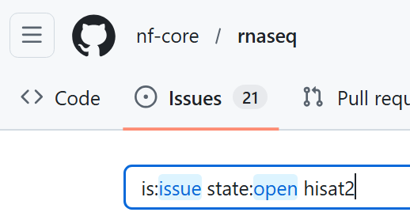

#  2.3 Case study: customising a path less travelled

!!! tip "Objectives"

    - Execute a non-default analysis with an nf-core pipeline
    - Troubleshoot pipeline execution failures
    - Use custom configuration files to resolve the failure


## 2.3.1 Case study introduction

This section will take a more playful approach to customisation. No new nf-core or Nextflow concepts will be introduced. Instead, we will apply a number of the customisation strategies we have learnt over the last two days to a theoretical real-world customisation scenario. 

We will cover a typical journey experienced when you choose to perform a non-standard analysis, included debugging the dreaded *error message*, searching for the *issue solution*, and working out how to *make the solution work for you*.

We will apply strategic thinking and methodology to:

- Identify what customisations we can make to the rnaseq run to best suit our experiment goals using **pipeline parameters**
- Apply the parameters to the run and **investigate an error message**, including searching known **nf-core issues**
- Use multiple **custom configuration files** to resolve the issue
- **Customise pipeline report files** to validate the non-default workflow choice supports the experiment goals 

<br>


🐭 **The scenario**

Our busy lab is in the throes of a research project that prioritises quick answers about which genes are expressed in the study animals. Transcript-level expression is not of interest - simply 'gene ON' or 'gene OFF' answers, ideally yesterday!  

The project lead is not happy with the time it takes to run the rnaseq workflow over all 1,000 study animals. We have been tasked with finding a quicker way to identify expressed genes in the samples. 

## 2.3.2 Devising and running a non-default analysis 

Knowing that the main pipeline bottleneck is the STAR_ALIGN process, we decide to review what other aligner choices the workflow provides. 

After visiting the [nf-core/rnaseq user guide](https://nf-co.re/rnaseq/3.23.0) we can see from the metro map that Hisat2 and Bowtie2 can be used instead of STAR:


Like the STAR workflow, Bowtie2 can use Salmon quantification, but Hisat2 does not have this option. However, we spot the tool featureCounts listed under pipeline stage 5, 'Quality control & reporting'. Having used featureCounts before, we know that it can be used to quickly and easily count the number of reads mapped to genes.


!!! example "Exercise 2.3.2 :stopwatch: 3 mins" 

    - Using the [nf-core/rnaseq parameters guide](), find the parameter needed to use the Hisat2 aligner
    - Add the new parameter to `run_rnaseq.sh`
    - Update the `--outdir` value to lesson-2.3
    - Save the script, and resubmit with the command `bash run_rnaseq.sh`

    ??? success "Solution"

        ```bash
        --aligner hisat2 
        ```


!!! abstract "Poll 2.3.2"

    Did your run complete, or fail? 

    If it failed, what was the error printed to the terminal window? 

    ??? success "Solution"

        In this exercise, some runs may succeed, and some may fail! 

        If the run fails, the expected error message is:

        ```console title="Error message"
        Command error: 
         (ERR): mkfifo(/tmp/45.unp) failed. 
         Exiting now ...
         [main_samview] fail to read the header from "-".
        ```


## 2.3.3 Troubleshooting a pipeline error 

The error doesn't give much to go by, apart from that it is something to do with `/tmp` and the piped samtools command received no input. 

A quick `ls -l` shows that we can read and write the VM `/tmp` directory, so we decide to check the command that was executed by the failing process, HISAT2_ALIGN. 

In [Lesson 2.1.2](2.1_params.md/#212-find-and-view-a-process-task-command) we learnt that the command executed by a process was saved within the `.command.sh` file in the process work directory. We learnt how to find the work directory using the `nextflow log` command. 

In this case, we don't need to hunt for the directory as it has been helpfully printed out along with the error message:

```console title="Example"
Work dir:
  /home/tdev02/session2/work/dc/5184fdc7c63198d41a03c73790b7f6
```

!!! example "Exercise 2.3.3.1 :stopwatch: 2 mins"

    View the `.command.sh` file within the failed process work directory

    Do you detect any obvious issues with the command?


    ??? success "Solution"

        The command has received our sample reads and input genome files OK.

        ```console title=".command.sh"
        INDEX=`find -L ./ -name "*.1.ht2*" | sed 's/\.1.ht2.*$//'`
        hisat2 \
            -x $INDEX \
            -U SRR3473988_trimmed_trimmed.fq.gz \
            \
            --known-splicesite-infile mm10_chr18.filtered.splice_sites.txt \
            --summary-file SRR3473988.hisat2.summary.log \
            --threads 2 \
            --rg-id SRR3473988 --rg SM:SRR3473988 \
            --un-gz SRR3473988.unmapped.fastq.gz \
            --met-stderr --new-summary --dta \
            | samtools view -bS -F 4 -F 256 - > SRR3473988.bam
        ```


🌐 The logical next step is to check if this is a known error with the Hisat2 module within the pipeline. 

!!! example "Exercise 2.3.3.2 :stopwatch: 3 mins"
    - In a web browser, navigate to the [nf-core/rnaseq github repository](https://github.com/nf-core/rnaseq)
    - Select the 'Issues' tab, and search for issues matching the term 'hisat2'
    - Also do the same for the [nf-core modules github repository](https://github.com/nf-core/modules)

    Can you find any issues relating to the `(ERR): mkfifo(/tmp/45.unp)` error in either of these repositories? 

    {width=65%}


    ??? success "Solution"

        [update module: HISAT2/ALIGN #9487](https://github.com/nf-core/modules/issues/9487)

        There is a known, recent issue marked as 'WIP' (work in progress) describing our exact issue!


!!! abstract "Poll 2.3.3"

    Read the comment history on [the issue](https://github.com/nf-core/modules/issues/9487), then type your suggested solution into the poll window 


## 2.3.4 Configuring the solution

Lucky for us, we don't need to puzzle out the solution, as it has already been described on the issue ticket. Excellent, since the project lead is insisting we simply cannot wait for nf-core to complete their testing and merge the WIP into the rnaseq pipeline!
 

The ticket describes a [new release of Hisat2 v 2.2.2](https://github.com/DaehwanKimLab/hisat2/releases/tag/v2.2.2) that explicitly references the issue some of us may have encountered. 

Before applying the solution soon to be implemented by nf-core, which involves using a **non-standard tool version**, we should find out what version of Hisat2 the current nf-core/rnaseq pipeline version is using. 

TODO when VM access restored - exercise to find Hisat2 version (v 2.2.1)


### 2.3.4.1 Apply a custom tool version

TODO when VM access restored - add latest hisat container to  withName in hisat2 config . Make it a separate config so it can be easily dropped when nfcore finishes the WIP


### 2.3.4.2 Apply a custom parameter using `ext.args`

As we learnt in [Lesson 1.3.6](../session_1/1.3_configure.md/#configuring-processes), nf-core modules define an `ext.args` process directive that can be used to add any tool parameter to a process command. 

The utility of this directive is wide-reaching when you consider the number of optional parameters a typical bioinformatics tool may have. It is not feasible for nf-core to paramaterise all of these arguments...

{width=40%}

Extra convenience has been added for some commonly-used tools by wrapping the `ext.args` directive within a pipeline parameter, typically named `--extra_<tool>_args`. 

!!! example "Exercise 2.3.4 :stopwatch: 2 mins"

    - In the [nf-core/rnaseq parameters guide](https://nf-co.re/rnaseq/3.23.0/parameters), check for `--extra_<tool>_args`. 
    - Can you find a pipeline parameter to add extra arguments to the Hisat2 tool?


    ??? success "Solution"

        There is no such parameter for Hisat2. The only tools that have this parameter are:

        - `--extra_trimgalore_args`
        - `--extra_fastp_args`
        - `--extra_star_align_args`
        - `--extra_bowtie2_align_args`
        - `--extra_salmon_quant_args`
        - `--extra_kallisto_quant_args`
        - `--extra_fqlint_args`
        

While we do not have a handy `--extra_hisat2_args` parameter to which to apply the required argument `"--temp-dir ./tmp"`, we *can* make use of the `ext.args` directive. This directive typically forms part of all nf-core module code, whether or not there is an `--extra_<tool>_args` parameter to directly interact with it.. 


TODO when VM access restored - exercise add arg to withName in hisat2 config 


~~~~~~~~~~~~~~~~~


In this lesson, we will learn how to apply any argument for a tool that is not explicitly covered by an nf-core workflow parameter using Nextflow's [`ext` directive](https://www.nextflow.io/docs/latest/process.html#ext).

~~~~~~~~~~

## 2.3.1. Customise resource tracing

- project meeting coming up next week, need to present the new analysis plan. want to make some plots to show speed gains from the curent analysis - default trace doesnt include all the desired fields, customise these to give the results needed to make the impactful respources-saved plot

## 2.3.2. Personalise MultiQC reports

- salmon quant corrects for gc, featureCounts doesn't. need to verify that this is ok for our data.. add the track 


https://daehwankimlab.github.io/hisat2/manual/


this is getting a bit long, let's wrap this up into a profile to keep things clean


~~~~~~~~~~

kill vs code server on the host
relog in 