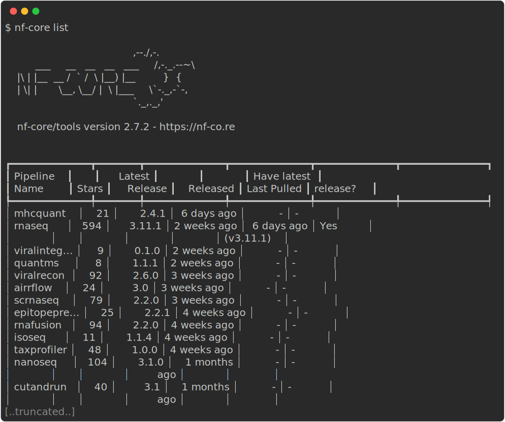
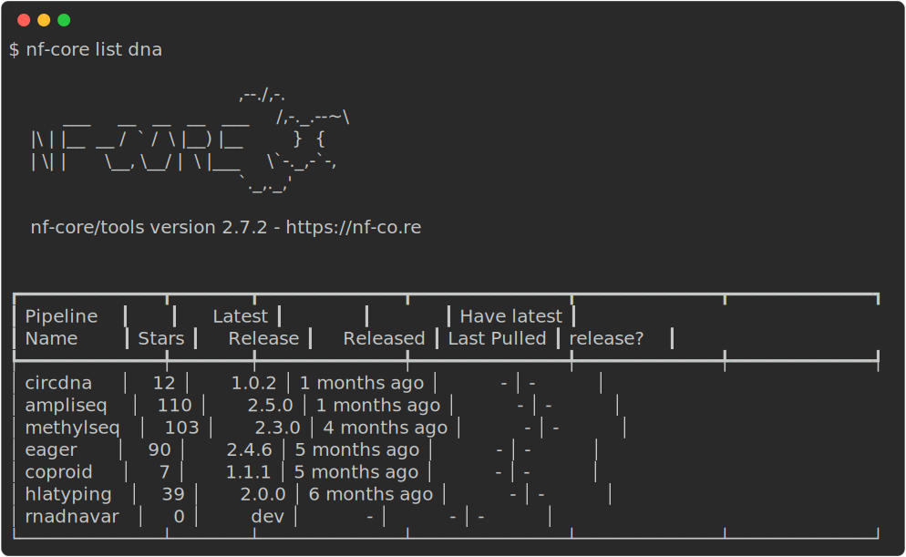
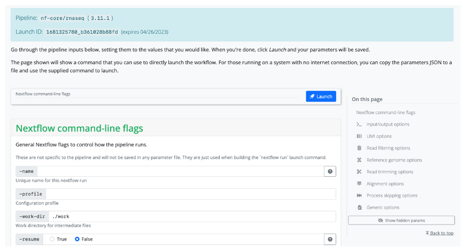

# Tips and tricks

## Installing Nextflow

Nextflow is distributed as a self-installing package and can be installed using a few easy steps:

1. Download the executable package using either `wget -qO- https://get.nextflow.io | bash` or `curl -s https://get.nextflow.io | bash`
2. Make the binary executable on your system by running `chmod +x nextflow`.
3. Move the `nextflow` file to a directory accessible by your `$PATH` variable, e.g. `~/.local/bin/`

## Cleaning up the work directory

Your work directory can get very big very quickly (especially if you are using full sized datasets). It is good practise to `clean` your work directory regularly. Rather than removing the `work` folder with all of it's contents, the Nextflow `clean` function allows you to selectively remove data associated with specific runs.

```default
nextflow clean -help
```


Note that to prevent unintended deletion of important data, `nextflow clean` **requires** you to supply either the `-dry-run` or `-force` flag. By running `nextflow clean -dry-run`, you will see a list of files that would be removed if you were to instead provide the `-force` flag.

Additionally, the `-after`, `-before`, and `-but` options are all very useful to select specific runs to clean.

## Listing and dropping cached workflows

When using `nextflow pull` and `nextflow run` to automatically pull workflows from their GitHub repositories, they will be cached locally within your `$HOME/.nextflow/assets` directory. Over time, these will build up and you might want to clean this directory up. Nextflow has functionality to help you to view and remove these cached workflows.

The `nextflow list` command prints the projects stored in your cache folder. If you want to remove a specific workflow from your cache you can remove it using the Nextflow `drop` command:

```default
nextflow drop <workflow>
```

## nf-core tools

### Installing nf-core tools

nf-core tools is written in Python and is available from the [Python Package Index (PyPI)](https://pypi.org/project/nf-core/):

```default
pip install nf-core
```

Alternatively, nf-core tools can be installed from [Bioconda](https://anaconda.org/bioconda/nf-core):

```default
conda install -c bioconda nf-core
```

### `nf-core list`

The nf-core `list` command can be used to print a list of remote nf-core workflows along with your local workflow information.

```default
nf-core list
```

{width=100%}

The output shows the latest workflow version number and when it was released. You will also be shown if and when a workflow was pulled locally and whether you have the latest version.

Keywords can also be supplied to help filter the workflows based on matches in titles, descriptions, or topics:

```default
nf-core list dna
```

{width=100%}

Options can also be used to sort the workflows by latest release (`-s release`, default), when you last pulled a workflow locally (`-s pulled`), alphabetically (`-s name`), or number by the number of GitHub stars (`-s stars`).

### `nf-core launch`

A workflow can have a large number of optional parameters. To help with this, the `nf-core launch` command is designed to help you write parameter files for when you launch your workflow.

The nf-core `launch` command takes one argument - either the name of an nf-core workflow which will be pulled automatically **or** the path to a directory containing a Nextflow workflow:

```default
nf-core launch nf-core/<workflow>
```

When running this command, you will first be asked about which version of the workflow you would like to execute. Next, you will be given the choice between a web-based graphical interface or an interactive command-line wizard tool to enter the workflow parameters. Both interfaces show documentation alongside each parameter, will generate a run ID, and will validate your inputs.

{width=100%}

The nf-core `launch` tool uses the `nextflow_schema.json` file from a workflow to give parameter descriptions, defaults, and grouping. If no file for the workflow is found, one will be automatically generated at runtime.

The `launch` tool will save your parameter variables as a `.json` file called `nf-params.json`. It will also suggest an execution command that includes the `-params-file` flag and your new `nf-params.json` file. The command line wizard will finish by asking if you want to launch the workflow. Any profiles or options that were set using the wizard will be included in your `run` command.

You can also use the launch command directly from the [nf-core launch website](https://nf-co.re/launch). In this case, you can configure your workflow using the wizard and then copy the outputs to your terminal or use the run id generated by the wizard. You will need to be connected to the internet to use the run id.

```default
nf-core launch --id <run_id>
```

